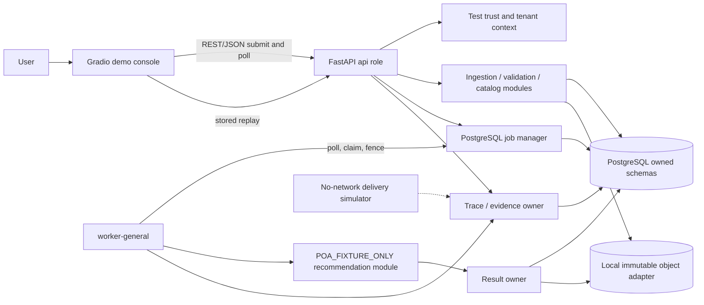

# ARK Reference MVP scope

Status: `PLANNED — NO APPLICATION CODE IMPLEMENTED`

> **Post-publication refinement:** ADR-017/018 supersede the direct two-tenant/unpriced fixture as the next required scope. This historical plan must be read with `docs/mvp/ADR-017-IMPACT.md` and `docs/mvp/ADR-018-IMPACT.md`; the current implementation satisfies neither refinement.

## Purpose

The ARK Reference MVP is a bounded, local, executable architectural hypothesis. It demonstrates one synthetic Recommendation-shaped request crossing ARK's important runtime boundaries while a Gradio console renders the stored execution trace.

It is not production ARK, not a scientific Recommendation implementation, and not the Stage 20 Phase 2 “first admitted vertical slice.” It is a sponsor-authorized refinement of the non-production Phase 1 proof-of-architecture concept. Its original reversible implementation choices did not amend ADR-000 through ADR-016; accepted ADR-017 now adds the documented hierarchy/pattern/admin revision and still clears no admission block.

The immutable demonstration label is `ARK_REFERENCE_MVP / POA_FIXTURE_ONLY`. The API, stored run, result, trace, UI, build manifest, and implementation README must display that label.

## Demonstrated outcome

A user selects a predefined scenario in Gradio, submits bounded synthetic transaction, catalog, and inventory data, and observes a single run through:

1. run initialization;
2. tenant context derivation from a test credential;
3. data receipt and immutable raw reference creation;
4. schema validation;
5. invalid-row quarantine;
6. deterministic normalization and dataset publication;
7. fixture-only capability eligibility;
8. durable Recommendation job creation and worker execution;
9. deterministic feature generation;
10. deterministic candidate generation;
11. deterministic ranking and fixture business rules;
12. immutable result persistence and job finalization;
13. result retrieval through polling, with a separately simulated delivery outcome where the scenario requires it.

Every step emits a structured, database-backed trace event. Stored-run replay reads those events; it never reruns ingestion or recommendation computation.

## Scope boundaries

### In scope

- One Python coordinated release with separate `api`, `worker-general`, and one-shot migration/reset entrypoints.
- One FastAPI application exposing bounded demo, job, result, and trace resources.
- Pydantic request, response, fixture, trace-event, and problem schemas.
- One Gradio demonstration console that uses only the HTTP API and periodic polling.
- PostgreSQL as authoritative run, job, attempt, trace-event, quarantine, dataset metadata, result metadata, audit/lineage, and simulated-delivery state.
- A behavior-compatible immutable local object adapter for bounded raw, normalized, and result payloads; PostgreSQL stores opaque references and digests.
- Two synthetic tenants and a test-only credential-to-tenant adapter.
- One immutable synthetic transaction/catalog/inventory contract.
- One deterministic `POA_FIXTURE_ONLY` Recommendation operation with fixture eligibility, features, candidates, ranking, and business rules.
- One logical job with attempts, lease, fence, retry classification, finalization, and result polling.
- Six predefined scenarios, fault hooks usable only by those fixtures, and deterministic stored-run replay.
- Tests and implementation READMEs required by `implementation/MVP-BACKLOG.md`.

### Out of scope

- Real customers, production data, production trust, production secrets, or internet egress.
- Scientific recommendation quality, training, fitted preprocessing, model registry/promotion/assignment, or provider calls.
- Any claim that CAP-REC exits `MIGRATION_BLOCKED` or that a source contract exits `DATA_CONTRACT_ADMISSION_BLOCKED`.
- Scheduler, broker, Kafka, outbox publisher, webhook sender, proactive action, generic workflow engine, or multi-capability workflow.
- Production IAM, cryptographic key management, policy administration, billing, customer-facing UI, consumer cutover, or LAB promotion authority.
- Kubernetes, service mesh, gRPC, independently deployed microservices, distributed workflow infrastructure, feature-store/MLOps products, GPU, Rust, lakehouse, vector store, agents, MCP, or A2A.
- Production SLO, capacity, HA, RPO/RTO, backup, disaster-recovery, compliance, retention, or cost claims.

## Canonical component classification

Classification describes only this MVP. `real implementation` means the MVP exercises its actual local contract and state transitions; it never means production-admitted.

| MVP component | Classification | MVP treatment | Demonstration shortcut / production boundary |
|---|---|---|---|
| Gradio trace console | simplified implementation | Scenario selector, submit action, run summary, stage timeline, quarantine/result panes, polling, replay | Demo client only; not ARK product UI or consumer contract |
| FastAPI HTTP boundary | real implementation | Typed submit/status/result/trace endpoints and problem responses | Bounded demo surface; production ingress/trust/limits remain undecided |
| Pydantic contracts | real implementation | Strict schemas, unknown-field rejection, version fields, stable enums | Only MVP schema subset; does not admit a production source contract |
| Test trust adapter | simplified implementation | Credential maps to one of two fixture tenants; body tenant is never authority | Impossible to enable outside demo profile; `EXTERNAL_TRUST_BLOCKED` remains |
| Tenant context propagation | real implementation | Immutable tenant/correlation context on every command, row, object ref, job, result, and event | Proves contract propagation, not production identity assurance |
| Run manager | real implementation | Creates stable run/correlation/scenario identities and state | Reference-MVP resource, not a new production ARK aggregate |
| Fixture control/eligibility policy | simplified implementation | Versioned allow/deny fixture decisions and reason codes | No production grant, quota, policy administration, or scientific authority |
| Data receipt/raw preservation | real implementation | Accept bounded synthetic payload, persist immutable bytes/reference/digest before parsing | Local object adapter and small fixtures only; no real source admission |
| Structural validation | real implementation | Strict file/envelope/row schema checks and validation report | Rules apply only to the synthetic contract version |
| Invalid-row quarantine | real implementation | Persist rejected row refs, codes, counts, and safe previews | No production retention/privacy policy claim |
| Normalization/readiness | simplified implementation | Deterministic canonical fields, dedupe rule, referential checks, immutable dataset version | Demonstrates lifecycle ordering; canonical semantics are fixture-only |
| Capability eligibility | simplified implementation | Deterministic sufficiency rule evaluated after readiness | Named “fixture eligibility,” never REC scientific eligibility |
| PostgreSQL job manager | real implementation | Logical job, attempts, claim, lease, fence, retry wait, finalizing, terminal truth | Bounded policy values are demo configuration, not production sizing |
| `worker-general` | real implementation | Separate role polls/claims and executes exact handler version | One local worker is enough; no service extraction or distributed queue |
| Feature generation | simplified implementation | Deterministic recency/frequency/value/item-affinity fixture features | No trained or scientifically validated feature contract |
| Candidate generation | simplified implementation | Deterministic catalog/inventory candidates for eligible synthetic customers | No learned retrieval or production candidate strategy |
| Ranking | simplified implementation | Stable scoring expression and deterministic tie-break | Test oracle, not production ranking science |
| Business rules | simplified implementation | Remove unavailable items, dedupe, cap top-k, deterministic fallback/empty result | Fixture policy only; no business approval implied |
| Result persistence | real implementation | Owner commit before `FINALIZING`; immutable result ref/digest and exact lineage | Small local object payload; production retention and storage mechanism unresolved |
| Job/result polling | real implementation | Gradio polls authoritative job, result, and trace APIs | Poll interval is UI configuration, not an SLO |
| Simulated delivery adapter | simulated behavior | Local no-network emulator records delivered/failed state independently of result | Does not deploy publisher/webhook; `EXTERNAL_DELIVERY_BLOCKED` remains |
| Execution-trace ledger | real implementation | Append-only PostgreSQL events with per-run order and immutable identities | Demo observability plus evidence; not the full production audit/telemetry platform |
| Stored-run replay | real implementation | Snapshot and return stored events/results in original order | Replay is presentation only; it does not resubmit a job or recreate effects |
| Audit/lineage/usage subset | simplified implementation | Required refs and completion checks sufficient for the demonstration | Does not satisfy production governance, metering, or compliance |
| Local immutable object adapter | simplified implementation | Digest-addressed fixture storage behind the provider-neutral port | Local filesystem is not approved production object storage/data lake |
| Migration/reset entrypoint | real implementation | Additive bootstrap and safe reset limited to marked demo data | Not a production privileged/recovery mechanism |
| Release/config identity | simplified implementation | Build/config/fixture/handler versions recorded on runs and events | No signing, SBOM, or production supply-chain admission |
| Diagnostic telemetry export | postponed | Trace ledger and health are sufficient for the demo | Rich exporter/backend waits for a named environment/target |
| Real REC model/lifecycle | postponed | No model is loaded or trained | CAP-REC remains `MIGRATION_BLOCKED` |
| Scheduler/events/proactive workflow | postponed | Explicit user submit only | No named schedule/subscriber/action requirement |
| External webhook delivery | postponed | Local failure simulator only | External delivery stays blocked |
| Agent runtime | not applicable | Deterministic typed flow covers the use case | ADR-013 and Stage 11 re-entry remain authoritative |

## Simplest local architecture

One codebase contains hard logical modules. FastAPI and the worker are separate role entrypoints from the same release. Gradio is a separate demo-client process or entrypoint and imports no module internals. PostgreSQL polling is both the job-dispatch baseline and the UI update mechanism. No broker, scheduler, or distributed workflow layer is introduced.

## Non-negotiable guardrails

- Fixture artifacts, credentials, routes, reset commands, and fault hooks must fail startup outside the explicit `reference_mvp` profile.
- `tenant_id` is derived from the test credential and never accepted as authority from request data.
- Raw input is persisted before parsing; invalid rows remain traceable but never enter the normalized dataset.
- Structural validity, readiness, and fixture capability eligibility remain separate decisions and reason codes.
- `202`/run acceptance occurs only after durable run/job truth exists for the relevant command.
- Attempt retry creates a new attempt under the same job and result identity.
- Owner result persistence precedes job `FINALIZING` and `SUCCEEDED`.
- Delivery failure cannot change a successful job/result and cannot rerun computation.
- Replay cannot create a new job, attempt, result, delivery, or business event.
- Trace payloads contain no raw rows, secrets, direct identifiers, or stack traces.
- Every implementation README must repeat the non-production and non-precedent warning.

## Source basis

- `outputs/final/ARK-system-design.md — Binding architecture baseline; Runtime roles and actual first placement; Active admission blocks`
- `outputs/final/ARK-execution-flows.md — UC-02 — Asynchronous inference or batch job; Execution laws`
- `outputs/final/ARK-interface-contracts.md — Contract laws; Durable submission and job resource; Internal public ports`
- `outputs/final/ARK-implementation-roadmap.md — Phase 1 — non-production proof of architecture`
- `outputs/final/ARK-risks-and-open-questions.md — Top ten risks; Decisions required now`
- `outputs/stages/16-testing.md — Testing principles; Production-blocking invariant scenarios`
- `outputs/stages/20-roadmap.md — Phase 1 — Walking skeleton / proof of architecture`
- `outputs/stages/22-runtime-execution-analysis.md — UC-22-02 — Asynchronous inference or batch job`
- `outputs/stages/24-final-assurance.md — Downstream consequences; Exact next-stage inputs`
- accepted ADR-003, ADR-004, ADR-005, ADR-008 through ADR-016
