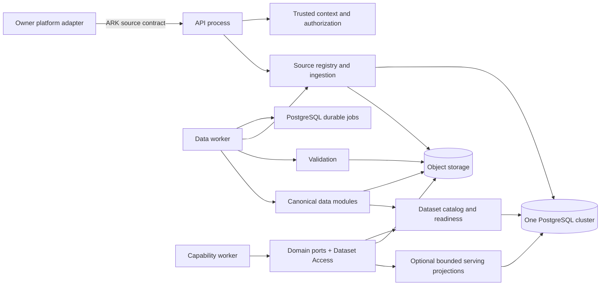
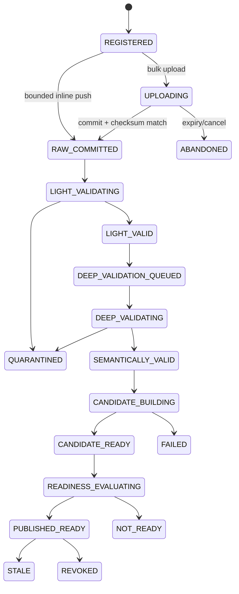

# ARK implementation architecture — data-management deep design

Status: `IMPLEMENTATION DESIGN — NON-PRODUCTION; ACTIVE ADMISSION BLOCKS REMAIN`

This document redesigns the ARK implementation tree with a detailed data-management architecture. It keeps ARK as a boundary-enforced modular monolith: one coordinated codebase, one PostgreSQL cluster/database with module-owned schemas and migrations, and provider-neutral object storage for large immutable content.

It does not authorize production data onboarding, select a production object-storage vendor, or activate a real capability. Real source and canonical contracts remain `DATA_CONTRACT_ADMISSION_BLOCKED` until their identifiers, semantics, owners, validation evidence, and approval exist.

## 1. Decisions and corrections applied

The following refinements are intentional and should be visible before implementation.

### 1.1 The upstream platform translates, but ARK still validates

Direct, POS, Whatson, or another owner platform translates its source data into a registered ARK source contract and pushes it through ARK APIs. ARK must not trust that translation merely because the caller is authorized. It independently authenticates the caller, resolves the business tenant, verifies the registered source and contract version, preserves the raw submission, and validates it.

The upstream platform remains the source of record. ARK owns the accepted raw evidence, validation results, canonical dataset versions, lineage, readiness state, and capability-owned derived data.

### 1.2 There are two data-validation passes, followed by two separate gates

The requested two validation passes are correct, but `valid` must not become one overloaded Boolean.

1. **Light admission validation** finds obvious technical faults quickly after raw commit.
2. **Deep semantic validation** checks all rows/records and the allowed business/domain values asynchronously.
3. **Dataset readiness** decides whether an immutable dataset version is generally usable.
4. **Capability eligibility** decides whether that ready version is sufficient for one exact capability operation.

Only the first two are data-validation passes. Readiness belongs to the data platform; capability eligibility belongs to the consuming capability. Passing one never implies passing the next.

Deep validation should normally be queued immediately after ingestion. A schedule may revalidate for freshness, contract-policy changes, drift, or previously missing references, but scheduled validation is not a reason to expose unvalidated data. Until deep validation and readiness publication pass, the data remains unavailable to capabilities.

### 1.3 The exposure layer is not a generic database proxy

No capability, gateway route, or sibling module receives direct SQL, ORM models, object-storage credentials, bucket names, or raw object keys.

ARK uses two cooperating boundaries:

- **Dataset Access** supplies shared enforcement: tenant/job scope, dataset-version resolution, allowed columns, filters, row limits, cursor pagination, purpose, audit, and scoped object readers.
- **Domain data modules** such as `customer_data`, `transaction_data`, and `product_data` own domain contracts, merge/correction rules, field visibility, and typed queries.

A generic `execute_sql`, `get_table`, `read_path`, or unrestricted dataframe API is prohibited. It would bypass domain meaning and become a hidden shared-data service.

### 1.4 “Customer upsert” does not mean direct mutation of a master customer table

ARK is not the customer system of record. An owner platform submits source customer facts through ingestion. The `customer_data` module applies the registered source/canonical contract and versioned correction/upsert/tombstone rules to build a new immutable canonical dataset version.

If a measured use case needs low-latency individual-customer reads, `customer_data` may maintain a bounded PostgreSQL serving projection. That projection is:

- module-owned and business-tenant scoped;
- rebuildable from an exact canonical dataset version;
- not the historical lake or upstream source of record;
- accessed only through `CustomerDataPort`;
- versioned and lineage-linked;
- never directly written by a capability.

This avoids putting large historical customer data into PostgreSQL while still supporting bounded lookup and pagination.

### 1.5 Rust is an acceleration option, not the owner of the whole data architecture

Rust is a good candidate for CPU- and memory-intensive byte processing: checksums, decompression, CSV/JSONL/Parquet parsing, full-file validation, columnar transformation, and large object streaming. It does not make authentication, authorization, catalog publication, job state, audit, migrations, or domain ownership faster by default.

The initial authoritative baseline remains Python/PostgreSQL. A `DataEngine` port gives ARK a Python reference implementation and a benchmark-gated Rust adapter. Rust is activated only when a representative benchmark shows a material benefit and packaging, parity, failure isolation, observability, and support tests pass. Domain rules remain versioned contracts owned by ARK modules; Rust may execute them but does not define or authorize them.

## 2. Simplest deployable topology



Initial runtime roles:

- `api`: REST/JSON, trusted context, source/upload registration, status/query endpoints;
- `worker-general`: durable ingestion, light/deep validation, canonicalization, publication, and fixture capability work;
- `maintenance`: migrations, reconciliation, revalidation, backfill, restore checks, and controlled cleanup;
- `scheduler`: absent until a named scheduled revalidation/source operation is approved; scheduled commands can initially be invoked through maintenance or an external system timer.

The roles may run on one Linux server from one coordinated release. They are process roles, not microservices.

## 3. Complete repository layout

The data area is expanded to file level. Non-data capability internals remain represented by their stable module boundary because this document does not redesign their science.

How to read the annotations:

- A folder comment explains what belongs inside it and normally gives an example.
- A file comment explains the file's single responsibility and the kind of content it contains.
- `domain/` contains business/data rules without FastAPI, SQLAlchemy, object-store clients, or other infrastructure code.
- `application/` contains use cases that coordinate domain rules and declared interfaces; for example, “commit an upload” or “publish a dataset version.”
- `ports/` contains interfaces the module needs; for example, `ObjectStorePort` or `DatasetCatalogPort`.
- `adapters/` contains concrete implementations of those interfaces; for example, PostgreSQL repositories or object-storage readers.
- `contracts/` contains versioned request, response, event, and canonical-record schemas. Documentation links to them but does not redefine them.
- `migrations/` contains database changes owned by that module only.
- `tests/` contains tests closest to the owning module; the root `tests/` folder contains cross-module and end-to-end suites.
- `MODULE.md` is the human-readable identity card: purpose, responsibilities, boundaries, contracts, ownership, dependencies, and gaps.
- `module.yaml` is a small tooling index: module ID, kind, tenant scope, pattern, dependencies, owned data, contracts, events, and ADR links. It never grants runtime authority.
- Examples in comments illustrate expected content; they do not activate a capability, source contract, storage product, or production path.

```text
ark/                                                                       # Repository root; contains the complete ARK code, contracts, architecture records, tooling, and tests.
├── pyproject.toml                         # Python dependencies, build, lint, test, typing.
├── README.md                              # Setup, local operation, and entry points.
├── ARK.md                                 # Whole-system identity, invariants, and architecture links.
├── CHANGELOG.md                           # User-visible and implementation-history changes.
├── docker/                                # Optional local/container definitions; no Kubernetes baseline.
├── scripts/                                                               # Operator/developer commands; for example migrations, fixture loading, revalidation, and reconciliation.
│   ├── migrate.py                         # Calls module-owned migrations in declared order.
│   ├── seed_fixture.py                    # Non-production, synthetic data only.
│   ├── reconcile_data.py                  # Runs registered reconciliation commands.
│   ├── revalidate_dataset.py              # Submits an explicit deep-validation job.
│   ├── backfill_dataset.py                # Submits a versioned backfill/reprocess request.
│   └── validate_architecture.py            # Import, manifest, schema-owner, and dependency checks.
├── apps/                                                                  # Thin executable entry points; each folder starts one runtime role without business logic.
│   ├── api/                                                               # HTTP-facing code; for example the API process entry point or transport translators.
│   │   └── main.py                        # Builds and starts the HTTP API role.
│   ├── worker/                                                            # Background worker entry point; claims durable jobs and calls typed module handlers.
│   │   └── main.py                        # Builds a selected general/data/capability worker role.
│   ├── scheduler/                                                         # Conditional schedule-submission role; stores no capability logic and only creates ordinary jobs.
│   │   └── main.py                        # Conditional; submits typed commands only.
│   └── maintenance/                                                       # One-shot privileged/operator commands; for example migrate, reconcile, revalidate, or backfill.
│       └── main.py                        # One-shot migration/reconcile/revalidate/backfill role.
├── architecture/                                                          # Architecture knowledge kept with the implementation: contexts, patterns, and accepted decisions.
│   ├── contexts/                                                          # Documents for major boundaries; for example Data explains its modules and permitted interactions.
│   │   ├── platform.md                    # Control-plane membership and relationships.
│   │   ├── data.md                        # Data context, flows, owners, and forbidden access.
│   │   ├── execution.md                   # Jobs, leases, fences, retries, finalization.
│   │   ├── capabilities.md                # Capability boundaries and derived-data ownership.
│   │   └── integration.md                 # External adapter and API boundaries.
│   ├── patterns/                                                          # Reusable module-family structures and dependency rules; for example data-module-v1.
│   │   ├── platform-module-v1.md                                          # Pattern for control-plane modules such as IAM or billing: ownership, layers, and tests.
│   │   ├── data-module-v1.md               # Source/catalog/access/domain-data module convention.
│   │   ├── capability-module-v1.md                                        # Pattern for capability modules such as Recommendation: contract, science, and isolation rules.
│   │   ├── execution-module-v1.md                                         # Pattern for durable job/execution modules: state, attempts, fences, retries, and recovery.
│   │   └── integration-module-v1.md                                       # Pattern for external adapters and gateways that translate consumer data into ARK contracts.
│   └── decisions/                                                         # Accepted and superseding ADRs explaining why durable architectural choices were made.
│       └── ADR-*.md                        # Actual accepted/superseding decisions, not duplicated prose.
├── contracts/                                                             # Canonical versioned schemas shared at a public boundary; for example IngestionSubmissionV1.
│   ├── openapi/                                                           # Generated and verified HTTP API descriptions used by clients, documentation, and compatibility tests.
│   │   └── ark-v1.yaml                    # Generated/verified public REST contract.
│   ├── common/                                                            # Small shared data types with no business ownership; for example opaque IDs, versions, and object refs.
│   │   ├── identifiers.py                 # Opaque typed IDs.
│   │   ├── pagination.py                  # Bounded cursor-page contracts.
│   │   ├── object_refs.py                 # Opaque, tenant-scoped reference contract.
│   │   ├── errors.py                      # Versioned problem/error codes.
│   │   └── lineage.py                     # Shared lineage reference envelope.
│   └── data/                                                              # Public/versioned data schemas only; e.g. ingestion requests, validation reports, and canonical records.
│       ├── source_registration_v1.py                                      # V1 source-registration schema; e.g. source ID, owner, mode, contract, and policies.
│       ├── upload_registration_v1.py                                      # V1 bulk-upload authority schema; e.g. expected format, size, checksum, and expiry.
│       ├── ingestion_submission_v1.py                                     # V1 inline/bulk ingestion command; e.g. source, contract version, and idempotency key.
│       ├── ingestion_status_v1.py                                         # V1 status response containing run state, validation refs, and dataset refs—not raw bytes.
│       ├── validation_report_v1.py                                        # V1 machine-readable validation summary and bounded finding/report references.
│       ├── dataset_version_v1.py                                          # V1 immutable dataset metadata: objects, checksums, schema, lineage, and status.
│       ├── readiness_decision_v1.py                                       # V1 READY/NOT_READY/STALE/REVOKED decision with reasons and policy versions.
│       ├── customer_source_v1.py                                          # Example admitted/fixture customer source schema before ARK canonical normalization.
│       ├── customer_canonical_v1.py                                       # Canonical V1 customer record schema using opaque IDs and explicit lifecycle semantics.
│       ├── transaction_source_v1.py                                       # Example admitted/fixture transaction source schema before canonical mapping.
│       ├── transaction_canonical_v1.py                                    # Canonical V1 transaction/line/refund schema with currency and time semantics.
│       ├── product_canonical_v1.py                                        # Canonical V1 product/catalog schema with opaque product ID and lifecycle state.
│       ├── inventory_canonical_v1.py                                      # Canonical V1 availability/quantity schema with location and as-of/effective time.
│       └── interaction_canonical_v1.py                                    # Canonical V1 interaction/feedback schema with purpose, source, and event time.
├── src/                                                                   # Installable application source code; generated artifacts and deployment files do not belong here.
│   └── ark/                                                               # Main installable Python package containing bootstrap, gateway, logical modules, and infrastructure adapters.
│       ├── bootstrap/                                                     # Composition root that loads settings and connects public ports to concrete adapters.
│       │   ├── app.py                     # Runtime-role application factory.
│       │   ├── container.py               # Wires public ports to adapters.
│       │   ├── lifecycle.py               # Startup, readiness, graceful shutdown.
│       │   └── settings.py                # Validated immutable settings.
│       ├── gateway/                                                       # Transport boundary that converts HTTP requests into typed module calls and maps responses/errors back.
│       │   ├── api/                                                       # HTTP-facing code; for example the API process entry point or transport translators.
│       │   │   └── v1/                                                    # Version 1 HTTP routes; path version is independent from source, dataset, and capability contract versions.
│       │   │       ├── sources.py         # Source registration/query endpoints.
│       │   │       ├── data_contracts.py  # Admitted contract metadata; no schema invention.
│       │   │       ├── uploads.py         # Register and commit scoped bulk uploads.
│       │   │       ├── ingestions.py      # Submit inline ingestion and inspect status.
│       │   │       ├── validations.py     # Authorized validation status/report endpoints.
│       │   │       ├── datasets.py        # Dataset/version/readiness/lineage endpoints.
│       │   │       ├── customers.py       # Bounded authorized customer-data queries.
│       │   │       ├── transactions.py    # Bounded authorized transaction-data queries.
│       │   │       └── data_exports.py    # Conditional, typed, audited export only.
│       │   ├── middleware/                                                # Shared request processing; for example authentication, tenant derivation, limits, IDs, and tracing.
│       │   │   ├── authentication.py                                      # Validates the admitted credential and creates the trusted subject identity.
│       │   │   ├── tenant_context.py      # Derives organization then one business tenant.
│       │   │   ├── request_id.py                                          # Creates one unique ID for each HTTP attempt for support and log correlation.
│       │   │   ├── request_limits.py      # Size/rate/time bounds before intake.
│       │   │   └── tracing.py                                             # Technical spans connecting API, job, validation, storage, and publication operations.
│       │   ├── dependencies.py            # Supplies public module ports, never repositories.
│       │   ├── exception_handlers.py                                      # Implements exception handlers for the current owning module; it must use declared public ports.
│       │   └── request_context.py          # Immutable trusted request context.
│       ├── modules/                                                       # Logical business/platform owners inside the modular monolith; each owns contracts, rules, and state.
│       │   ├── iam/                       # Authentication identities and account state.
│       │   ├── organizations/             # Organization memberships and business registry.
│       │   ├── billing/                   # Shared balance, organization policies, reservations.
│       │   ├── entitlements/              # Capability grants/quotas/admission.
│       │   ├── jobs/                      # Jobs, attempts, leases, fencing, cancellation.
│       │   ├── audit/                     # Mandatory append-only control evidence.
│       │   ├── data/                                                      # The complete data context: intake, validation, catalog, controlled access, lineage, and canonical domains.
│       │   │   ├── CONTEXT.md             # Membership, public dependencies, and data invariants.
│       │   │   ├── common/                                                # Small shared data types with no business ownership; for example opaque IDs, versions, and object refs.
│       │   │   │   ├── ids.py             # Data-specific typed identifiers.
│       │   │   │   ├── states.py          # Shared vocabulary; owners control transitions.
│       │   │   │   ├── checksums.py       # Digest types/verification results.
│       │   │   │   ├── object_refs.py     # Opaque ref value objects; no raw paths.
│       │   │   │   ├── versions.py        # Contract/dataset/ruleset/code versions.
│       │   │   │   └── errors.py          # Data error taxonomy.
│       │   │   ├── source_registry/                                       # Owns registered source systems and admitted source-contract versions; e.g. Direct POS feed v2.
│       │   │   │   ├── MODULE.md                                          # Human identity card for this module: purpose, ownership, public contracts, dependencies, and gaps.
│       │   │   │   ├── module.yaml                                        # Tool-readable module index; e.g. ID, tenant scope, contracts, dependencies, owned data, and ADRs.
│       │   │   │   ├── public.py          # Register/resolve source and admitted contract version.
│       │   │   │   ├── domain/                                            # Pure rules and invariants for the current module; contains no HTTP, SQL, or object-storage implementation.
│       │   │   │   │   ├── entities.py    # SourceRegistration, SourceContractRegistration.
│       │   │   │   │   ├── policies.py    # Mode, identity, correction, object constraints.
│       │   │   │   │   └── errors.py                                      # Error types owned by the current scope; e.g. UNKNOWN_CONTRACT or DATASET_REVOKED.
│       │   │   │   ├── application/                                       # Use cases coordinating domain rules and ports; for example commit upload or publish dataset.
│       │   │   │   │   ├── commands.py                                    # Typed state-changing use cases for the current module; e.g. RegisterSource.
│       │   │   │   │   ├── queries.py                                     # Typed read-only use cases; e.g. GetIngestionStatus or ResolveReadyDataset.
│       │   │   │   │   └── service.py                                     # Public application service coordinating commands/queries through domain rules and ports.
│       │   │   │   ├── ports/                                             # Interfaces required or exposed by the module; implementations live in adapters or infrastructure.
│       │   │   │   │   └── repository.py                                  # Repository interface or implementation for this module's owned PostgreSQL state only.
│       │   │   │   ├── adapters/                                          # Concrete PostgreSQL/object-storage/engine implementations of declared ports.
│       │   │   │   │   └── postgres_repository.py                         # PostgreSQL adapter implementing the current module's repository port and schema ownership.
│       │   │   │   ├── migrations/                                        # Database migrations owned by the current module; it must not alter another module's schema.
│       │   │   │   │   └── versions/                                      # Ordered immutable migration revisions, such as 0001_create_ingestion_runs.py.
│       │   │   │   └── tests/                                             # Tests for the current scope; examples include contract, isolation, failure, and retry behavior.
│       │   │   │       ├── test_contract_admission.py                     # Verifies contract admission; includes positive, negative, and failure cases where relevant.
│       │   │   │       └── test_tenant_source_scope.py                    # Verifies tenant source scope; includes positive, negative, and failure cases where relevant.
│       │   │   ├── ingestion/                                             # Owns uploads, raw receipts, ingestion runs, idempotency, cursors, replay, and intake reconciliation.
│       │   │   │   ├── MODULE.md                                          # Human identity card for this module: purpose, ownership, public contracts, dependencies, and gaps.
│       │   │   │   ├── module.yaml                                        # Tool-readable module index; e.g. ID, tenant scope, contracts, dependencies, owned data, and ADRs.
│       │   │   │   ├── public.py          # Register upload, commit raw, submit/replay run.
│       │   │   │   ├── domain/                                            # Pure rules and invariants for the current module; contains no HTTP, SQL, or object-storage implementation.
│       │   │   │   │   ├── entities.py    # UploadSession, IngestionRun, RawObjectReceipt.
│       │   │   │   │   ├── states.py      # Intake state machine.
│       │   │   │   │   ├── idempotency.py                                 # Defines logical deduplication identity and conflict behavior for repeated submissions.
│       │   │   │   │   ├── policies.py    # Size/media/checksum/sequence/correction policies.
│       │   │   │   │   └── errors.py                                      # Error types owned by the current scope; e.g. UNKNOWN_CONTRACT or DATASET_REVOKED.
│       │   │   │   ├── application/                                       # Use cases coordinating domain rules and ports; for example commit upload or publish dataset.
│       │   │   │   │   ├── register_upload.py                             # Creates scoped, expiring bulk-upload authority after authentication and preflight checks.
│       │   │   │   │   ├── commit_upload.py                               # Verifies object size/checksum and records one immutable raw receipt.
│       │   │   │   │   ├── submit_inline.py                               # Accepts a bounded inline micro-batch and starts the same durable ingestion lifecycle.
│       │   │   │   │   ├── replay_ingestion.py                            # Reprocesses registered raw evidence with exact versions without rewriting the old run.
│       │   │   │   │   ├── reconcile_ingestion.py                         # Repairs/reports stuck runs, missing objects, partial uploads, or cursor disagreements.
│       │   │   │   │   └── queries.py                                     # Typed read-only use cases; e.g. GetIngestionStatus or ResolveReadyDataset.
│       │   │   │   ├── ports/                                             # Interfaces required or exposed by the module; implementations live in adapters or infrastructure.
│       │   │   │   │   ├── repository.py                                  # Repository interface or implementation for this module's owned PostgreSQL state only.
│       │   │   │   │   ├── object_store.py                                # Port for scoped immutable object operations; callers never pass trusted raw bucket paths.
│       │   │   │   │   ├── job_submitter.py                               # Port used to create ordinary durable validation/canonicalization jobs idempotently.
│       │   │   │   │   └── source_registry.py                             # Port used to resolve the exact admitted source and source-contract version.
│       │   │   │   ├── adapters/                                          # Concrete PostgreSQL/object-storage/engine implementations of declared ports.
│       │   │   │   │   ├── postgres_repository.py                         # PostgreSQL adapter implementing the current module's repository port and schema ownership.
│       │   │   │   │   └── object_storage.py                              # Concrete storage adapter for raw/candidate objects and opaque refs under trusted scope.
│       │   │   │   ├── migrations/                                        # Database migrations owned by the current module; it must not alter another module's schema.
│       │   │   │   │   └── versions/                                      # Ordered immutable migration revisions, such as 0001_create_ingestion_runs.py.
│       │   │   │   └── tests/                                             # Tests for the current scope; examples include contract, isolation, failure, and retry behavior.
│       │   │   │       ├── test_idempotency.py                            # Verifies idempotency; includes positive, negative, and failure cases where relevant.
│       │   │   │       ├── test_raw_before_parse.py                       # Verifies raw before parse; includes positive, negative, and failure cases where relevant.
│       │   │   │       ├── test_upload_commit.py                          # Verifies upload commit; includes positive, negative, and failure cases where relevant.
│       │   │   │       └── test_reconciliation.py                         # Verifies reconciliation; includes positive, negative, and failure cases where relevant.
│       │   │   ├── validation/                                            # Owns light/deep validation runs, ruleset references, findings, and machine-readable reports.
│       │   │   │   ├── MODULE.md                                          # Human identity card for this module: purpose, ownership, public contracts, dependencies, and gaps.
│       │   │   │   ├── module.yaml                                        # Tool-readable module index; e.g. ID, tenant scope, contracts, dependencies, owned data, and ADRs.
│       │   │   │   ├── public.py          # Submit/query validation; never publishes readiness.
│       │   │   │   ├── domain/                                            # Pure rules and invariants for the current module; contains no HTTP, SQL, or object-storage implementation.
│       │   │   │   │   ├── entities.py    # ValidationRun, Finding, RuleSetRef, Report.
│       │   │   │   │   ├── states.py                                      # Legal states/transitions for the current domain; e.g. RAW_COMMITTED to LIGHT_VALIDATING.
│       │   │   │   │   ├── severity.py                                    # Stable validation finding severities and their publication/quarantine meaning.
│       │   │   │   │   ├── rule_contract.py                               # Versioned interface for executable light/deep rules and deterministic reason codes.
│       │   │   │   │   ├── report_policy.py                               # Limits finding rows/samples and moves large detail into immutable report objects.
│       │   │   │   │   └── errors.py                                      # Error types owned by the current scope; e.g. UNKNOWN_CONTRACT or DATASET_REVOKED.
│       │   │   │   ├── application/                                       # Use cases coordinating domain rules and ports; for example commit upload or publish dataset.
│       │   │   │   │   ├── run_light_validation.py                        # Runs cheap obvious-fault checks after raw commit; e.g. checksum, parse, and headers.
│       │   │   │   │   ├── run_deep_validation.py                         # Runs all declared semantic rules; e.g. enums, references, units, and corrections.
│       │   │   │   │   ├── schedule_revalidation.py                       # Creates a typed revalidation job for freshness, ruleset, policy, or reference changes.
│       │   │   │   │   ├── compare_reports.py                             # Compares immutable validation runs to explain quality improvement/regression.
│       │   │   │   │   └── queries.py                                     # Typed read-only use cases; e.g. GetIngestionStatus or ResolveReadyDataset.
│       │   │   │   ├── ports/                                             # Interfaces required or exposed by the module; implementations live in adapters or infrastructure.
│       │   │   │   │   ├── repository.py                                  # Repository interface or implementation for this module's owned PostgreSQL state only.
│       │   │   │   │   ├── data_engine.py                                 # Port for deterministic parse/validate/transform execution, independent of Python or Rust.
│       │   │   │   │   ├── object_reader.py                               # Port exposing only an authorized scoped stream/partition reader for an opaque object ref.
│       │   │   │   │   └── contract_resolver.py                           # Resolves exact source/canonical schemas and rulesets; never chooses an implicit latest.
│       │   │   │   ├── adapters/                                          # Concrete PostgreSQL/object-storage/engine implementations of declared ports.
│       │   │   │   │   ├── postgres_repository.py                         # PostgreSQL adapter implementing the current module's repository port and schema ownership.
│       │   │   │   │   ├── python_data_engine.py                          # Correct reference DataEngine implementation used first and for Rust parity checks.
│       │   │   │   │   └── rust_data_engine.py  # Optional, benchmark-gated adapter.
│       │   │   │   ├── migrations/                                        # Database migrations owned by the current module; it must not alter another module's schema.
│       │   │   │   │   └── versions/                                      # Ordered immutable migration revisions, such as 0001_create_ingestion_runs.py.
│       │   │   │   └── tests/                                             # Tests for the current scope; examples include contract, isolation, failure, and retry behavior.
│       │   │   │       ├── test_light_rules.py                            # Checks obvious malformed inputs are quarantined with stable reason codes.
│       │   │   │       ├── test_deep_rules.py                             # Checks full allowed-value, reference, time, correction, and domain rules.
│       │   │   │       ├── test_report_limits.py                          # Checks huge bad inputs create bounded DB summaries and object-backed detail.
│       │   │   │       ├── test_revalidation.py                           # Checks revalidation creates a new run and changes readiness only through Catalog.
│       │   │   │       └── test_python_rust_parity.py                     # Checks Python and admitted Rust engines produce identical outputs/errors.
│       │   │   ├── catalog/                                               # Owns dataset identities, immutable versions, object refs, readiness, staleness, and revocation.
│       │   │   │   ├── MODULE.md                                          # Human identity card for this module: purpose, ownership, public contracts, dependencies, and gaps.
│       │   │   │   ├── module.yaml                                        # Tool-readable module index; e.g. ID, tenant scope, contracts, dependencies, owned data, and ADRs.
│       │   │   │   ├── public.py          # Register candidate, publish/query/revoke readiness.
│       │   │   │   ├── domain/                                            # Pure rules and invariants for the current module; contains no HTTP, SQL, or object-storage implementation.
│       │   │   │   │   ├── entities.py    # Dataset, DatasetVersion, ReadinessDecision.
│       │   │   │   │   ├── states.py      # READY, NOT_READY, STALE, REVOKED.
│       │   │   │   │   ├── publication_policy.py                          # Defines evidence required before a candidate may become discoverable as READY.
│       │   │   │   │   ├── compatibility.py                               # Classifies schema/version compatibility and supported reader ranges.
│       │   │   │   │   └── errors.py                                      # Error types owned by the current scope; e.g. UNKNOWN_CONTRACT or DATASET_REVOKED.
│       │   │   │   ├── application/                                       # Use cases coordinating domain rules and ports; for example commit upload or publish dataset.
│       │   │   │   │   ├── register_candidate.py                          # Registers an undiscoverable immutable candidate and its exact object manifest.
│       │   │   │   │   ├── evaluate_readiness.py                          # Evaluates validation, quality, freshness, policy, lineage, and object integrity.
│       │   │   │   │   ├── publish_version.py                             # Atomically publishes one exact dataset version in Catalog metadata.
│       │   │   │   │   ├── mark_stale.py                                  # Records that a formerly ready version no longer meets freshness/policy evidence.
│       │   │   │   │   ├── revoke_version.py                              # Immediately denies future access to a version with an authorized audited reason.
│       │   │   │   │   └── queries.py                                     # Typed read-only use cases; e.g. GetIngestionStatus or ResolveReadyDataset.
│       │   │   │   ├── ports/                                             # Interfaces required or exposed by the module; implementations live in adapters or infrastructure.
│       │   │   │   │   ├── repository.py                                  # Repository interface or implementation for this module's owned PostgreSQL state only.
│       │   │   │   │   ├── object_verifier.py                             # Port for verifying candidate object existence, size, checksum, and manifest integrity.
│       │   │   │   │   ├── lineage.py                                     # Port for tracing affected data; in other contexts may be the public lineage service.
│       │   │   │   │   └── validation_reports.py                          # Port for retrieving exact light/deep report outcomes used by readiness.
│       │   │   │   ├── adapters/                                          # Concrete PostgreSQL/object-storage/engine implementations of declared ports.
│       │   │   │   │   └── postgres_repository.py                         # PostgreSQL adapter implementing the current module's repository port and schema ownership.
│       │   │   │   ├── migrations/                                        # Database migrations owned by the current module; it must not alter another module's schema.
│       │   │   │   │   └── versions/                                      # Ordered immutable migration revisions, such as 0001_create_ingestion_runs.py.
│       │   │   │   └── tests/                                             # Tests for the current scope; examples include contract, isolation, failure, and retry behavior.
│       │   │   │       ├── test_atomic_publication.py                     # Checks failed publication never exposes a partial candidate as READY.
│       │   │   │       ├── test_readiness_reasons.py                      # Checks every readiness decision has stable machine-readable reasons/evidence.
│       │   │   │       └── test_revoked_not_readable.py                   # Checks revoked versions fail closed through every public reader.
│       │   │   ├── access/                                                # The guarded read boundary: tenant scope, allowed fields/filters, row limits, pagination, and audit.
│       │   │   │   ├── MODULE.md                                          # Human identity card for this module: purpose, ownership, public contracts, dependencies, and gaps.
│       │   │   │   ├── module.yaml                                        # Tool-readable module index; e.g. ID, tenant scope, contracts, dependencies, owned data, and ADRs.
│       │   │   │   ├── public.py          # Scoped reader/query factory; no arbitrary SQL/path.
│       │   │   │   ├── domain/                                            # Pure rules and invariants for the current module; contains no HTTP, SQL, or object-storage implementation.
│       │   │   │   │   ├── request.py     # DatasetReadRequest and ProjectionQuery.
│       │   │   │   │   ├── authorization.py                               # Rechecks action, tenant, dataset state, purpose, and permission before each read.
│       │   │   │   │   ├── field_policy.py                                # Allowlist/minimization rules for returned fields; e.g. hide phone unless purpose permits.
│       │   │   │   │   ├── query_limits.py                                # Bounds rows, columns, scan cost, deadlines, and permitted typed filters.
│       │   │   │   │   ├── pagination.py                                  # Opaque cursor creation/verification for stable bounded pages without raw offsets/SQL.
│       │   │   │   │   └── errors.py                                      # Error types owned by the current scope; e.g. UNKNOWN_CONTRACT or DATASET_REVOKED.
│       │   │   │   ├── application/                                       # Use cases coordinating domain rules and ports; for example commit upload or publish dataset.
│       │   │   │   │   ├── open_dataset_reader.py                         # Creates a scoped reader for one exact ready dataset version and purpose.
│       │   │   │   │   ├── query_projection.py                            # Runs an allowlisted field/filter/page query against a module-owned projection.
│       │   │   │   │   ├── issue_download_reference.py                    # Creates a short-lived scoped download ref only for an admitted export contract.
│       │   │   │   │   └── count_bounded.py                               # Returns a count only when authorization and an approved scan/cost bound allow it.
│       │   │   │   ├── ports/                                             # Interfaces required or exposed by the module; implementations live in adapters or infrastructure.
│       │   │   │   │   ├── catalog.py                                     # Port for resolving exact dataset metadata and READY/STALE/REVOKED truth.
│       │   │   │   │   ├── object_reader.py                               # Port exposing only an authorized scoped stream/partition reader for an opaque object ref.
│       │   │   │   │   ├── projection_reader.py                           # Port for read-only access to an admitted module-owned serving projection.
│       │   │   │   │   ├── policy.py                                      # Port for authoritative purpose/classification/retention access decisions.
│       │   │   │   │   └── audit.py                                       # Port for required immutable access/change evidence; no audit means sensitive effect fails.
│       │   │   │   ├── adapters/                                          # Concrete PostgreSQL/object-storage/engine implementations of declared ports.
│       │   │   │   │   ├── object_dataset_reader.py                       # Reads authorized object partitions by opaque ref; cannot list buckets/tenants.
│       │   │   │   │   └── postgres_projection_reader.py                  # Reads only the owning module's bounded serving projection with tenant scope.
│       │   │   │   └── tests/                                             # Tests for the current scope; examples include contract, isolation, failure, and retry behavior.
│       │   │   │       ├── test_no_path_authority.py                      # Checks caller object keys/paths never establish access authority.
│       │   │   │       ├── test_business_isolation.py                     # Checks one business cannot read another business's rows, refs, or metadata.
│       │   │   │       ├── test_field_visibility.py                       # Checks purpose/permission returns only allowed fields and redacts sensitive data.
│       │   │   │       ├── test_limits_and_pagination.py                  # Checks row/column/scan bounds and tamper-resistant cursor pagination.
│       │   │   │       └── test_revocation_recheck.py                     # Checks a newly revoked dataset is denied before a later read/execution.
│       │   │   ├── lineage/                                               # Stores trace relationships between sources, runs, datasets, features, models, jobs, and results.
│       │   │   │   ├── MODULE.md                                          # Human identity card for this module: purpose, ownership, public contracts, dependencies, and gaps.
│       │   │   │   ├── module.yaml                                        # Tool-readable module index; e.g. ID, tenant scope, contracts, dependencies, owned data, and ADRs.
│       │   │   │   ├── public.py          # Append/query lineage edges and impact graph.
│       │   │   │   ├── domain/                                            # Pure rules and invariants for the current module; contains no HTTP, SQL, or object-storage implementation.
│       │   │   │   │   ├── nodes.py                                       # Lineage node types; e.g. raw object, validation run, dataset version, job, or result.
│       │   │   │   │   ├── edges.py                                       # Immutable producer/input/output relationships with exact versions and transformations.
│       │   │   │   │   ├── impact.py                                      # Forward-impact model used for correction, reprocessing, revocation, and deletion.
│       │   │   │   │   └── errors.py                                      # Error types owned by the current scope; e.g. UNKNOWN_CONTRACT or DATASET_REVOKED.
│       │   │   │   ├── application/                                       # Use cases coordinating domain rules and ports; for example commit upload or publish dataset.
│       │   │   │   │   ├── append_edge.py                                 # Appends one deduplicated lineage edge after validating owner and tenant scope.
│       │   │   │   │   ├── trace_back.py                                  # Traverses from a dataset/result back to source objects, rules, code, and runs.
│       │   │   │   │   ├── trace_forward.py                               # Finds derived datasets/features/results affected by a source/version change.
│       │   │   │   │   └── build_impact_manifest.py                       # Creates immutable affected-resource evidence for correction/deletion workflows.
│       │   │   │   ├── ports/                                             # Interfaces required or exposed by the module; implementations live in adapters or infrastructure.
│       │   │   │   │   └── repository.py                                  # Repository interface or implementation for this module's owned PostgreSQL state only.
│       │   │   │   ├── adapters/                                          # Concrete PostgreSQL/object-storage/engine implementations of declared ports.
│       │   │   │   │   └── postgres_repository.py                         # PostgreSQL adapter implementing the current module's repository port and schema ownership.
│       │   │   │   ├── migrations/                                        # Database migrations owned by the current module; it must not alter another module's schema.
│       │   │   │   │   └── versions/                                      # Ordered immutable migration revisions, such as 0001_create_ingestion_runs.py.
│       │   │   │   └── tests/                                             # Tests for the current scope; examples include contract, isolation, failure, and retry behavior.
│       │   │   │       ├── test_complete_trace.py                         # Checks a published result can be traced to every mandatory exact input/version.
│       │   │   │       └── test_missing_edge_blocks_publish.py            # Checks missing mandatory lineage prevents readiness or success.
│       │   │   ├── governance/                                            # Coordinates classification, purpose, retention, deletion, and hold workflows through owner ports.
│       │   │   │   ├── MODULE.md                                          # Human identity card for this module: purpose, ownership, public contracts, dependencies, and gaps.
│       │   │   │   ├── module.yaml                                        # Tool-readable module index; e.g. ID, tenant scope, contracts, dependencies, owned data, and ADRs.
│       │   │   │   ├── public.py          # Retention/delete/hold workflow coordination.
│       │   │   │   ├── domain/                                            # Pure rules and invariants for the current module; contains no HTTP, SQL, or object-storage implementation.
│       │   │   │   │   ├── classification.py                              # Data-classification value objects and references; exact policy values need approval.
│       │   │   │   │   ├── purpose.py                                     # Declared allowed-use/purpose references checked before ingestion, reads, and processing.
│       │   │   │   │   ├── retention.py                                   # Retention-policy references and lifecycle states without inventing numeric durations.
│       │   │   │   │   ├── deletion.py                                    # Deletion/tombstone/hold workflow entities and per-owner completion states.
│       │   │   │   │   └── errors.py                                      # Error types owned by the current scope; e.g. UNKNOWN_CONTRACT or DATASET_REVOKED.
│       │   │   │   ├── application/                                       # Use cases coordinating domain rules and ports; for example commit upload or publish dataset.
│       │   │   │   │   ├── request_deletion.py                            # Creates one authenticated idempotent deletion request and immediate revocation intent.
│       │   │   │   │   ├── execute_owner_scope.py                         # Asks each authoritative storage owner to execute its part; never cross-writes stores.
│       │   │   │   │   ├── reconcile_deletion.py                          # Aggregates failures/holds/completion evidence across derived and backup obligations.
│       │   │   │   │   └── queries.py                                     # Typed read-only use cases; e.g. GetIngestionStatus or ResolveReadyDataset.
│       │   │   │   ├── ports/                                             # Interfaces required or exposed by the module; implementations live in adapters or infrastructure.
│       │   │   │   │   ├── repository.py                                  # Repository interface or implementation for this module's owned PostgreSQL state only.
│       │   │   │   │   ├── lineage.py                                     # Port for tracing affected data; in other contexts may be the public lineage service.
│       │   │   │   │   ├── storage_owner.py                               # Port implemented by each data owner for revoke/purge/status under its rules.
│       │   │   │   │   └── audit.py                                       # Port for required immutable access/change evidence; no audit means sensitive effect fails.
│       │   │   │   ├── adapters/                                          # Concrete PostgreSQL/object-storage/engine implementations of declared ports.
│       │   │   │   │   └── postgres_repository.py                         # PostgreSQL adapter implementing the current module's repository port and schema ownership.
│       │   │   │   ├── migrations/                                        # Database migrations owned by the current module; it must not alter another module's schema.
│       │   │   │   │   └── versions/                                      # Ordered immutable migration revisions, such as 0001_create_ingestion_runs.py.
│       │   │   │   └── tests/                                             # Tests for the current scope; examples include contract, isolation, failure, and retry behavior.
│       │   │   │       ├── test_revoke_before_purge.py                    # Checks access stops immediately even when physical policy purge is deferred.
│       │   │   │       └── test_lineage_expansion.py                      # Checks deletion/correction impact reaches all relevant derived resources.
│       │   │   └── domains/                                               # Canonical data-family owners; for example customers, transactions, products, and interactions.
│       │   │       ├── customers/          # Fully expanded below.
│       │   │       ├── transactions/       # Same required domain-data pattern.
│       │   │       ├── products/           # Same required domain-data pattern.
│       │   │       ├── inventory/          # Same required domain-data pattern.
│       │   │       ├── interactions/       # Same required domain-data pattern.
│       │   │       └── reference_data/     # Calendar/reference data when admitted.
│       │   └── capabilities/                                              # Independent capability modules; they consume public data ports and own only their private science/results.
│       │       ├── recommendation/                                        # Recommendation capability contracts, eligibility, ranking logic, private features, and results.
│       │       ├── churn/                                                 # Churn capability contracts, scientific eligibility, private features/models, and results.
│       │       ├── npt/                                                   # Next Purchase Prediction contracts, horizon/label rules, private features/models, and results.
│       │       ├── rfm/                                                   # RFM segmentation contracts, recency/frequency/monetary rules, derivations, and results.
│       │       ├── synapse_chat/                                          # Synapse Chat interface-contract boundary only; provider/internal behavior remains evidence-blocked.
│       │       ├── synapse_message/                                       # Synapse message-generation interface boundary only; no hidden storage/provider behavior is inferred.
│       │       └── synapse_campaign_verifier/                             # Campaign-verifier interface boundary only; its output is advisory, not authority.
│       ├── infrastructure/                                                # Shared technical implementations such as DB pools, object clients, workers, and telemetry.
│       │   ├── database/                                                  # PostgreSQL connection, transaction, and health primitives; contains no module-owned business query.
│       │   │   ├── engine.py               # Pool/transaction primitives, no business queries.
│       │   │   ├── unit_of_work.py         # Shared transaction boundary for owner ports.
│       │   │   └── health.py                                              # Truthful liveness/readiness check for this dependency; no hard-coded healthy response.
│       │   ├── object_storage/                                            # Provider-neutral immutable object adapter, scoped reference resolution, integrity, and cleanup.
│       │   │   ├── client.py               # Provider-neutral client implementation.
│       │   │   ├── scoped_refs.py          # Ref resolution under trusted scope.
│       │   │   ├── multipart.py                                           # Registers/completes/abandons bounded multipart uploads through scoped authority.
│       │   │   ├── integrity.py                                           # Computes/verifies sizes, checksums, manifests, and missing/corrupt parts.
│       │   │   ├── cleanup.py                                             # Controlled cleanup of expired staging and orphan candidates under retention policy.
│       │   │   └── health.py                                              # Truthful liveness/readiness check for this dependency; no hard-coded healthy response.
│       │   ├── data_engine/                                               # Swappable parse/validate/transform engine boundary with Python reference and optional Rust adapter.
│       │   │   ├── protocol.py             # Stable Python DataEngine port.
│       │   │   ├── python_engine.py         # Correct reference implementation.
│       │   │   ├── rust_engine.py           # Optional binding/subprocess adapter.
│       │   │   ├── manifests.py            # Versioned execution/ruleset manifest.
│       │   │   └── errors.py                                              # Error types owned by the current scope; e.g. UNKNOWN_CONTRACT or DATASET_REVOKED.
│       │   ├── workers/                                                   # Durable polling loops and typed handlers that call module public commands under job/fence authority.
│       │   │   ├── loop.py                                                # Poll/claim/heartbeat worker loop using job leases and fencing tokens.
│       │   │   ├── handlers_ingestion.py                                  # Maps ingestion jobs to the Ingestion public command—no direct table writes.
│       │   │   ├── handlers_validation.py                                 # Maps light/deep validation jobs to Validation public commands.
│       │   │   ├── handlers_canonical.py                                  # Maps canonicalization jobs to the selected domain-data public command.
│       │   │   ├── handlers_publication.py                                # Maps readiness/publication jobs to Catalog public commands.
│       │   │   └── supervision.py                                         # Bounds worker resources, shutdown, deadlines, crash reporting, and retry handoff.
│       │   └── observability/                                             # PII-safe logs, metrics, traces, redaction, and truthful health reporting.
│       │       ├── logging.py                                             # Structured privacy-safe logs with request/run/job correlation and no raw PII.
│       │       ├── metrics.py                                             # Counters/histograms for intake, validation, publication, access, jobs, and failures.
│       │       ├── tracing.py                                             # Technical spans connecting API, job, validation, storage, and publication operations.
│       │       ├── redaction.py                                           # Central safeguards removing secrets and sensitive fields from diagnostics.
│       │       └── health.py                                              # Truthful liveness/readiness check for this dependency; no hard-coded healthy response.
│       └── shared_kernel/                                                 # Tiny technical primitives shared across modules; for example IDs, clocks, results, and base errors.
│           ├── ids.py                                                     # Opaque strongly typed identifiers preventing accidental ID/scope mixing.
│           ├── clock.py                                                   # Replaceable time source for deterministic expiry, lease, freshness, and policy tests.
│           ├── result.py                                                  # Standard typed success/failure result used without coupling domains to HTTP.
│           └── errors.py                                                  # Error types owned by the current scope; e.g. UNKNOWN_CONTRACT or DATASET_REVOKED.
├── rust/                                  # Created only after the Rust admission gate passes.
│   ├── Cargo.toml                         # Workspace manifest.
│   └── ark-data-engine/                                                   # Rust crate implementing scoped parsing, validation, and transforms without policy authority.
│       ├── Cargo.toml                                                     # Rust package/workspace dependencies, features, build profiles, and reproducibility settings.
│       ├── README.md                      # Scope, safety, parity, and packaging contract.
│       ├── src/                                                           # Rust crate source code: scoped I/O, format readers, validation executors, and canonical transforms.
│       │   ├── lib.rs                                                     # Rust crate entry point exposing only the admitted DataEngine operations.
│       │   ├── error.rs                                                   # Rust error taxonomy translated into stable ARK validation/engine reason codes.
│       │   ├── manifest.rs               # Exact ruleset/contract/code/input identities.
│       │   ├── io/                                                        # Scoped object input/output code; receives exact refs and cannot enumerate tenants or buckets.
│       │   │   ├── mod.rs                                                 # Declares and re-exports the Rust submodules in this folder.
│       │   │   ├── object_reader.rs       # Reads only supplied scoped references.
│       │   │   └── object_writer.rs       # Writes only supplied candidate namespace.
│       │   ├── formats/                                                   # File-format readers/writers; for example CSV, JSON Lines, and Parquet.
│       │   │   ├── mod.rs                                                 # Declares and re-exports the Rust submodules in this folder.
│       │   │   ├── csv.rs                                                 # Bounded deterministic CSV parser/writer used by an admitted engine operation.
│       │   │   ├── jsonl.rs                                               # Streaming JSON Lines parser/writer with bounded malformed-record handling.
│       │   │   └── parquet.rs                                             # Columnar Parquet reader/writer preserving exact schema and manifest metadata.
│       │   ├── validation/                                                # Rust execution code for admitted light/deep rules; Python modules still own policy and run state.
│       │   │   ├── mod.rs                                                 # Declares and re-exports the Rust submodules in this folder.
│       │   │   ├── light.rs                                               # Rust executor for the admitted light-validation ruleset.
│       │   │   ├── deep.rs                                                # Rust executor for the admitted full semantic-validation ruleset.
│       │   │   ├── rules.rs                                               # Loads/executes versioned rules supplied by owning modules; does not invent policy.
│       │   │   └── report.rs                                              # Builds deterministic bounded validation summaries and object-backed detail.
│       │   ├── transforms/                                                # Deterministic domain transformation executors; rules originate in versioned module contracts.
│       │   │   ├── mod.rs                                                 # Declares and re-exports the Rust submodules in this folder.
│       │   │   ├── customers.rs                                           # Rust customer canonical transform executor for one exact admitted contract version.
│       │   │   ├── transactions.rs                                        # Rust transaction canonical transform executor for one exact admitted contract version.
│       │   │   ├── products.rs                                            # Rust product canonical transform executor for one exact admitted contract version.
│       │   │   ├── inventory.rs                                           # Rust inventory canonical transform executor for one exact admitted contract version.
│       │   │   └── interactions.rs                                        # Rust interaction canonical transform executor for one exact admitted contract version.
│       │   └── python_binding.rs          # Optional PyO3 boundary if selected.
│       ├── tests/                                                         # Tests for the current scope; examples include contract, isolation, failure, and retry behavior.
│       │   ├── golden_contracts.rs                                        # Checks Rust outputs match approved golden source/canonical/report fixtures.
│       │   ├── invalid_inputs.rs                                          # Checks malformed/adversarial inputs fail safely with bounded resource use.
│       │   ├── determinism.rs                                             # Checks identical manifest/input/version produces identical logical output.
│       │   └── python_parity.rs                                           # Checks Rust and Python reference implementations agree exactly.
│       └── benches/                                                       # Repeatable Rust benchmarks for parsing, validation, and transformation throughput/memory.
│           ├── parse.rs                                                   # Benchmark for representative format parsing throughput and peak memory.
│           ├── validate.rs                                                # Benchmark for light/deep rule execution on representative datasets.
│           └── transform.rs                                               # Benchmark for canonical transformation throughput, memory, and output size.
└── tests/                                                                 # Cross-module verification suites using real boundaries; module-local unit tests remain beside modules.
    ├── unit/                                                              # Fast tests of one function/class/rule in isolation; e.g. checksum or merge-policy behavior.
    ├── contract/                                                          # Compatibility tests for public schemas and ports; e.g. IngestionSubmissionV1 round trips.
    ├── architecture/                                                      # Enforces import, public-port, schema-owner, manifest, and forbidden-dependency rules.
    ├── migrations/                                                        # Runs every module migration against clean/upgrade/rollback scenarios without cross-schema ownership leaks.
    ├── integration/                                                       # Tests with real module adapters/stores; e.g. PostgreSQL plus object-storage publication.
    ├── isolation/                                                         # Cross-business/organization negative tests for rows, objects, refs, jobs, and projections.
    ├── concurrency/                                                       # Race tests for idempotency, claims, publication, projection advance, and stale writers.
    ├── reliability/                                                       # Crash, retry, restore, missing-object, and reconciliation tests.
    ├── data_quality/                                                      # Validation fixtures for schema, allowed values, references, corrections, freshness, and reports.
    ├── property/                                                          # Generated-input invariant tests; e.g. arbitrary retries never create a second logical effect.
    ├── end_to_end/                                                        # Complete API-to-raw-to-ready-to-capability/result scenarios using real boundaries.
    └── performance/                                                       # Representative workload and regression benchmarks, including the evidence for Rust admission.
```

### 3.1 Executable entry-point samples

Concrete sample implementations are kept in
`sample-code/runtime-entrypoints/` beside this document. The bundle follows the
same internal repository paths and currently covers the four `apps/` entry
points, three V1 data contracts, their common opaque-identifier types, and the
four bootstrap files. Its README defines the proposed interfaces, environment
inputs, and responsibilities that must remain outside these files.

| Sample | What it includes | What it deliberately excludes |
|---|---|---|
| `apps/api/main.py` | validated API settings, application assembly, and ASGI server startup | route business rules, repositories, SQL, object keys, or authorization decisions |
| `apps/worker/main.py` | worker-role selection and delegation to the durable job runner | direct job-table access, hand-written lease transitions, or capability/data logic |
| `apps/scheduler/main.py` | one-shot or looped submission of due versioned schedules | executing scheduled work, maintaining a second queue model, or embedding validation rules |
| `apps/maintenance/main.py` | privileged CLI parsing and typed migrate/reconcile/revalidate/backfill commands | authorization bypass, direct database sessions, object-store mutation, or sibling-module repository access |
| `contracts/data/ingestion_submission_v1.py` | discriminated bounded inline/bulk submission, exact source contract, scope, correlation, and idempotency | admission, authorization, validation execution, or raw object paths |
| `contracts/data/customer_canonical_v1.py` | immutable effective-time customer record, opaque IDs, contact fields, policy references, and explicit lifecycle | database models, merge/upsert policy, readiness, or access decisions |
| `contracts/data/product_canonical_v1.py` | immutable effective-time product record, opaque IDs, catalog fields, decimal money, and lifecycle | inventory ownership, arbitrary attributes, publication, or pricing policy |
| `src/ark/bootstrap/settings.py` | validated frozen role, HTTP, database, storage, scheduler, and adapter-factory settings | secrets resolution policy, business rules, or deployment mutation |
| `src/ark/bootstrap/container.py` | provider-neutral assembly of deployment adapters into public runtime façades | domain behavior or cross-module repository access |
| `src/ark/bootstrap/lifecycle.py` | ordered startup, truthful readiness, rollback, and reverse shutdown | hard-coded healthy responses or job/business state |
| `src/ark/bootstrap/app.py` | lifecycle-aware API and non-HTTP runtime factories | routes, handlers, repositories, or capability logic |
| `src/ark/gateway/dependencies.py` | request-time access to bootstrapped public application ports | sessions, ORM models, repositories, or concrete storage clients |
| `src/ark/gateway/request_context.py` | immutable server-derived request, subject, organization, business, scope, and correlation identity | trusting tenant/identity values from request bodies |
| `src/ark/gateway/api/v1/sources.py` | source registration and retrieval through `SourcePort` | source-schema invention or direct persistence |
| `src/ark/gateway/api/v1/data_contracts.py` | read-only retrieval of admitted contract metadata | accepting or synthesizing caller-authored schemas |
| `src/ark/gateway/api/v1/uploads.py` | register/commit bounded uploads through opaque upload authority | buckets, permanent object keys, or direct multipart clients |
| `src/ark/gateway/api/v1/ingestions.py` | submit/replay ingestion and retrieve status with required idempotency | parsing bytes, job-table writes, validation, or publication |
| `src/ark/gateway/api/v1/validations.py` | typed validation submission plus bounded status/report queries | executing validators or changing readiness directly |
| `src/ark/gateway/api/v1/datasets.py` | bounded catalog/version/readiness/lineage and revalidation calls | object reads, catalog table access, or publication decisions |
| `src/ark/gateway/api/v1/customers.py` | purpose-aware, projected, paginated calls to `CustomerDataPort` | arbitrary SQL/filtering or trusting the path business as authority |
| `src/ark/gateway/api/v1/transactions.py` | purpose-aware bounded transaction queries with typed filters | raw SQL, unbounded scans, or sibling-domain access |
| `src/ark/gateway/api/v1/data_exports.py` | conditional typed export submission/status through its audited port | automatic activation or direct file/object download |

These examples name future public `ark.bootstrap`, Jobs, Scheduling, Data
Operations, and Migration contracts. The names are an implementation target;
they do not claim those modules already exist or are admitted for production.

## 4. Canonical domain-data module pattern

Each canonical family is a separate data-domain module. It is not a capability and not a generic database table wrapper.

The `customers` module is the concrete pattern:

```text
domains/customers/                                                         # Canonical customer-data module: contracts, merge/visibility rules, public queries, storage ports, and tests.
├── MODULE.md                              # Identity, owners, public ports, tenancy, gaps.
├── module.yaml                            # Small discoverable metadata only.
├── public.py                              # Only supported cross-module entry point.
├── contracts/                                                             # Canonical versioned schemas shared at a public boundary; for example IngestionSubmissionV1.
│   ├── source_v1.py                       # Registered source shape reference.
│   ├── canonical_v1.py                    # Canonical customer record/version contract.
│   ├── queries_v1.py                      # Get/list/count requests and projections.
│   └── events_v1.py                       # Optional internal publication facts.
├── domain/                                                                # Pure rules and invariants for the current module; contains no HTTP, SQL, or object-storage implementation.
│   ├── entities.py                        # CanonicalCustomer and source-link identity.
│   ├── value_objects.py                   # Opaque customer ID, lifecycle/effective interval.
│   ├── merge_policy.py                    # Versioned correction/upsert/tombstone rules.
│   ├── validation_rules.py                # Customer-specific semantic rules.
│   ├── visibility_policy.py               # Allowed fields by purpose/permission.
│   └── errors.py                                                          # Error types owned by the current scope; e.g. UNKNOWN_CONTRACT or DATASET_REVOKED.
├── application/                                                           # Use cases coordinating domain rules and ports; for example commit upload or publish dataset.
│   ├── build_candidate.py                 # Source-aligned input -> canonical candidate.
│   ├── apply_corrections.py                                               # Implements apply corrections for the current owning module; it must use declared public ports.
│   ├── apply_tombstones.py                                                # Implements apply tombstones for the current owning module; it must use declared public ports.
│   ├── publish_projection.py              # Optional rebuildable serving projection.
│   ├── get_customer.py                                                    # Implements get customer for the current owning module; it must use declared public ports.
│   ├── list_customers.py                                                  # Implements list customers for the current owning module; it must use declared public ports.
│   ├── count_customers.py                                                 # Implements count customers for the current owning module; it must use declared public ports.
│   └── service.py                                                         # Public application service coordinating commands/queries through domain rules and ports.
├── ports/                                                                 # Interfaces required or exposed by the module; implementations live in adapters or infrastructure.
│   ├── canonical_store.py                 # Immutable object-backed dataset writer/reader.
│   ├── projection_repository.py           # Optional bounded PostgreSQL projection.
│   ├── dataset_access.py                                                  # Implements dataset access for the current owning module; it must use declared public ports.
│   ├── lineage.py                                                         # Port for tracing affected data; in other contexts may be the public lineage service.
│   └── audit.py                                                           # Port for required immutable access/change evidence; no audit means sensitive effect fails.
├── adapters/                                                              # Concrete PostgreSQL/object-storage/engine implementations of declared ports.
│   ├── object_canonical_store.py                                          # Implements object canonical store for the current owning module; it must use declared public ports.
│   └── postgres_projection_repository.py  # Present only when projection is admitted.
├── migrations/                                                            # Database migrations owned by the current module; it must not alter another module's schema.
│   └── versions/                          # Owns only customer projection/index metadata.
└── tests/                                                                 # Tests for the current scope; examples include contract, isolation, failure, and retry behavior.
    ├── test_contract_v1.py                                                # Verifies contract v1; includes positive, negative, and failure cases where relevant.
    ├── test_merge_correction_tombstone.py                                 # Verifies merge correction tombstone; includes positive, negative, and failure cases where relevant.
    ├── test_semantic_rules.py                                             # Verifies semantic rules; includes positive, negative, and failure cases where relevant.
    ├── test_visibility_policy.py                                          # Verifies visibility policy; includes positive, negative, and failure cases where relevant.
    ├── test_projection_rebuild.py                                         # Verifies projection rebuild; includes positive, negative, and failure cases where relevant.
    ├── test_pagination.py                                                 # Verifies pagination; includes positive, negative, and failure cases where relevant.
    └── test_business_isolation.py                                         # Checks one business cannot read another business's rows, refs, or metadata.
```

`transactions`, `products`, `inventory`, `interactions`, and `reference_data` use the same file responsibilities with domain-specific identities and rules. They are created only when an admitted release slice needs the contract family. Do not generate empty modules merely to complete the tree.

## 5. PostgreSQL ownership

PostgreSQL is one physical cluster/database but not one shared ownership area.

| Schema owner | Tables/state it owns | It does not own |
|---|---|---|
| `iam` | identities, account status, credentials/trust references | organization/business data |
| `organizations` | organizations, memberships, businesses, capability patterns | datasets or source content |
| `billing` | owner accounts, policies, ledger, reservations, settlements | jobs or capability results |
| `jobs` | jobs, attempts, leases, fences, cancellation/finalization | computed result content |
| `data_source_registry` | sources, admitted contract versions, source policy | raw bytes or dataset readiness |
| `data_ingestion` | upload sessions, ingestion runs/attempts, raw receipts, idempotency, cursors, reconciliation issues | canonical data or catalog publication |
| `data_validation` | validation runs, ruleset refs, bounded findings, report refs | readiness or capability eligibility |
| `data_catalog` | datasets, versions, objects, readiness decisions, quality/freshness refs, supersession/revocation | capability-specific sufficiency |
| `data_lineage` | lineage nodes/edges and impact manifests | underlying business truth |
| `data_governance` | classifications, purpose/retention refs, deletion/hold workflow state | direct writes into owner stores |
| `customer_data` | bounded projection/index metadata when admitted | historical lake payloads or upstream master records |
| other domain schemas | only admitted bounded projections/index metadata | another domain/capability state |
| capability schemas | capability runs, derived metadata, bounded result rows | canonical domain data or sibling state |
| `audit` | required append-only evidence | business/data authority |

Rules:

- Every tenant-bearing row includes `business_id`/`tenant_id`; the value is derived from trusted context.
- Each schema has its own migrations, repository, database role, and authoritative writer.
- Root migration tooling coordinates order but never owns module DDL.
- Cross-schema writes and unrestricted joins are prohibited.
- Cross-schema foreign keys are avoided unless a specific stable ownership contract and migration order are approved; opaque IDs plus owner-port validation are the default.
- PostgreSQL row-level security is defense in depth, never the only authorization check.
- A coordinated transaction may call several owner public ports, but each owner issues writes only to its tables.
- Large raw, canonical, derived, result, artifact, and evidence payloads never become PostgreSQL blobs.

### 5.1 Minimum data table inventory

These are logical table responsibilities, not final column-level DDL. Every table has immutable opaque IDs, timestamps, state/version fields, and tenant scope where applicable.

| Schema | Minimum tables |
|---|---|
| `data_source_registry` | `sources`, `source_contract_versions`, `source_contract_activations` |
| `data_ingestion` | `upload_sessions`, `ingestion_runs`, `ingestion_attempts`, `raw_object_receipts`, `ingestion_idempotency`, `source_cursors`, `reconciliation_issues` |
| `data_validation` | `validation_runs`, `validation_ruleset_refs`, `validation_finding_summaries`, `validation_report_refs` |
| `data_catalog` | `datasets`, `dataset_versions`, `dataset_version_objects`, `readiness_decisions`, `quality_report_refs`, `supersessions`, `revocations` |
| `data_lineage` | `lineage_nodes`, `lineage_edges`, `impact_manifests` |
| `data_governance` | `classification_refs`, `purpose_policy_refs`, `retention_policy_refs`, `deletion_requests`, `deletion_owner_steps`, `hold_refs` when policy admits them |
| `customer_data` | Optional only: `customer_projection_versions`, `customers_current`, `customer_projection_checkpoints` |

Required uniqueness includes:

- one logical submission per business/source/contract/operation/idempotency key;
- one raw receipt identity per committed object version/checksum;
- one validation outcome per input/ruleset/code/logical run;
- one immutable dataset version identity and one object position per version;
- one readiness decision version under optimistic concurrency;
- no duplicate lineage edge for the same logical producer/input/output/effect;
- one current customer projection row per business/customer/projection version when that optional projection exists.

## 6. Object-storage organization

Physical provider and bucket naming remain environment decisions. Logical object identity follows this pattern:

```text
<opaque-business-partition>/
└── <owner-module>/
    └── <data-class>/
        └── <resource-id>/
            └── <immutable-version>/
                ├── manifest.json
                ├── part-00000.<format>
                ├── part-00001.<format>
                └── checksums.json
```

Logical classes:

| Class | Purpose | Reader rule |
|---|---|---|
| `upload-staging` | Incomplete multipart transfers | ingestion adapter only; never evidence/ready |
| `raw` | Exact accepted bytes plus receipt manifest | restricted ingestion/replay only; no capability reads |
| `quarantine` | Rejected bytes/records and bounded reason evidence | authorized steward/operator only |
| `validated-source` | Fully validated but source-shaped immutable version | canonical builders only |
| `canonical` | Published bounded domain datasets | domain ports and authorized capabilities through Dataset Access |
| `derived` | Capability-owned features/labels/materializations | owning capability and approved training/evaluation paths |
| `results` | Large immutable capability outputs | result/data access after owner authorization |
| `artifacts` | Models, scalers, mappings, evaluation evidence | exact assignment/registry authorization only |
| `evidence` | Large quality, lineage, audit, deletion, reconciliation reports | authorized owner/auditor by reference |

No API or module accepts an object key as authority. Public and internal contracts use an opaque `object_ref`; the storage adapter resolves it under the trusted business, owner, purpose, resource, and version scope. Raw objects are never public URLs. Any short-lived upload/download authority is narrowly scoped, expires, and is audited.

Every object-version `manifest.json` records at least the business, owner module, data class, resource/version, source/contract or dataset identity, ingestion/validation/job run, format/schema, part list, sizes, checksums, creation time, code/transformation version, classification/purpose-policy references, and lineage reference. The manifest contains opaque IDs, not names, phone numbers, secrets, or raw caller credentials.

## 7. Source and ingestion contracts

Every source registration contains:

- derived `business_id` and owning `organization_id`;
- stable `source_id` and source owner;
- `source_contract_id` and exact version;
- accepted transport mode: inline push or registered object upload initially;
- stable batch/record/event identity rules;
- sequence/cursor and event/effective-time semantics where applicable;
- correction, upsert, tombstone, and deletion semantics;
- schema reference and compatibility classification;
- classification, purpose, consent-policy reference, and retention-policy reference;
- allowed media types, compression, size/row/column bounds;
- light and deep validation ruleset versions;
- domain canonical target(s);
- named contract/data owner and activation status.

Every submission contains or resolves:

- `source_id`, source-contract version, idempotency key;
- batch/record/event identity as required by its contract;
- media type, content length, checksum, and opaque object reference for bulk;
- event/effective/observed/received time meanings;
- actor, request, correlation, ingestion-run, and attempt identities.

Caller-supplied organization/business fields never establish scope. Unknown source/contract versions fail before upload authority or durable acceptance.

## 8. Ingestion lifecycle and state machine



Lifecycle:

1. Authenticate and derive organization/business scope.
2. Authorize the source operation and resolve the registered source/contract.
3. Apply request/upload preflight limits before granting intake authority.
4. For bulk, register a scoped upload session; for inline data, enforce the bounded inline limit.
5. Commit exact raw bytes and receipt metadata. A partial/mismatched upload remains staging/quarantine.
6. Create or replay one logical ingestion run by idempotency identity.
7. Run light validation and produce a versioned report.
8. If light validation passes, queue deep validation immediately.
9. Run full semantic validation with the exact contract/ruleset/code version.
10. Build immutable validated-source and canonical candidate objects.
11. Evaluate dataset readiness using validation, completeness, quality, freshness, lineage, policy, and object-integrity evidence.
12. Atomically publish catalog metadata for one exact immutable version or record `NOT_READY` with reasons.
13. Capabilities resolve the exact ready version through public ports and apply their own eligibility checks.

The raw object is committed before parsing/normalization so failures are reproducible. Unauthenticated, unauthorized, oversized, expired, or contract-unknown requests receive no durable upload authority. This prevents the raw zone from becoming an unlimited garbage sink.

## 9. Validation design

### 9.1 Light validation

Purpose: reject obvious, unsafe, or unprocessable input quickly without performing complete domain analysis.

Checks:

- upload/session state and object existence;
- content length and checksum;
- allowed media type and compression;
- decompression and parser startup;
- registered source-contract/schema version;
- required envelope/top-level fields;
- obvious header/column mismatch;
- bounded row/column/object limits where cheaply available;
- encoding and malformed record detection;
- source/batch identity presence required by the contract;
- optional environment-approved content-safety scan before parsing untrusted files.

Output:

- immutable `ValidationRun` identity;
- exact ruleset/validator/code versions;
- `STRUCTURALLY_VALID` or `QUARANTINED`;
- bounded finding counts and samples;
- large finding report by opaque object reference;
- no ready/canonical publication.

The report must cap in-row errors and samples so one bad file cannot create millions of PostgreSQL findings.

### 9.2 Deep semantic validation

Purpose: decide whether all admitted values form coherent source-authoritative facts under the exact domain contract.

Checks may include, when declared by that contract:

- full-record schema/type/nullability evaluation;
- allowed enum and controlled-vocabulary values;
- numeric ranges, units, currencies, precision, and sign rules;
- date/time parsing, time zone, event/effective ordering, and future/late bounds;
- stable IDs, uniqueness, duplicate identity, sequence gaps, and cursor regression;
- referential integrity between customer, transaction, product, inventory, and reference datasets;
- correction, refund, upsert, tombstone, and deletion semantics;
- tenant/source identity consistency and cross-business contamination;
- required partitions, completeness, and source coverage;
- classification, purpose, consent, retention, and policy references;
- domain invariants owned by each canonical data module;
- quality metrics such as null, duplicate, invalid, missing-reference, freshness, and distribution summaries.

Output:

- `SEMANTICALLY_VALID` or rejected/quarantined outcome;
- deterministic normalized candidate or no candidate;
- full machine-readable validation/quality report;
- row-group/partition finding references rather than uncontrolled SQL rows;
- exact input, contract, ruleset, normalizer, code, and run lineage.

### 9.3 Scheduled revalidation

Revalidation always creates a new `ValidationRun`; it never overwrites an earlier report. It pins the same immutable input version plus a new exact ruleset/policy/code version. It may change readiness to `STALE`, `NOT_READY`, or `REVOKED` through the catalog owner's public command, with an audit reason.

Schedules are versioned typed commands. Useful triggers include:

- freshness deadline reached;
- referenced dataset/catalog version changed;
- validation ruleset or governance policy changed;
- previously missing reference data arrived;
- integrity verification or restore reconciliation;
- explicitly approved periodic quality review.

## 10. Dataset readiness and publication

A dataset version is publishable only when:

- raw receipt and accepted source contract are present;
- light and deep validation reports exist and pass their policies;
- canonical candidate objects and checksums exist;
- required partitions/domain families are present;
- lineage is complete from source to candidate;
- quality/freshness/governance policies are evaluated;
- no unresolved object/publication/reconciliation error exists;
- the publisher is authorized and audit evidence is available where required.

Publication protocol:

1. Write candidate objects to an undiscoverable immutable namespace.
2. Verify object count, size, checksums, schema, and manifest.
3. Append lineage and validation/quality references.
4. In one PostgreSQL transaction, create the dataset-version record, attach exact object refs, record the readiness decision, and make the version discoverable.
5. On transaction failure, the candidate remains undiscoverable and controlled cleanup/reconciliation handles it.

Published versions are never modified in place. Corrections, late data, reprocessing, and policy changes create a new version and explicit supersession/impact edges.

## 11. Data exposure and customer example

### 11.1 Supported access forms

`DatasetAccessPort` supports only bounded typed operations:

- resolve one exact ready dataset version;
- open a scoped sequential/partition reader;
- select an allowed field projection;
- apply an allowlisted typed filter;
- return a bounded page using an opaque cursor;
- count only when policy and cost bounds allow it;
- create a short-lived download reference only for an explicitly authorized export contract;
- recheck readiness/revocation before each new execution.

It does not support arbitrary SQL, arbitrary expressions, caller-selected paths, bucket listing, cross-business reads, or implicit `latest`.

### 11.2 Customer read

For `get_customer` or `list_customers`:

1. Caller/capability invokes `CustomerDataPort`, not a repository.
2. `customer_data` verifies the requested operation, purpose, field projection, and domain visibility policy.
3. Dataset Access verifies the trusted business context and resolves the exact ready customer dataset/projection version.
4. The adapter reads only the authorized object partitions or module-owned serving projection.
5. Results are field-minimized, page-bounded, PII-safe, and audit/telemetry correlated.
6. Revoked/stale/deleted versions fail according to policy without leaking metadata.

### 11.3 Customer correction/upsert

For owner-submitted customer changes:

1. The owner platform submits source facts through the registered ingestion contract.
2. Ingestion deduplicates by tenant/source/contract/operation/idempotency identity.
3. `customer_data` applies its versioned merge/correction/tombstone policy; generic last-write-wins is prohibited.
4. A new canonical candidate/version is built and validated.
5. Catalog publication makes the new immutable version ready.
6. If an optional serving projection exists, `customer_data` atomically advances/rebuilds it from the published version and records lineage.
7. Prior dataset versions remain reproducible or are explicitly revoked/purged under policy.

Capabilities never call customer upsert and never write the customer projection.

## 12. Public data API

```text
POST /v1/data/sources
GET  /v1/data/sources/{source_id}
GET  /v1/data/contracts/{contract_id}/versions/{version}

POST /v1/data/uploads
POST /v1/data/uploads/{upload_id}:commit

POST /v1/data/ingestions
GET  /v1/data/ingestions/{ingestion_id}
POST /v1/data/ingestions/{ingestion_id}:replay

POST /v1/data/validations
GET  /v1/data/validations/{validation_run_id}
GET  /v1/data/validations/{validation_run_id}/report

GET  /v1/datasets
GET  /v1/datasets/{dataset_id}/versions/{version}
GET  /v1/datasets/{dataset_id}/versions/{version}/lineage
POST /v1/datasets/{dataset_id}/versions/{version}:revalidate

GET  /v1/businesses/{business_id}/data/customers/{customer_id}
GET  /v1/businesses/{business_id}/data/customers
GET  /v1/businesses/{business_id}/data/transactions
```

Rules:

- API major and request/response schemas are versioned.
- `Authorization` is required; production trust is still blocked until admitted.
- `Idempotency-Key` is required for registration, ingestion, upload commit, replay, and revalidation submissions.
- Business IDs in paths/queries are lookup values only; trusted membership and stored business parent derive authority.
- Any organization-scoped administrator explicitly selects exactly one business lookup for a normal data operation; the server derives one business tenant before calling a data port.
- List endpoints use bounded opaque cursor pagination and maximum field/row limits.
- No endpoint accepts raw SQL, table name, schema name, object path, or unrestricted projection/filter expressions.
- Raw/quarantine download is not a normal product API and requires an explicit privileged audited contract.
- A response returns metadata or opaque references, not large payloads.

## 13. Internal public ports

| Port | Commands/queries | Forbidden responsibility |
|---|---|---|
| `SourceRegistryPort` | register/resolve source and exact contract | accepting bytes or publishing datasets |
| `IngestionPort` | register upload, commit raw, submit/replay/status | semantic meaning or readiness |
| `ValidationPort` | run light/deep validation, revalidate, query reports | catalog publication or capability science |
| `CanonicalDomainPort` | build domain candidate, apply corrections/tombstones | source authority or other domain state |
| `DatasetCatalogPort` | register candidate, decide/publish/query readiness, mark stale/revoke | capability eligibility |
| `DatasetAccessPort` | scoped read/projection/page/count/download authority | arbitrary SQL/path or domain merge rules |
| `CustomerDataPort` | typed customer normalize/get/list/count/project | authentication, job state, sibling data |
| `TransactionDataPort` | typed transaction normalize/query | customer/product ownership |
| `LineagePort` | append/trace/impact manifest | underlying data mutation |
| `GovernancePort` | classification/purpose/retention/delete workflow | direct mutation of owner stores |
| `ObjectStorePort` | scoped immutable put/get/head/delete under owner authority | authorization or raw key exposure |
| `DataEngine` | parse/validate/transform exact manifest | defining policy, tenancy, publication, or audit authority |

Every mutating call carries immutable trusted organization/business/workload context, correlation, idempotency/effect identity, expected state/version, and exact contract/ruleset/code/input refs.

## 14. Dependency rules

```text
gateway -> module public APIs
application -> its domain + declared ports
adapters/infrastructure -> declared ports
bootstrap -> constructs and connects implementations
capability -> domain-data public port + catalog/access public ports
domain-data module -> shared data ports + its own state
worker handler -> job public port + target module public command

Never:
gateway -> repository/ORM/session
capability -> object-storage client or raw object path
capability -> another capability internals/features/tables
module A -> module B repository/models/tables
domain-data module -> another domain's private state
infrastructure -> cross-module business orchestration
shared_kernel -> domain rules
DataEngine/Rust -> authorization, readiness publication, audit authority, or DB ownership
```

Architecture tests must inspect imports, migration paths, declared manifests, SQL ownership, and adapter wiring. Database permissions and object namespaces must enforce the same rule at runtime.

## 15. Idempotency, concurrency, and recovery

- Logical ingestion identity is tenant + source + contract + operation + idempotency key.
- Content checksum detects identical object retries; source event/record IDs handle record identity where authoritative.
- Exact duplicates return the existing logical run and record a duplicate observation.
- Cursor/watermark advancement commits only with durable raw registration.
- Every ingestion/validation/canonical/publication job has attempts, leases, heartbeats, fencing, cancellation, and bounded retry.
- Expired workers cannot publish after a newer attempt owns the fence.
- Publication and projection advance use compare-and-set/version preconditions.
- `FINALIZING` reconciles object, catalog, lineage, audit, and job completion without rerunning successful transformation.
- Orphan candidates, missing objects, incomplete multipart uploads, stuck runs, stale projections, and report/catalog disagreement have explicit reconciliation commands.
- Restore creates a recovery epoch; stale writers are fenced and PostgreSQL/object/catalog/projection integrity is reconciled before roles resume.

No end-to-end exactly-once claim is made. ARK pursues one logical effect with stable identities, unique constraints, fences, idempotent owner commands, and reconciliation.

## 16. Retention, correction, deletion, and privacy

- Immutable means no in-place edit, not “undeletable.”
- Corrections and late data create new facts, dataset versions, and impact/supersession edges.
- Deletion begins with immediate access revocation/tombstone, then policy-driven purge across raw, validated, canonical, derived, result, artifact/evidence, cache/export, and backup obligations.
- Each storage owner reports `PENDING`, `IN_PROGRESS`, `COMPLETED`, `FAILED`, or `HELD/EXEMPT`; governance coordinates but does not write another owner's store.
- Raw/quarantine access is stricter than canonical access.
- Names, phone numbers, addresses, raw text, credentials, and secrets are absent from logs, metrics, traces, object keys, idempotency keys, and normal error text.
- Canonical and result contracts minimize fields to the declared purpose.
- Exact retention periods, residency, consent, legal hold, erasure applicability, encryption provider/algorithm, and backup purge behavior remain production governance decisions.

## 17. Observability and audit

Every signal is scoped by privacy-safe business, source, contract, ingestion run, validation run, dataset version, job/attempt, and correlation identifiers as applicable.

Minimum metrics:

- received/accepted/rejected bytes and records;
- staging age and abandoned uploads;
- light/deep validation duration and failure count by reason code;
- quarantine count/size;
- missing/duplicate/reference/allowed-value findings;
- freshness and last complete partition/watermark;
- candidate-to-publication latency;
- ready/not-ready/stale/revoked decisions;
- orphan/missing-object and reconciliation counts;
- access denial, field-policy denial, row/page limit, and query duration;
- Python/Rust engine selection, duration, memory, failure, and parity result;
- worker queue age, attempts, lease expiry, retry, and finalization age.

Mandatory audit covers source/contract registration, upload authority, privileged raw/quarantine access, dataset publication/stale/revoke, validation/ruleset changes, serving-projection advance, export/download authority, correction/tombstone/deletion/hold, and reconciliation/restore actions.

Logs and metrics are diagnostic; audit and owner state remain authoritative.

## 18. Test architecture

### Contract tests

- source/ingestion/validation/dataset/customer schemas and compatibility;
- unknown fields/version behavior;
- source correction/tombstone semantics;
- Python/Rust golden contract parity.

### Isolation and authorization tests

- forged organization/business/source/dataset/object/customer IDs;
- cross-organization and cross-business reads;
- object-ref/path substitution;
- worker authority expiry and fence mismatch;
- raw/quarantine/export access denial;
- field-level PII minimization.

### Data-quality tests

- malformed bytes, bad compression/checksum/encoding;
- missing/extra columns and wrong types;
- invalid enums/ranges/units/currency/time zones;
- duplicate/late/out-of-order/correction/tombstone cases;
- broken customer/product/inventory references;
- incomplete partitions and freshness failure;
- bounded report sampling under extremely bad input.

### Reliability and concurrency tests

- response loss, duplicate commit, duplicate ingestion, worker crash at each state;
- lease expiry and stale-writer fencing;
- concurrent publication and version conflict;
- orphan candidate/missing object/catalog disagreement;
- revalidation while a dataset is being read;
- revoke/delete during queued or running capability work;
- backup/restore epoch and projection rebuild.

### Architecture tests

- gateway cannot import repositories;
- capabilities cannot import data adapters, ORM models, or sibling internals;
- migrations stay under their owning module;
- SQL touches only owner-qualified schemas;
- object storage is reachable only through declared ports/adapters;
- module manifests have unique IDs and real contract/ADR paths.

### Performance/Rust admission tests

- representative input sizes and formats;
- throughput, peak memory, CPU time, and startup/package cost;
- output byte/schema/report determinism;
- identical errors and reason codes between Python and Rust;
- cancellation/deadline behavior;
- malformed/adversarial input safety;
- rollback to Python implementation without contract change.

## 19. Rust admission gate

Rust may be enabled for one exact `DataEngine` operation only when all are true:

1. A representative, repeatable workload shows the Python reference path misses an approved target.
2. Simpler batching, columnar libraries, query/algorithm changes, and resource tuning were evaluated first.
3. Rust demonstrates a material before/after improvement in the failing measure.
4. Golden and property tests prove contract/report/output parity.
5. Packaging, dependency provenance, vulnerability scanning, build reproducibility, platform support, and rollback are documented.
6. Panics, memory/resource bounds, cancellation, corrupt input, and error translation are tested.
7. The Rust adapter receives only exact scoped object refs and a versioned execution manifest; it cannot list tenants or publish readiness.
8. One named owner can operate and debug the mixed Python/Rust release.

Recommended sequence:

- start with Python and a stable `DataEngine` protocol;
- profile real light/deep validation and canonicalization;
- implement the single hottest proven operation in Rust;
- keep Python as reference/fallback until parity and operational evidence mature;
- do not rewrite catalog, authorization, jobs, audit, or domain application services in Rust merely for consistency.

## 20. Implementation order

### Slice 1 — contracts and storage boundaries

- create source registry, ingestion, catalog, access, and lineage module identities/ports;
- create module-owned schemas/migrations and provider-neutral object refs;
- implement synthetic source/customer/transaction contracts only;
- add dependency and schema-ownership tests.

### Slice 2 — raw intake and light validation

- implement upload registration/commit and bounded inline push;
- preserve raw before parsing;
- implement idempotency and structural report/quarantine;
- add fault and isolation tests.

### Slice 3 — deep validation and canonical customer/transaction data

- implement versioned rulesets and full reports;
- implement customer/transaction canonical domain modules;
- build immutable validated-source/canonical candidates;
- add correction/tombstone/referential tests.

### Slice 4 — catalog publication and exposure

- implement readiness and metadata-atomic publication;
- implement Dataset Access and domain public queries;
- add optional customer serving projection only if a concrete bounded lookup requires it;
- prove no direct SQL/object/path access from capabilities.

### Slice 5 — one end-to-end capability fixture

- resolve exact customer/transaction dataset versions;
- apply capability-owned eligibility;
- run one deterministic fixture handler;
- produce result, lineage, audit, and retry/recovery evidence.

### Slice 6 — scheduled revalidation and operations

- add typed revalidation commands, stale/revoke behavior, reconciliation, deletion workflow, restore checks, and operator runbooks;
- activate a scheduler process only if a named schedule cannot be handled by existing system timing/maintenance invocation.

### Slice 7 — measured Rust acceleration

- benchmark the admitted workload;
- implement only the proven hotspot;
- pass parity, safety, packaging, observability, and rollback gates.

## 21. Deliberately deferred

- microservices or separate database per module;
- Kafka/event backbone, CDC, or streaming platform;
- lakehouse/catalog/warehouse/query-engine product;
- shared mutable feature tables or feature-store product;
- universal customer/profile model;
- generic SQL/dataframe exposure API;
- cross-business aggregation/export without a typed purpose-specific contract;
- always-on scheduler before a named schedule;
- Rust rewrite of all data/control code;
- production identity, governance, secrets, object-store, capacity, retention, or SLO claims without authoritative evidence.

## 22. Source basis

- User direction in this task — owner-platform push, two validation passes, protected data exposure, customer interaction example, and possible Rust use.
- `D:/ARK/level 0/ARK knowledge system.docx` — module identities, manifests, implementation patterns, ADR links, and context-resolution guidance; it is not a data-runtime authority.
- `sources/normalized/ark-assumptions.md — Product and architecture`; `— Integration and contracts`; `— Ingestion and the ARK data lake`.
- `outputs/stages/06-data-architecture.md — Data boundaries and invariants`; `— Four-layer acceptance model`; `— Zone and authoritative-writer matrix`; `— Tenant and access-isolation rules`; `— Incremental changes, duplicates, corrections, and late data`.
- `decisions/ADR-009-provisional-python-postgresql-linux-target.md` — Python baseline and evidence gate for Rust/additional data infrastructure.
- `decisions/ADR-010-shared-postgresql-owned-schemas-and-object-storage.md` — shared physical stores with logical ownership.
- `decisions/ADR-011-push-first-ingestion.md` — push/reference ingestion and `DATA_CONTRACT_ADMISSION_BLOCKED`.
- `decisions/ADR-012-basic-feature-management-before-feature-store.md` — capability-owned immutable features before a product.
- `decisions/ADR-017-organization-business-capability-pattern-and-admin-scope.md` — organization administration and business data tenancy.
- `outputs/final/ARK-interface-contracts.md — Contract laws`; `— Public resource and operation surface`; `— Data contracts`; `— Internal public ports`.
