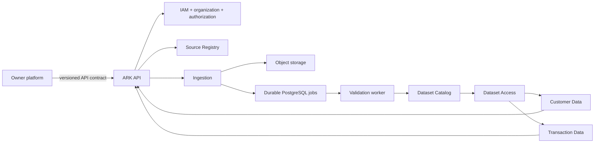

# ARK Starter Architecture — Simplified Data Lake

Status: starter implementation design  
Purpose: build the smallest sound ARK foundation without losing boundaries that
would be expensive or unsafe to repair later.

## 1. What stays non-negotiable

- ARK is one modular monolith and one coordinated release initially.
- One PostgreSQL cluster/database is used, with one owned schema and migrations
  per state-owning module.
- Large immutable data lives in object storage, not PostgreSQL.
- Every module reads or changes another module only through its public API.
- No API, capability, or module receives a raw database session, table model,
  bucket name, or object-storage path.
- Authentication creates a trusted subject; organization membership derives one
  trusted business scope; request JSON and path IDs never establish authority.
- Every accepted source uses an exact versioned contract and idempotency key.
- Raw bytes are stored before parsing so failures can be reproduced.
- Validation has two passes: a cheap structural pass and a complete semantic
  pass. Only fully validated, published versions are readable by services.
- Jobs that may outlive an HTTP request are durable, retryable, and fenced.
- Audit evidence is required for privileged changes and sensitive reads.

The upstream owner platform may transform data toward ARK contracts before
submission. ARK still verifies the submitted contract, tenant, bytes, values,
references, and readiness; upstream transformation is not a trust boundary.

## 2. Simplifications made for the first release

The earlier design separated lineage, governance, canonicalization, and each
domain into many layered modules. That is valid later but too large for the
first implementation.

For the starter release:

- minimal lineage and policy references are fields owned by Dataset Catalog;
- light and deep validation live in one Validation module;
- each data module begins with one commented `public.py`; split it into domain,
  application, ports, and adapters only when its code becomes substantial;
- Customer Data and Transaction Data own typed query shapes but do not get
  PostgreSQL serving projections initially;
- Dataset Access is stateless and reads only Catalog-approved object references;
- one Python data engine is used first;
- no scheduler, separate governance service, separate lineage service, cache,
  streaming platform, warehouse, or Rust component is required initially.

These are postponed splits, not removed responsibilities.

## 3. Smallest deployable shape



Runtime roles:

- `api`: authenticates requests and calls public module methods;
- `worker`: claims durable ingestion/validation/publication jobs;
- `maintenance`: migrations, explicit revalidation, and reconciliation;
- `scheduler`: not deployed until a named recurring schedule is approved.

These are process roles from the same codebase, not microservices.

## 4. Concise repository shape

```text
ark/
├── apps/                              # Thin API, worker, maintenance, and optional scheduler executables.
├── contracts/                         # Versioned external/public request and record schemas.
│   ├── common/identifiers.py          # Opaque IDs, checksums, idempotency keys.
│   └── data/                          # Ingestion and canonical customer/product schemas.
├── src/ark/
│   ├── bootstrap/                     # Settings, adapter wiring, lifecycle, runtime factories.
│   ├── gateway/                       # HTTP routes, middleware-derived context, public-port dependencies.
│   ├── modules/
│   │   ├── iam/                       # Authenticated identity and account status.
│   │   ├── organizations/             # Organization membership and trusted business selection.
│   │   ├── billing/                   # Credit policy, reservation, settlement, refund when an operation is billed.
│   │   ├── entitlements/              # Whether an operation/capability is currently allowed.
│   │   ├── jobs/                      # Durable jobs, attempts, leases, fencing, retry, cancellation.
│   │   ├── audit/                     # Append-only security and operator evidence.
│   │   └── data/                      # Small public data-owner modules described below.
│   └── infrastructure/                # PostgreSQL, object storage, worker loop, telemetry implementations.
└── tests/                              # Contract, isolation, retry, data-quality, and end-to-end tests.
```

## 5. Starter `modules/data` directory

```text
src/ark/modules/data/
├── common/
│   └── models.py                      # Tiny shared values: trusted context, opaque refs, receipts, reports, dataset versions, pages.
├── source_registry/
│   └── public.py                      # Register and resolve an exact admitted source-contract version.
├── ingestion/
│   └── public.py                      # Store immutable raw bytes idempotently and submit a validation job.
├── validation/
│   └── public.py                      # Run light structural checks, then deep allowed-value/domain checks.
├── catalog/
│   └── public.py                      # Publish and resolve immutable READY dataset versions with minimal lineage.
├── access/
│   └── public.py                      # Resolve READY data and perform bounded field/filter/page reads through a reader port.
├── customers/
│   └── public.py                      # Enforce customer-purpose/field rules and expose typed get/list operations.
└── transactions/
    └── public.py                      # Enforce supported transaction query shapes and bounded time-window reads.
```

`public.py` is intentionally flat for the starter. It may contain the public
types, port protocols, and a small application service. When a module grows,
split that file internally without changing its public imports.

### Module responsibilities

| Module | Owns now | Must not do |
|---|---|---|
| Source Registry | source registrations and exact admitted contract versions | store raw bytes or publish datasets |
| Ingestion | uploads/raw receipts, checksum, idempotency, ingestion status | define semantic validity or readiness |
| Validation | immutable light/deep reports and bounded findings | publish READY or authorize consumers |
| Dataset Catalog | dataset identity/version, readiness, object refs, minimal lineage/policy refs | expose arbitrary object paths or capability eligibility |
| Dataset Access | trusted scope, READY resolution, allowed bounded reads | own domain visibility rules or arbitrary SQL |
| Customer Data | customer fields, purpose-aware get/list, typed filters | authentication, job state, transaction ownership |
| Transaction Data | supported transaction projections and time/customer/product filters | customer ownership or generic query language |

## 6. Simple ingestion-to-read flow

1. API authentication derives the subject, organization, and exactly one
   business context.
2. Authorization and entitlements approve the operation. Billing reserves
   credit only when the admitted operation is chargeable.
3. Source Registry resolves the exact source and contract version.
4. Ingestion stores raw bytes immutably, records checksum/idempotency metadata,
   and creates a durable validation job.
5. Validation runs the light pass. Obvious malformed data is quarantined.
6. Validation runs the deep pass. Invalid values, references, lifecycle rules,
   or business invariants prevent publication.
7. The applicable domain owner creates canonical customer/transaction records;
   Catalog publishes a new immutable version only when required evidence passes.
8. Customer Data or Transaction Data calls Dataset Access, which resolves one
   READY version and performs a bounded read through an opaque object reference.

```text
RECEIVED
  -> LIGHT_VALID -> DEEP_VALID -> READY
  -> QUARANTINED (from either validation pass)
  -> NOT_READY   (publication evidence incomplete)
  -> STALE/REVOKED (a previously ready version is no longer permitted)
```

Old raw data, reports, and published versions are not modified in place.
Corrections and reprocessing create new runs and versions.

## 7. Two validation passes

| Pass | When | Examples | Result |
|---|---|---|---|
| Light | immediately after raw commit | checksum, size, media type, parseability, required top-level fields, obvious column mismatch | continue or quarantine quickly |
| Deep | immediately by durable job; later again when explicitly requested | all rows, allowed values, ranges, timestamps, currencies, duplicates, references, correction/tombstone rules | semantic pass/fail report |

A schedule is optional. Initial ingestion should queue deep validation directly.
Scheduled revalidation is added only for a named freshness, ruleset, reference,
restore, or policy-change requirement.

## 8. Storage ownership

### PostgreSQL

Use one database with these initial owned schemas:

| Schema | Minimum state |
|---|---|
| `data_sources` | sources and admitted contract versions |
| `data_ingestion` | uploads, ingestion runs, raw receipts, idempotency |
| `data_validation` | validation runs, summaries, report refs |
| `data_catalog` | datasets, immutable versions, readiness, object/validation/lineage refs |
| platform schemas | IAM, organizations, billing, entitlements, jobs, audit |

Dataset Access, Customer Data, and Transaction Data are stateless initially.
Add an owner-specific PostgreSQL projection only after measurements show that
object-backed reads cannot meet a named requirement.

Each schema has one writer module and its own migrations. Cross-schema writes,
direct model imports, and unrestricted joins are prohibited.

### Object storage

Keep only four logical classes initially:

```text
<opaque-business>/<owner-module>/<class>/<resource>/<version>/...
```

| Class | Contains | Normal readers |
|---|---|---|
| `raw` | exact accepted bytes and checksum manifest | ingestion/replay/validation |
| `quarantine` | rejected input and bounded error evidence | authorized operators |
| `canonical` | immutable published customer/transaction datasets | Dataset Access only |
| `reports` | large validation/reconciliation evidence | authorized report APIs/operators |

Contracts carry `object_ref`, never a bucket or key. The storage adapter resolves
that reference under trusted business, owner, class, resource, version, and
purpose scope.

## 9. Controlled data exposure

No service receives “data-lake access.” It receives a narrow public port.

```text
HTTP customer route
  -> CustomerData.get/list
  -> authorization for purpose and fields
  -> DatasetAccess.read_page
  -> Catalog.resolve_ready
  -> scoped DatasetReaderPort
  -> bounded projected rows
```

The APIs accept no SQL, table/schema names, object paths, or generic expression
language. Lists have a maximum limit, opaque cursor, approved fields, and typed
filters. The path `business_id` is only a lookup and must match server-derived
business context.

## 10. Minimum public API

```text
POST /v1/data/sources
GET  /v1/data/sources/{source_id}
GET  /v1/data/contracts/{contract_id}/versions/{version}

POST /v1/data/uploads
POST /v1/data/uploads/{upload_id}:commit
POST /v1/data/ingestions
GET  /v1/data/ingestions/{ingestion_id}

GET  /v1/data/validations/{validation_run_id}
GET  /v1/data/validations/{validation_run_id}/report

GET  /v1/datasets
GET  /v1/datasets/{dataset_id}/versions/{version}
POST /v1/datasets/{dataset_id}/versions/{version}:revalidate

GET  /v1/businesses/{business_id}/data/customers
GET  /v1/businesses/{business_id}/data/customers/{customer_id}
GET  /v1/businesses/{business_id}/data/transactions
```

Registration, upload commit, ingestion, replay, and revalidation require an
idempotency key. Responses return metadata, bounded rows, or opaque references,
not unrestricted large payloads.

## 11. Reliability and security minimums

- Unique database constraints enforce logical idempotency.
- A repeated idempotency key with different content is a conflict.
- Workers claim jobs with leases, heartbeat them, and use fencing tokens so an
  expired attempt cannot publish.
- Publication verifies object checksum and validation references before one
  catalog transaction makes a version discoverable.
- Every tenant-bearing row and object operation uses trusted business context.
- Secrets are loaded at runtime and never stored in source, contracts, logs, or
  object manifests.
- Logs contain request/job/ingestion/validation/dataset IDs but no raw PII.
- Backups cover PostgreSQL and immutable objects; restore includes catalog/object
  reconciliation before workers resume.

## 12. Python and Rust

Build the reference path in Python first. Keep byte-heavy parsing/validation
behind a `DataEngine` interface. Add Rust only when representative benchmarks
show a material bottleneck and parity tests prove identical outputs and error
semantics. Rust never owns authorization, catalog publication, audit, jobs, or
database schemas.

## 13. Recommended implementation order

1. IAM, organization/business context, authorization, audit, and basic billing.
2. Source Registry plus one customer source contract.
3. Inline ingestion, immutable raw storage, idempotency, and durable jobs.
4. Light and deep validation using the Python reference engine.
5. Catalog publication of one customer dataset and minimal lineage refs.
6. Dataset Access plus bounded Customer Data get/list.
7. Bulk upload and transaction data after the customer path works end to end.
8. Revalidation, reconciliation, restore tests, and operational hardening.

## 14. Explicitly deferred

- independent Lineage and Governance modules;
- per-domain PostgreSQL serving projections;
- a continuously running scheduler;
- generic export APIs;
- Redis, Kafka, a warehouse, a feature store, or a second database;
- Rust implementation before benchmark evidence;
- splitting each small module into many files merely to match a pattern.

Deferred items are introduced only with a named requirement, owner, failure
model, migration plan, and tests.

## 15. Teaching samples

Light commented code matching this architecture is under:

```text
sample-code/runtime-entrypoints/src/ark/modules/data/
```

It uses in-memory dictionaries and small protocols to explain ownership. Those
dictionaries are not a recommendation for production persistence; concrete
PostgreSQL/object-storage adapters belong under `infrastructure/` and are wired
only by `bootstrap/`.
