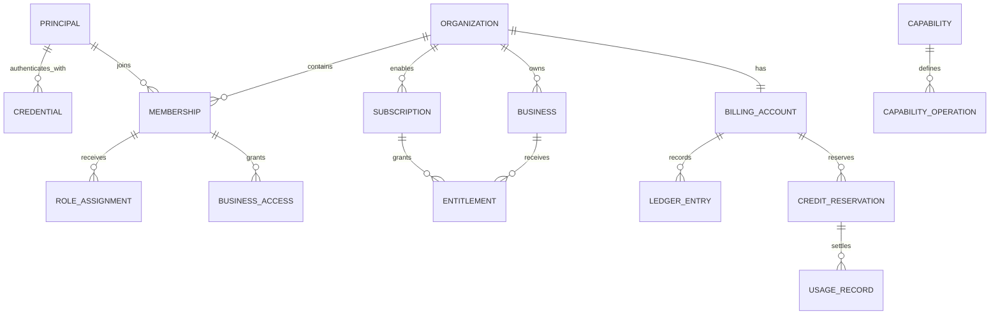

# ARK entities, PostgreSQL tables, and interactions

Status: starter-domain recommendation based on the current ARK architecture.  
Scope: the control-plane entities required before data ingestion or AI
capability use, followed by the entities and flows introduced when data and
capability execution begin.

## 1. Important meaning of “owner”

`Owner` should not be a standalone person table.

- An **owner platform** is an external system supplying data to ARK or consuming
  ARK results.
- An **organization owner** is a principal holding an active `ORG_OWNER` role.
- A **module owner** is an operational responsibility recorded through
  architecture/code ownership, not tenant data.

This permits multiple organization owners and safe ownership transfer instead
of permanently attaching an organization to one person.

## 2. Entities required before using data or AI services



### Identity and tenant entities

| Entity | Purpose |
|---|---|
| Principal | A human administrator, operator, or service/application identity. |
| Credential | Authentication metadata associated with a principal. Secrets and tokens are not stored directly. |
| Organization | Commercial and administrative tenant boundary. |
| Business | Data and execution boundary belonging to an organization. |
| Membership | Connects a principal to an organization. |
| Role assignment | Grants administrative or operational authority in an organization or business. |
| Business access | Restricts an organization member to specific businesses when necessary. |

Recommended interpretation:

- Organization owns billing, subscriptions, and administration.
- Business owns data, datasets, jobs, and capability-execution scope.
- One organization may contain multiple businesses.
- An authenticated request resolves one principal, one organization, and
  normally exactly one business.

### Capability-control entities

| Entity | Purpose |
|---|---|
| Capability | Global ARK capability definition, such as Recommendation or Churn. |
| Capability operation | A supported operation such as `recommend`, `train`, or `score`. |
| Subscription | Organization-level enablement of a capability. It does not ingest data or execute anything. |
| Entitlement | Grants a particular business access to a capability operation. |
| Quota policy | Defines allowed usage for an operation and scope. |
| Capability setting | Versioned business-specific configuration that is not private scientific implementation state. |

### Billing and usage entities

| Entity | Purpose |
|---|---|
| Billing account | Organization’s credit account and status. |
| Credit ledger entry | Immutable credit/debit/adjustment/refund record. |
| Credit reservation | Temporarily holds estimated credits before a job starts. |
| Usage record | Immutable evidence of actual metered use. |
| Audit event | Immutable evidence of security-sensitive decisions and mutations. |

Automated invoices, payment collection, taxation, and payment-provider records
are not currently required. ARK initially needs credits, reservations, usage,
settlement, refund/release, and reconciliation.

## 3. Suggested initial PostgreSQL tables

### IAM schema

| Table | Important columns |
|---|---|
| `iam.principals` | `principal_id`, `principal_type` (`human/service`), `display_name`, `status`, `created_at`, `disabled_at`, `row_version` |
| `iam.credentials` | `credential_id`, `principal_id`, `credential_type`, `issuer`, `external_subject`, `fingerprint_sha256`, `secret_ref`, `status`, `expires_at`, `last_used_at` |
| `iam.role_assignments` | `role_assignment_id`, `principal_id`, `organization_id`, optional `business_id`, `role_code`, `status`, grant/revocation evidence, `row_version` |

Passwords, API keys, bearer tokens, and private keys must not be stored directly.
Store a provider subject, fingerprint, non-reversible hash, or secret-manager
reference.

### Organizations schema

| Table | Important columns |
|---|---|
| `organizations.organizations` | `organization_id`, `name`, `status`, `created_by`, `created_at`, `version` |
| `organizations.businesses` | `business_id`, `organization_id`, `name`, `external_ref`, `status`, `created_at`, `version` |
| `organizations.memberships` | `membership_id`, `organization_id`, `principal_id`, `status`, `joined_at`, `suspended_at` |
| `organizations.membership_business_scopes` | `membership_id`, `business_id`, `access_level`, `granted_at`, `revoked_at` |

Recommended organization states:

```text
ACTIVE -> SUSPENDED -> ACTIVE
ACTIVE/SUSPENDED -> CLOSED
```

Recommended membership states:

```text
ACTIVE -> SUSPENDED -> ACTIVE
ACTIVE/SUSPENDED -> REVOKED
```

A current owner is represented by an active `ORG_OWNER` role assignment, not an
`owner_id` column on the organization.

### Control and entitlement schema

| Table | Important columns |
|---|---|
| `control.capabilities` | `capability_id`, `code`, `name`, `definition_version`, `status` |
| `control.capability_operations` | `operation_id`, `capability_id`, `operation_code`, `execution_mode`, `meter_code`, `status` |
| `control.subscriptions` | `subscription_id`, `organization_id`, `capability_id`, `status`, `starts_at`, `ends_at`, `version` |
| `control.entitlements` | `entitlement_id`, `business_id`, `operation_id`, `status`, `starts_at`, `expires_at`, `granted_by`, `version` |
| `control.quota_policies` | `quota_policy_id`, `organization_id`, optional `business_id`, `operation_id`, `period`, `allowed_units`, `status`, `version` |
| `control.capability_settings` | `setting_id`, `business_id`, `capability_id`, `settings_version`, `settings_json`, `status`, `effective_at` |

Recommended subscription states:

```text
PENDING -> ACTIVE -> SUSPENDED -> ACTIVE
ACTIVE/SUSPENDED -> CANCELLED
ACTIVE -> EXPIRED
```

Recommended entitlement states:

```text
ACTIVE -> SUSPENDED/REVOKED/EXPIRED
```

An entitlement cannot override a missing or inactive subscription.

### Billing schema

| Table | Important columns |
|---|---|
| `billing.billing_accounts` | `billing_account_id`, `organization_id`, `credit_unit`, `status`, optional cached balance, `version` |
| `billing.credit_ledger_entries` | `ledger_entry_id`, `billing_account_id`, `entry_type`, `amount`, `effect_id`, `reason_code`, `created_at`, `created_by` |
| `billing.credit_reservations` | `reservation_id`, `billing_account_id`, `business_id`, `operation_id`, requested/reserved units, `status`, `expires_at`, `idempotency_key`, `version` |
| `billing.usage_records` | `usage_record_id`, organization/business/operation/job/reservation IDs, measured units, charge amount, meter version, `recorded_at` |

Ledger entries are append-only. Corrections create compensating entries rather
than updating old entries.

Recommended reservation states:

```text
RESERVED -> SETTLED
RESERVED -> RELEASED
RESERVED -> EXPIRED
SETTLED -> REFUNDED/PARTIALLY_REFUNDED
```

Important uniqueness rules:

- one reservation per organization/business/operation/idempotency key;
- one usage effect per logical job/operation/meter version;
- one settlement effect per reservation;
- replaying an identical request must not charge twice;
- reusing an idempotency key for different content is a conflict.

### Audit schema

| Table | Important columns |
|---|---|
| `audit.audit_events` | event, organization/business/principal, action, target, decision, reason, request/correlation IDs, timestamp, details reference |

Audit is not an application log. It records authority and evidence such as
organization creation, membership/role changes, subscription activation,
entitlement grants, credit adjustments, reservation decisions, credential
disablement, and business suspension.

## 4. Entities introduced after onboarding

These are not prerequisites for creating an organization, but appear when data
and capabilities are used.

### Data entities

| Schema | Tables |
|---|---|
| `data_sources` | `sources`, `source_contract_versions` |
| `data_ingestion` | `upload_sessions`, `ingestion_runs`, `raw_receipts`, `ingestion_idempotency` |
| `data_validation` | `validation_runs`, `validation_report_refs` |
| `data_catalog` | `datasets`, `dataset_versions`, `dataset_version_objects`, `readiness_decisions` |

### Execution entities

| Schema | Tables |
|---|---|
| `jobs` | `jobs`, `job_attempts` |
| Capability-owned schema | `capability_runs`, `result_records`, optional model/configuration metadata |
| Object storage | raw data, quarantine data, canonical datasets, reports, results, and model artifacts |

## 5. Interactions before service usage

### Organization onboarding

1. Authenticate or register a principal.
2. Create an organization.
3. Create an active membership for the creator.
4. Assign `ORG_OWNER` to that principal/membership scope.
5. Create the organization’s billing account.
6. Create the first business.
7. Grant the owner access to that business.
8. Append audit events for every mutation.

Creating an organization does not automatically subscribe to capabilities,
ingest data, or create jobs.

### Member administration

- Add an existing principal as a member.
- Suspend or reactivate a membership.
- Remove or revoke a membership.
- Assign or revoke organization roles.
- Grant or revoke access to particular businesses.
- Transfer ownership by granting a new `ORG_OWNER` role before revoking the old
  assignment.
- Disable credentials independently from membership records.
- Audit every permission change.

The last active organization owner must not be removable until another active
owner exists.

### Business administration

- Create a business under an organization.
- Update non-authoritative metadata such as display name.
- Link an upstream external business reference.
- Activate, suspend, reactivate, or close the business.
- Grant members access to the business.
- Read business subscriptions, entitlements, usage, data, and jobs through
  their owner APIs.

Suspending a business prevents new ingestion and capability execution without
deleting historical evidence.

### Credential operations

- Register an external identity binding.
- Register a service credential reference.
- Rotate, revoke, or expire a credential.
- Disable all credentials for a principal.
- Authenticate and create immutable trusted context:

```text
AuthContext {
  principal_id,
  credential_id,
  organization_id,
  business_id,
  scopes,
  authenticated_at
}
```

Organization and business scope come from authenticated binding, membership,
and authorization resolution—not arbitrary request fields.

## 6. Subscription, entitlement, and configuration interactions

### Enable a capability

1. Authenticate an organization administrator.
2. Verify organization status.
3. Select an existing ARK capability definition.
4. Create or activate the organization subscription.
5. Grant selected businesses entitlements to specific operations.
6. Attach quota policies.
7. Optionally create versioned business settings.
8. Record audit evidence.

This operation does not ingest data or execute the capability.

### Disable a capability

1. Suspend or cancel the subscription.
2. Revoke or suspend business entitlements.
3. Reject new operation admission.
4. Use an explicit policy to decide whether existing jobs finish or cancel.
5. Preserve historical jobs, usage, results, and audit records.

### Change capability configuration

1. Authenticate an authorized administrator.
2. Read the current version and ETag.
3. Validate the proposal against the capability definition.
4. Write a new settings version using `If-Match`.
5. Audit old and new version references.
6. Do not mutate capability-private model/scientific state directly.

## 7. Credit and billing interactions

### Add credits

1. Authorize a billing administrator/operator.
2. Append a positive ledger entry.
3. Update an optional cached account balance/version.
4. Record the adjustment reason and effect ID.
5. Append an audit event.

### Reserve credits before work

1. Resolve the organization billing account.
2. Verify the account is active.
3. Evaluate subscription, entitlement, and quota.
4. Estimate units using a versioned meter policy.
5. Check available credits.
6. Create an idempotent reservation.
7. Return `reservation_id` to job admission.
8. Create the job referencing that reservation.

If reservation fails, no job is created.

### Successful completion

1. Capability finishes and commits its result.
2. Write one immutable usage record.
3. Calculate actual charge using the recorded meter version.
4. Settle the reservation.
5. Append the debit ledger entry.
6. Release unused reserved credits.
7. Link result, job, usage, reservation, and ledger effect.
8. Audit settlement when required.

### Failure or cancellation

Depending on the approved commercial policy:

- release the complete reservation;
- charge consumed units and release the remainder; or
- create a compensating refund after settlement.

The exact pricing and failure-charge policy remains unresolved. It must be
versioned rather than hard-coded.

### Reconciliation

- Find expired reservations.
- Find completed jobs without usage records.
- Find usage without settlement.
- Find duplicate effect IDs.
- Compare cached balance with ledger-derived balance.
- Release or correct through explicit compensating entries.
- Never silently edit ledger history.

## 8. Data-ingestion interaction

1. Authenticate a principal or service credential.
2. Resolve organization membership and one business.
3. Verify the business is active.
4. Check source-write entitlement and quota.
5. Reserve credits only if ingestion is a billed operation.
6. Resolve the exact registered source-contract version.
7. Register an upload or accept bounded inline data.
8. Store immutable raw bytes and checksum.
9. Create an ingestion run idempotently.
10. Submit a durable validation job.
11. Run light validation.
12. Run deep validation.
13. Build canonical customer/transaction data.
14. Publish a new immutable READY dataset version.
15. Record usage and settle/release any reservation.
16. Append audit and lineage evidence.

## 9. Capability-execution interaction

1. Authenticate and derive principal, organization, and business.
2. Verify organization and business are active.
3. Verify the subscription is active.
4. Verify the business entitlement for the requested operation.
5. Check quota and rate limits.
6. Resolve the exact READY dataset version.
7. Run capability-specific scientific eligibility.
8. Reserve credits if chargeable.
9. Create a durable job with reservation, dataset, operation, configuration,
   and idempotency references.
10. Worker claims the job using a lease and fencing token.
11. Capability executes without accessing sibling internals.
12. Commit the result.
13. Record usage.
14. Settle or release the credit reservation.
15. Append audit and trace evidence.
16. Return bounded result metadata or an opaque result reference.

These checks are deliberately separate:

```text
Subscription enabled
    != data ingested
    != dataset READY
    != capability scientifically eligible
    != capability executed
```

## 10. Recommended starting migration order

1. `iam.principals`
2. `iam.credentials`
3. `organizations.organizations`
4. `organizations.businesses`
5. `organizations.memberships`
6. `iam.role_assignments`
7. `organizations.membership_business_scopes`
8. `control.capabilities`
9. `control.capability_operations`
10. `control.subscriptions`
11. `control.entitlements`
12. `control.quota_policies`
13. `billing.billing_accounts`
14. `billing.credit_ledger_entries`
15. `billing.credit_reservations`
16. `billing.usage_records`
17. `audit.audit_events`

Then add source, ingestion, validation, catalog, and job tables for the first
end-to-end data slice.

## 11. Current unresolved production decisions

- authoritative IdP and credential types;
- issuer/audience and tenant-claim binding;
- human and workload authentication assurance;
- credential lifetimes, rotation, and revocation;
- exact roles, permissions, prohibited role combinations, stronger
  authentication, dual control, and emergency access;
- exact commercial pricing, meter, failure-charge, invoice, and payment policy.

The starter schemas remain provider-neutral and deny production activation
until these policies and their tests are approved.

