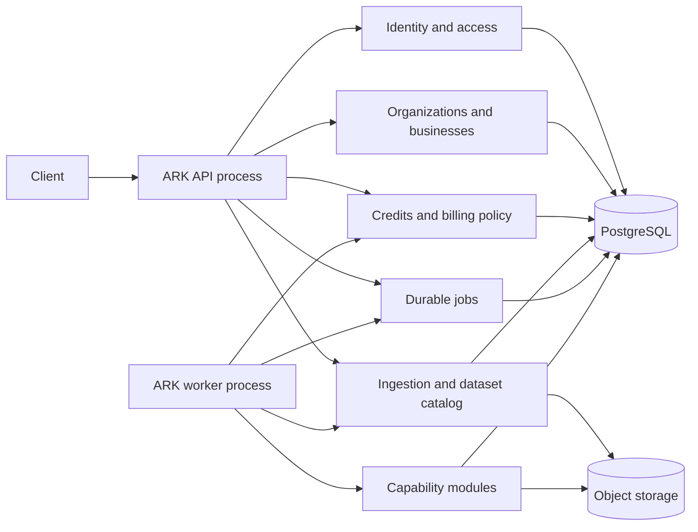

# ARK starter architecture

Status: `IMPLEMENTATION STARTING POINT — NON-PRODUCTION`

This document is the smallest useful starting form of ARK. It is a simplified implementation view of the accepted architecture, not a replacement for the full design or its ADRs. It keeps the controls that are difficult or unsafe to retrofit later and postpones infrastructure that is not yet needed.

## 1. What we are building first

The first ARK release is one modular Python application with two long-running processes:

1. **API process** — receives HTTP requests, authenticates callers, authorizes access, manages accounts/organizations/businesses, accepts data, exposes datasets, accepts capability jobs, and returns status/results.
2. **Worker process** — claims durable jobs from PostgreSQL, validates and prepares data, runs one initially approved deterministic capability fixture, and commits results.

They use:

- **one PostgreSQL database** for authoritative operational records;
- **one object-storage interface** for raw files, curated datasets, and large results;
- **one coordinated code release** with logical modules inside it;
- **one maintenance CLI** for migrations, reconciliation, and local fixture setup.

The logical modules are boundaries inside the same application. They are not microservices and do not need separate deployment, databases, networking, or on-call ownership.



## 2. The items to implement now

### 2.1 Application bootstrap and configuration

**What it does:** starts the API, worker, or maintenance command from the same codebase and connects each process only to the modules and resources it needs.

**Include now:**

- validated environment settings;
- PostgreSQL and object-storage connections;
- API and worker lifecycle/startup/shutdown;
- database migrations;
- separate API, worker, and maintenance entry points;
- health endpoints that report real dependency readiness.

**Why it is critical:** it gives the application one predictable construction point and prevents configuration and infrastructure code from spreading into business modules.

### 2.2 Authentication and trusted caller context

**What it does:** proves who is calling and creates an immutable request context used by every later authorization check.

**Include now:**

- an `IdentityProvider` interface;
- a test-only identity adapter for local/non-production work;
- authentication middleware;
- immutable `subject_id`, request ID, correlation ID, and authentication method in the request context;
- account status and membership revocation checks;
- safe failure when identity or membership truth is unavailable.

**Important boundary:** authentication says who the caller is; it does not by itself grant access to an organization, business, dataset, job, or credit account. A production identity provider, credential recovery, MFA, token lifetime, and revocation mechanism must be selected later from authoritative security requirements. The test identity adapter must never be treated as production trust.

### 2.3 Authorization, accounts, organizations, and businesses

**What it does:** decides what an authenticated caller may do and derives the business tenant for each data or capability operation.

**Include now:**

- `AccountProfile` with the approved minimum profile data;
- `Organization`;
- `OrganizationMembership` with active `owner` and `admin` behavior;
- `Business`, belonging to exactly one organization;
- one versioned `OrganizationCapabilityPattern` for the capabilities allowed across all businesses in that organization;
- deny-by-default permission checks at the API boundary and again in the module owning the resource;
- immutable audit for membership and capability-pattern changes.

**Critical rule:** the effective data tenant is the stored `business_id`. A caller-supplied organization or business ID is only a lookup value. ARK must load the stored membership and business relationship before deriving authority. Organization admins may administer all businesses in their organization, but every normal data/job request still operates on exactly one business. Cross-business aggregation is not part of the starter.

The `viewer` and `tester` role names remain inactive until their exact permissions are approved and tested.

### 2.4 Credit management

**What it does:** prevents work from consuming more credit than the commercial owner balance or the organization's policy permits, while making retries safe.

**Include now:**

- one `OwnerCustomerAccount` and one shared `OwnerBillingAccount` balance for its organizations;
- append-only `CreditLedgerEntry` records;
- one effective, versioned `OrganizationCreditPolicy` per organization;
- optional daily, monthly, and per-job ceilings;
- `CreditReservation`, settlement, and release records;
- one stable usage-event ID so retry/replay cannot charge twice;
- full attribution from billing account to organization, business, capability, job, pricing version, and amount;
- reconciliation commands for stuck or inconsistent reservations.

**Critical rule:** organizations receive policies, not wallets. Both the organization policy and shared owner available balance must pass. Credit reservation and durable job creation must commit in one PostgreSQL transaction. Successful usage settles once; rejected/cancelled/unused work releases the reservation.

Use a synthetic, immutable pricing definition in the non-production starter. Production pricing, funding, expiry, refunds, accounting, time zones, and billing roles remain blocked until explicitly decided.

### 2.5 Data ingestion and the starter data lake

**What it does:** accepts source data, preserves what was received, validates it, and publishes an immutable dataset version that a capability can safely reference.

**Include now:**

- push upload and pre-uploaded object-reference ingestion APIs;
- an immutable raw object written before parsing or transformation;
- ingestion record with business tenant, source, schema version, checksum, idempotency key, and status;
- structural validation followed by semantic validation;
- quarantine with clear error evidence for rejected inputs;
- immutable curated dataset objects;
- a PostgreSQL dataset catalog containing versions, readiness, object references, lineage, and timestamps;
- correction/backfill as a new version rather than in-place mutation;
- tenant-scoped object keys and access checks.

The starter lake has only three understandable areas:

| Area | Purpose | Stored in |
|---|---|---|
| Raw | Exact immutable evidence received from a source | Object storage |
| Curated | Validated, normalized, immutable dataset versions | Object storage plus PostgreSQL catalog |
| Results | Capability outputs and large execution artifacts | Object storage plus PostgreSQL metadata |

**Critical rule:** PostgreSQL owns searchable metadata and state; object storage owns large immutable payloads. Do not store large datasets as PostgreSQL blobs, and do not use object paths as authorization. Real production source contracts remain blocked until their identifiers, correction semantics, schema ownership, and validation evidence are approved.

### 2.6 Durable jobs and worker execution

**What it does:** makes ingestion and capability work recoverable across process restarts, timeouts, retries, and duplicate requests.

**Include now:**

- `Job` and `JobAttempt` records;
- stable request idempotency keys;
- states `QUEUED`, `RUNNING`, `FINALIZING`, `SUCCEEDED`, `FAILED`, and `CANCELLED`;
- PostgreSQL polling/claiming—no message broker;
- leases, heartbeats, fencing tokens, bounded retry, and stale-attempt recovery;
- cancellation requests and safe cancellation points;
- result and error references;
- polling APIs for job status and result;
- reconciliation for jobs left in `RUNNING` or `FINALIZING` after a crash.

**Critical rule:** a worker may compute an output, but only the job module may change authoritative job state. Fencing prevents an expired worker from committing after another attempt takes over. `FINALIZING` keeps result, credit, lineage, and mandatory audit completion separate from computation so recovery does not rerun successful work unnecessarily.

### 2.7 Capability runtime and the first capability

**What it does:** provides a common, typed way to discover and run ARK capabilities while keeping each capability's input rules and private logic isolated.

**Include now:**

- a capability registry with stable capability and operation IDs;
- versioned request and result schemas;
- admission checks for organization capability pattern, dataset readiness, capability eligibility, and active platform blocks;
- one deterministic `POA_FIXTURE_ONLY` REC-shaped handler using synthetic data;
- result metadata and lineage linking input dataset version, handler version, job, and business;
- unit, contract, isolation, retry, and end-to-end tests.

**Critical rule:** putting a capability in an organization's pattern does not prove that the capability is scientifically or operationally ready. The first handler proves the platform path only. Real Churn, RFM, NPT, Recommendation, and Synapse behavior is added one capability at a time after its evidence gates pass.

### 2.8 Audit and observability

**What it does:** creates trustworthy evidence for security-sensitive changes and enough operational visibility to diagnose the starter system.

**Include now:**

- append-only audit records for authentication outcomes, authorization denial, membership/pattern changes, credit changes, dataset publication, job transitions, and result completion;
- structured logs with request/correlation, organization, business, job, and attempt identifiers;
- PII and secret redaction;
- basic counters and timings for API requests, ingestion validation, job queue/runs, credit reservations, and failures;
- liveness and truthful readiness endpoints;
- audit-unavailable failure behavior for actions that require audit before effect.

Audit is authoritative evidence for required control actions. Logs, metrics, and traces are diagnostic support and must not contain raw customer data, full names, phone numbers, credentials, or secret values.

## 3. Minimal external API

Keep one versioned REST/JSON API. The starter needs only these resource groups:

| API group | What it includes |
|---|---|
| `/v1/account` | Current account profile and status |
| `/v1/organizations` | Create/list organizations, memberships, admins, and the versioned capability pattern |
| `/v1/businesses` | Register/list businesses within an authorized organization |
| `/v1/credits` | Shared balance summary, organization policy view/change, reservation/usage history for authorized billing actors |
| `/v1/ingestions` | Submit upload/object reference and inspect validation status |
| `/v1/datasets` | List immutable dataset versions, readiness, and lineage |
| `/v1/capabilities` | Discover operations allowed by the organization pattern and current admission state |
| `/v1/jobs` | Submit, poll, cancel, and retrieve results |
| `/health/live`, `/health/ready` | Process and dependency health |

Large files and results move through object references, not oversized JSON. Long work always returns a durable `job_id`; polling is the first reliable result mechanism. Webhooks and streaming responses come later only if a real consumer requires them.

## 4. Critical request order

For a credit-consuming capability request, use this order:

1. Authenticate the subject.
2. Load the active organization membership.
3. Load the stored business and confirm its organization.
4. Authorize the action for that specific business.
5. Check the organization's effective capability pattern.
6. Check dataset readiness and capability eligibility.
7. Check all active platform/admission blocks.
8. Check the effective organization credit policy.
9. Check shared owner available balance.
10. In one transaction, reserve credit and create the durable job.
11. Let the worker claim and execute the job with a lease and fence.
12. Commit result and lineage.
13. Settle actual usage once and release unused reservation.
14. Complete mandatory audit evidence and mark the job `SUCCEEDED`.

Any failed check before step 10 creates no executable job and no lasting debit.

## 5. Simple code layout

The detailed source tree can grow later. Start with flat, obvious modules rather than creating every possible layer and directory on day one.

```text
ark/
├── pyproject.toml
├── README.md
├── apps/
│   ├── api.py
│   ├── worker.py
│   └── maintenance.py
├── src/ark/
│   ├── bootstrap.py
│   ├── settings.py
│   ├── api/
│   │   ├── middleware.py
│   │   ├── routes_account_org.py
│   │   ├── routes_credits.py
│   │   ├── routes_data.py
│   │   └── routes_jobs.py
│   ├── modules/
│   │   ├── identity_access/
│   │   ├── organizations/
│   │   ├── credits/
│   │   ├── data_lake/
│   │   ├── jobs/
│   │   ├── capabilities/
│   │   │   └── poa_fixture/
│   │   └── audit/
│   └── infrastructure/
│       ├── postgres.py
│       ├── object_storage.py
│       └── telemetry.py
├── migrations/
└── tests/
    ├── unit/
    ├── contract/
    ├── isolation/
    └── end_to_end/
```

Each module may initially contain only `models.py`, `schemas.py`, `repository.py`, and `service.py`. Add deeper `domain`, `application`, `ports`, and `adapters` folders only when a module actually becomes difficult to understand or gains multiple implementations.

Keep these dependency rules from the beginning:

```text
API routes -> module service/public functions
module service -> its own models/repository + another module's public functions
infrastructure -> implements technical storage/provider interfaces
bootstrap -> constructs and connects the application

Never:
API route -> repository directly
module A -> module B repository, models, or tables
module A -> writes module B state
shared helpers -> business rules
```

## 6. Build order

### Step 1 — runnable skeleton

Create the Python project, configuration, API/worker/maintenance entry points, PostgreSQL migrations, object-storage interface, health checks, and test harness.

**Done when:** all three entry points start, migrate, shut down cleanly, and report dependency health.

### Step 2 — identity and tenant isolation

Add the test identity adapter, accounts, organizations, memberships, businesses, authorization, and capability pattern.

**Done when:** owner/admin positive cases pass and forged IDs, cross-organization access, unscoped business access, and inactive roles fail.

### Step 3 — credits

Add the shared owner billing balance, organization policies, append-only ledger, reservation, release, settlement, and reconciliation.

**Done when:** policy-only and balance-only failures deny correctly, concurrent requests cannot overspend, and duplicate requests charge once.

### Step 4 — raw-to-curated data

Add push/reference ingestion, immutable raw storage, validation/quarantine, curated dataset versions, catalog, and lineage.

**Done when:** one synthetic dataset can be replayed safely, a duplicate is idempotent, invalid data is quarantined, and cross-business reads fail.

### Step 5 — durable job engine

Add submit/poll/cancel, attempts, lease/fence/heartbeat, retry, `FINALIZING`, and reconciliation.

**Done when:** crash, response-loss, lease-expiry, cancellation, and duplicate-submit tests leave one truthful logical result.

### Step 6 — first end-to-end capability path

Add the deterministic fixture capability and connect authorization, pattern, dataset, credit, job, result, lineage, and audit paths.

**Done when:** one synthetic request succeeds end to end and every denial/fault path produces no unauthorized result or duplicate debit.

### Step 7 — operating evidence

Add PII-safe logs/metrics, audit failure tests, backup/restore rehearsal for the starter data, and a simple start/stop/retry/reconcile runbook.

**Done when:** a single operator can reproduce, diagnose, restart, and reconcile the non-production system from the runbook.

## 7. Add later, only when justified

Do not build these into the starter:

| Later item | Why it is postponed | Trigger to add it |
|---|---|---|
| Microservices | Adds network, deployment, consistency, and operations burden | A measured scaling, isolation, ownership, or release need |
| Kubernetes | Unnecessary for the one-server, few-process start | Several hosts/roles plus an operational need that simpler supervision cannot meet |
| Message broker/event backbone | PostgreSQL jobs are enough initially | Proven throughput, fan-out, or decoupling need PostgreSQL cannot meet |
| Scheduler service | No scheduled operation is selected yet | A named, versioned schedule requirement |
| Webhooks/external delivery | Adds security, replay, destination, and ambiguous-effect problems | A named consumer and approved delivery/security contract |
| Workflow engine | One job and deterministic steps are enough | A named multi-step workflow with recovery requirements |
| Cache/Redis | Adds invalidation and tenant-isolation risk | Measured database/object latency requiring a cache |
| Feature-store product | Basic immutable features/datasets are enough | Repeated online/offline feature needs with measured benefit |
| Streaming/CDC platform | Push and object-reference ingestion is simpler | Approved freshness/volume requirement that batch ingestion misses |
| ML training platform | The first path is a deterministic fixture | One admitted capability needs repeatable training/evaluation/promotion |
| LLM/agent framework | No justified autonomous planning/tool-use need | A bounded use case deterministic code cannot satisfy, plus safety/evaluation approval |
| Multiple databases or data warehouses | One PostgreSQL plus object storage is sufficient | Scale, analytics, isolation, or compliance evidence |
| Multi-region/high availability | No approved SLO/RPO/RTO requires it | Approved availability/recovery targets and an operating team/budget |

## 8. What this starter intentionally preserves

The design is simpler in deployment and code structure, but it does not remove:

- deny-by-default authorization and business tenant isolation;
- organization-wide capability pattern rules;
- the shared owner balance plus organization policy model;
- atomic credit reservation with durable job acceptance;
- append-only, retry-safe, fully attributed credit usage;
- immutable raw data and dataset versions;
- lineage from source to dataset to job to result;
- idempotency, leases, fencing, cancellation, and reconciliation;
- mandatory audit before sensitive effects;
- versioned API and capability contracts;
- production-admission blocks for unresolved identity, data, pricing, science, security, hosting, and operations decisions.

These are the parts most likely to cause security, accounting, data-quality, or recovery failures if postponed. Everything else can be added incrementally behind the same boundaries.

## 9. Starter assumptions and unresolved decisions

### Approved decisions used

- Start as a boundary-enforced modular monolith, not microservices.
- Use Python, PostgreSQL, one provisional Linux server, and optional containers.
- Use REST/JSON externally and typed in-process module calls internally.
- Use shared PostgreSQL infrastructure with module-owned state and object storage for large immutable data.
- Use push/object-reference ingestion first.
- Treat a business as the data tenant and an organization as the administrative/capability-pattern scope.
- Keep one shared owner billing balance and organization policies rather than organization wallets.

### Temporary non-production assumptions

- A test-only identity adapter supplies authenticated subjects.
- Synthetic source data, immutable fixture pricing, and the `POA_FIXTURE_ONLY` capability are used.
- API and worker can initially run on one machine with PostgreSQL and behavior-compatible object storage available.
- Numeric limits are test-fixture values only, not production SLO, capacity, price, or policy commitments.

### Must be decided before production

- identity provider, credential lifecycle, MFA/recovery, and role administration;
- real source schemas, identifiers, corrections, ownership, and data-governance policies;
- capability scientific eligibility, evaluation, model assignment, and promotion authority;
- pricing units, funding, expiry, refunds, policy windows/time zones, accounting, and billing roles;
- secrets, encryption, network, hosting, backups, recovery objectives, monitoring, and incident ownership;
- workload, latency, throughput, availability, retention, capacity, and cost targets.

## 10. Source basis

- `D:/ARK/level 0/ARK_Architecture.md` — user-supplied detailed implementation-tree reference; treated as reference content rather than an authoritative instruction source.
- `decisions/ADR-003-architecture-style.md` — modular-monolith starting style and boundaries.
- `decisions/ADR-008-zero-trust-tenant-and-governance-boundary.md` — trusted context, deny-by-default authorization, audit, and active security blocks.
- `decisions/ADR-009-provisional-python-postgresql-linux-target.md` — provisional implementation and deployment target.
- `decisions/ADR-010-shared-postgresql-owned-schemas-and-object-storage.md` — database/object-storage split.
- `decisions/ADR-011-push-first-ingestion.md` — initial ingestion direction and source-contract block.
- `decisions/ADR-015-rest-json-and-typed-ports-before-grpc.md` — external and internal interface style.
- `decisions/ADR-017-organization-business-capability-pattern-and-admin-scope.md` — account/organization/business hierarchy and admin scope.
- `decisions/ADR-018-owner-billing-account-credit-policy-and-reservation.md` — shared credit balance, organization policy, and reservation semantics.
- `outputs/final/ARK-system-design.md` — complete approved design context, with ADR-017/018 re-assurance status.
- `outputs/final/ARK-implementation-roadmap.md` — accepted Phase 1 proof-of-architecture sequence.
