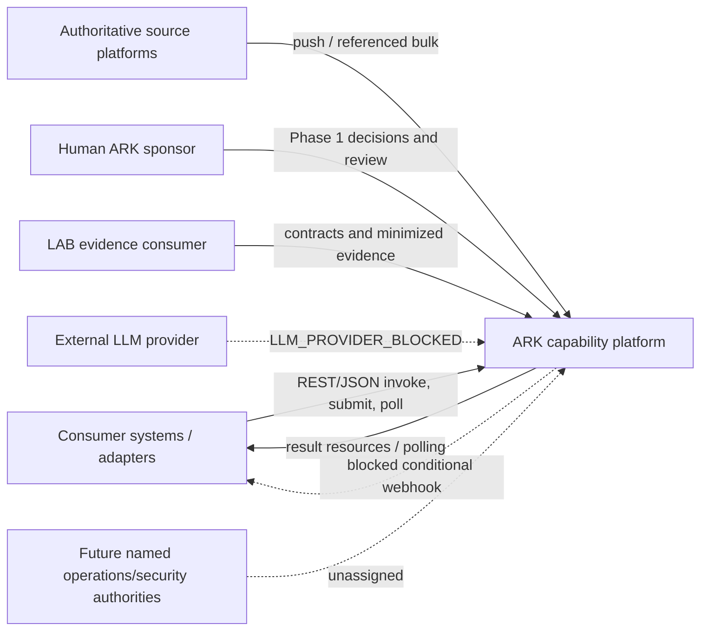
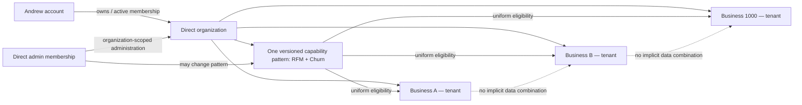
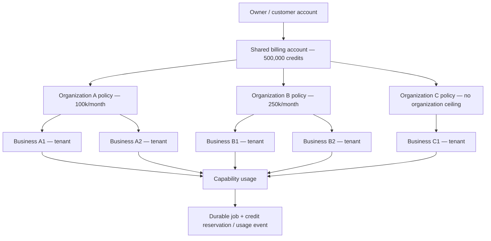
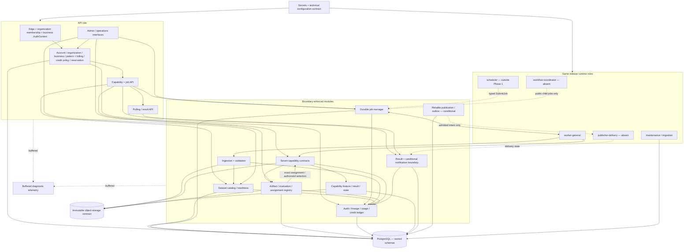
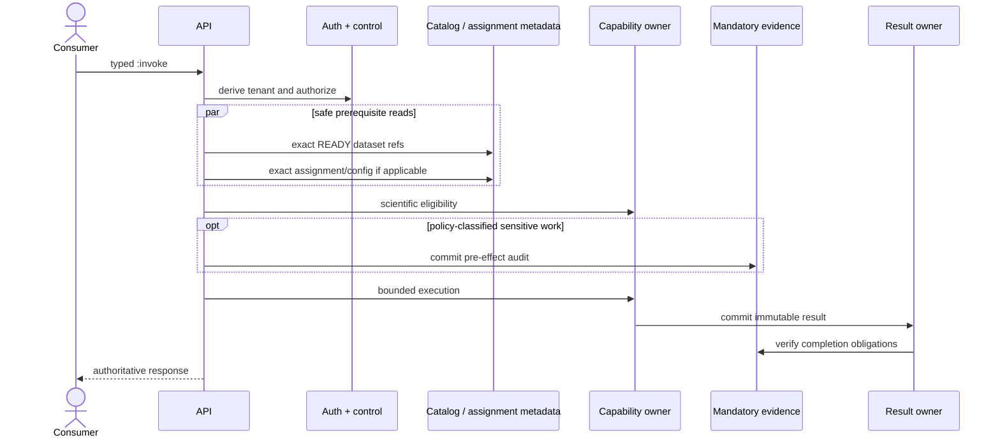
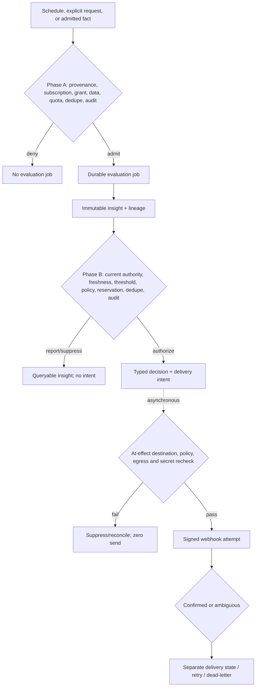
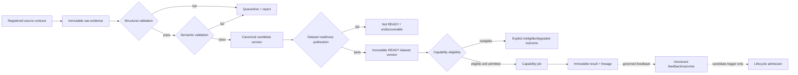
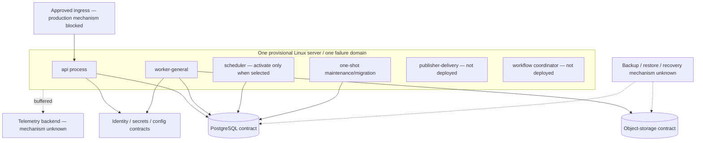

# ARK architecture diagrams — ADR-017/018 publication revision

Status: `POST-PUBLICATION REVISION — ADR-017/018 ACCEPTED; INDEPENDENT RE-ASSURANCE PENDING`

Legend: solid paths are required logical contracts; dashed paths are conditional, blocked or supporting. A box is not necessarily a separately deployed service. Red/block labels mean unavailable, not planned work.

## 1. System context



## 1a. Account, organization, business, and capability-pattern scope



An organization is the administrative/entitlement container; each business is an isolated tenant. Organization-wide admin scope permits access to every member business only through a separately derived one-business context. It does not authorize an untyped cross-business dataset, query, job, result, or export.

## 1b. Shared owner billing account and organization credit policies



Organizations have policy ceilings, not balances or wallets. Every admitted job must pass both its organization's effective policy and the owner's shared available-balance check. The numeric labels illustrate the sponsor example and are not ARK defaults.

## 2. Logical component architecture



## 3. Synchronous request flow — target contract only



No current capability profile is admitted to production synchronous execution. Under ADR-018, every credit-consuming execution requires a durable logical job/reservation identity; `:invoke` remains unpriced/zero-credit unless a later contract preserves the same job and financial truth.

## 4. Durable asynchronous flow

```mermaid
sequenceDiagram
    actor Consumer
    participant API
    participant Control
    participant Catalog as Dataset catalog/readiness
    participant Jobs as PostgreSQL job manager
    participant Worker
    participant Cap as Capability/result owner
    participant Registry as Assignment registry
    participant Credit as Organization policy + owner balance
    participant Evidence
    Consumer->>API: submit + idempotency key
    API->>Control: derive organization/business scope; check pattern and exact command/refs
    API->>Catalog: check exact dataset version is READY
    API->>Registry: check exact assignment/version and revocation
    API->>Cap: check capability eligibility
    API->>Credit: check organization policy + shared owner balance
    rect rgb(235, 245, 255)
        API->>Credit: create active credit reservation
        API->>Jobs: commit one logical job
    end
    Jobs-->>API: durable job id
    API-->>Consumer: 202 + polling URLs
    Worker->>Jobs: claim leases and fenced attempt
    Jobs-->>Worker: exact handler + fence
    Worker->>Control: recheck membership, business parent, pattern, entitlement, grant, policy and quota
    Worker->>Credit: recheck active reservation/current financial authority
    Worker->>Catalog: recheck exact dataset version is READY
    Worker->>Registry: recheck exact assignment/version and revocation
    Worker->>Cap: recheck capability eligibility for exact inputs
    opt sensitive work
        Worker->>Evidence: pre-effect audit
    end
    Worker->>Cap: execute public handler
    Cap->>Cap: commit owner result
    Cap-->>Jobs: result ref
    Worker->>Credit: settle unique usage + release unused reservation
    Jobs->>Evidence: link completion evidence
    Jobs->>Jobs: FINALIZING to SUCCEEDED
    Consumer->>API: poll
    API-->>Consumer: job/result truth
```

Only the synthetic `POA_FIXTURE_ONLY` Phase 1 path is immediately runnable, and only in validation.

## 5. Proactive insight and conditional delivery



The path is inactive and `EXTERNAL_DELIVERY_BLOCKED`; webhook outcome never changes insight/result truth.

## 6. Data lifecycle



The synthetic Phase 1 contract does not clear `DATA_CONTRACT_ADMISSION_BLOCKED`.

## 7. Provisional deployment architecture



This diagram makes no HA, RPO/RTO, capacity, provider, network or production-fitness claim. Containers are optional and Kubernetes is not selected.

## Diagram provenance and validation

| Diagram | Exact approved basis |
|---|---|
| 1. System context | `outputs/stages/19-diagrams.md — Diagram 1 — System context`; `outputs/stages/02-system-definition.md — System boundary` |
| 1a. Account/organization/business scope | `sources/sponsor-decisions/2026-08-15-owner-organization-business.md`; accepted ADR-017 |
| 1b. Shared owner billing/organization credit policy | `sources/sponsor-decisions/2026-08-15-owner-billing-credit-management.md`; accepted ADR-018 |
| 2. Logical architecture | `outputs/stages/19-diagrams.md — Diagram 2 — Logical container/component architecture`; `outputs/stages/05-end-to-end-architecture.md — Component inventory`; `outputs/stages/22-runtime-execution-analysis.md — Runtime element usage and placement matrix` |
| 3. Synchronous request | `outputs/stages/19-diagrams.md — Diagram 3 — Synchronous request flow`; `outputs/stages/22-runtime-execution-analysis.md — UC-22-01 — Synchronous inference` |
| 4. Durable asynchronous job | `outputs/stages/19-diagrams.md — Diagram 4 — Asynchronous durable-job flow`; `outputs/stages/22-runtime-execution-analysis.md — UC-22-02 — Asynchronous inference or batch job` |
| 5. Proactive action | `outputs/stages/19-diagrams.md — Diagram 5 — Proactive ML insight and event-delivery flow`; `outputs/stages/09-events-proactive-actions.md — Two-phase fail-closed decision order`; `outputs/stages/22-runtime-execution-analysis.md — UC-22-05 — Proactive insight and webhook delivery` |
| 6. Data lifecycle | `outputs/stages/19-diagrams.md — Diagram 6 — Data lifecycle and ML feedback`; `outputs/stages/06-data-architecture.md — Concrete data lifecycle — transaction file to recommendation result`; `outputs/stages/06-data-architecture.md — Four-layer acceptance model` |
| 7. Deployment | `outputs/stages/19-diagrams.md — Diagram 7 — Provisional deployment architecture`; `outputs/stages/15-deployment-infrastructure.md — Deployable runtime-role matrix` |

The original seven assembled Mermaid charts rendered successfully on 2026-08-14 with Mermaid CLI 11.16.0. Stage 24 independently verified their visual-to-contract consistency after the asynchronous authority-order repair. Diagrams 1a/1b and the ADR-017/018 label/flow revisions were added after that assurance and require render verification plus independent re-assurance. The transferred Windows environment could not relaunch the CLI during the original closure; `outputs/stages/24-final-assurance.md — Accepted residual risks` records that historical tooling limitation.
