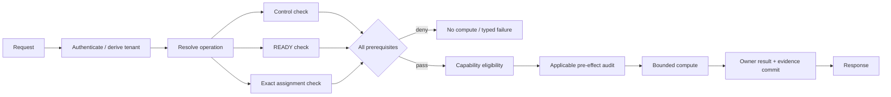
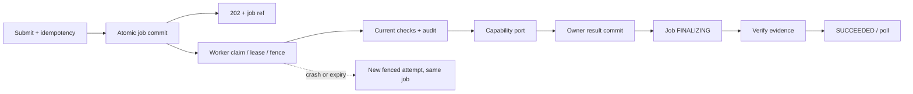
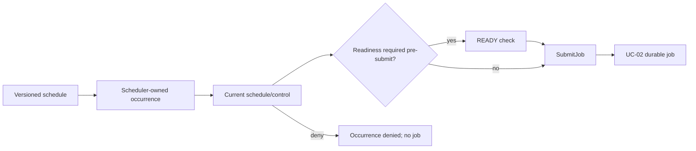
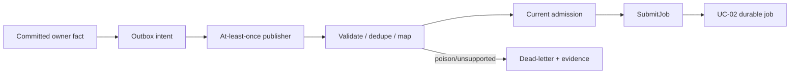
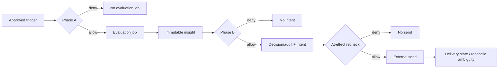
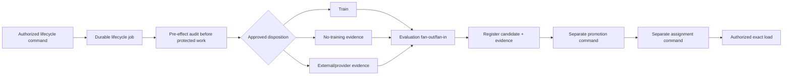
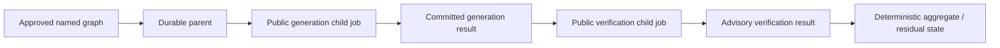
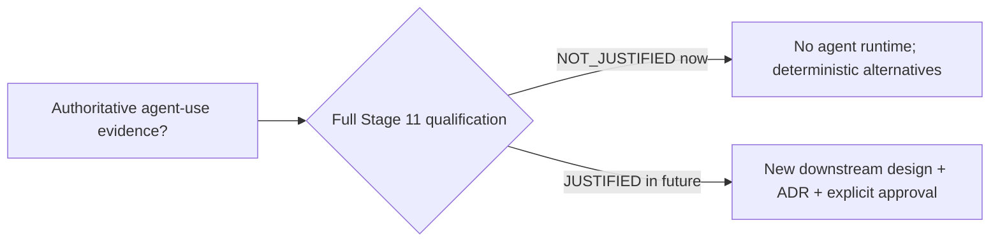
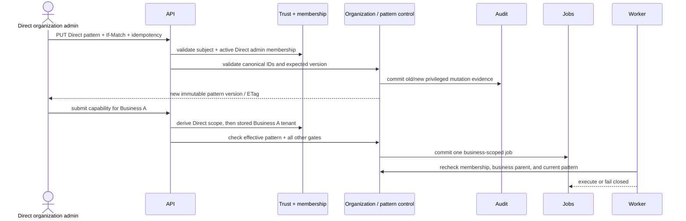

# ARK execution flows — ADR-017/018 publication revision

Status: `POST-PUBLICATION REVISION — ADR-017/018 ACCEPTED; INDEPENDENT RE-ASSURANCE PENDING`

The authoritative detailed four-artifact packages are in `outputs/stages/22-runtime-execution-analysis.md — UC-22-01 through UC-22-08`. This publication carries their activation, exact critical order, concurrency, failure and supporting-path decisions.

## Execution laws

- Authentication and trusted tenant context precede every tenant lookup.
- READY data is a prerequisite to capability eligibility, not a peer or substitute.
- Parallel work requires immutable independent inputs, bounded leases, explicit fan-in and partial/failure policy.
- Policy-applicable pre-effect audit precedes sensitive access/compute/effect; completion evidence is separate.
- Owner output commits before job `FINALIZING`; the job manager verifies evidence before `SUCCEEDED`.
- Retry repeats the failed boundary: attempt, finalization or delivery—not the whole workflow by default.
- Diagnostic export is asynchronous; mandatory audit may be critical. Delivery never becomes result truth.

## Flow summary

| Use case | Activation | Exact critical order | Permitted concurrency | Failure/retry boundary | Supporting path |
|---|---|---|---|---|---|
| Synchronous inference | Target only; no admitted production profile | ingress → auth/control → READY/assignment prerequisite fan-in → capability eligibility → applicable audit → exact load → bounded compute → owner result/evidence → response | Safe immutable prerequisite reads only | No silent background continuation; same-key replay resolves committed truth | Buffered telemetry only |
| Async/batch | Phase 1 fixture only; real profiles blocked | admission → atomic job/idempotency → `202` → claim/fence → recheck/audit → compute → owner result → `FINALIZING` → evidence → poll | Declared immutable partitions with explicit fan-in | New attempt, same job; finalization never recomputes | Conditional delivery separate |
| Scheduled ML | Conditional; scheduler outside Phase 1 | occurrence lease/identity → current schedule/control → optional declared readiness or WAITING → SubmitJob → async flow | Independent occurrences under configured scopes | Duplicate schedulers converge by occurrence key | Optional committed fact after result |
| Event-triggered | Conditional/inactive | source fact+outbox → publisher → validate/dedupe/map → current admission → SubmitJob → async flow | Other events only under ordering/concurrency policy | At-least-once event; same event+handler maps to same job | Dead-letter/replay and telemetry |
| Proactive/webhook | Conditional/blocked | trigger → Phase A → evaluation → insight → Phase B → decision/audit/intent → at-effect recheck → send | Independent reads inside gates; gates remain ordered | Ambiguous external effect reconciled before retry; never reevaluate on delivery retry | Polling authoritative; delivery separate |
| Model lifecycle | Target only; all profiles blocked | admission/audit → approved training disposition → applicable evaluation → register evidence → `FINALIZING` → separate promotion → separate assignment → exact load | Independent evaluation slices under fan-in | Checkpoint/finalization boundaries; no auto-promotion | Feedback/drift creates candidate trigger only |
| Multi-capability | Conditional illustration; no named workflow | parent admission → generation child → committed result → verifier child → advisory result → deterministic aggregation | Only graph-independent nodes; generate→verify is serial | Stable parent+node child identity; child truth survives parent failure | No action/delivery authority |
| Agentic | N/A | Stage 11 qualification → `NOT_JUSTIFIED` → deterministic alternative | None | No runtime exists | Build asserts agent/MCP/A2A/tool/memory absence |

## UC-01 — Synchronous inference

### A. Stage usage

| Stage | Component/operation | Trigger | Reason used here | Prerequisites | Input | Output | Execution mode | Blocking? | Failure effect | Next step |
|---:|---|---|---|---|---|---|---|---|---|---|
| 1 | Edge/trust/control | HTTP invoke | Establish trusted bounded request authority first | Supported route/credential | Request headers/body | Trusted context + control result | Sequential synchronous | Blocking | Reject/conceal; zero tenant access | Resolve prerequisites |
| 2 | Catalog/registry/capability admission | Trusted request | Join independent current prerequisites before science | Operation definition | Tenant, dataset, assignment refs | Joined prerequisite/eligibility decision | Parallel reads then fan-in | Blocking | Typed unavailable/ineligible; zero compute | Applicable audit |
| 3 | Capability owner/result/evidence | Admission pass | Produce bounded owner truth before responding | Audit policy and bounded profile | Exact ready data/config/artifact | Immutable result/evidence/response | Bounded synchronous | Blocking | No silent async continuation | Return response |

### B. Dependencies

| Operation | Depends on | May run in parallel | Synchronization | Ordering requirement | Critical path? | Retry boundary |
|---|---|---|---|---|---|---|
| Transport/auth | Valid request/credential | No tenant work | Request boundary | First | Yes | Client may retry only under operation/idempotency contract |
| Prerequisite reads | Trusted tenant + definition | Control, READY, assignment reads | Explicit all-required fan-in | Before eligibility | Yes | Repeat reads only |
| Eligibility/audit | Joined prerequisites | None across authority boundary | Decision/audit commit | Before compute | Yes | Re-evaluate whole current decision; no compute retry yet |
| Compute/commit | Authorized exact inputs | Capability-declared pure work | Owner result commit | Before response | Yes | No automatic continuation after timeout |

### C. Runtime narrative

1. The API validates transport/version limits, authenticates the principal and derives `AuthContext`; body tenant data is never authoritative.
2. It resolves the immutable operation definition. Independent read-only control, dataset-readiness and deployment-assignment checks may run concurrently, then join.
3. The capability owner evaluates eligibility only after READY and current control prerequisites pass. Where policy applies, mandatory pre-effect audit commits before protected access or computation.
4. The owner loads the exact authorized rules/artifact directly (cache remains separately blocked), performs bounded work, commits one immutable result plus lineage/usage/completion evidence, and returns it. Timeout never silently converts the request into background work.

### D. Execution diagram



## UC-02 — Asynchronous inference or batch job

### A. Stage usage

| Stage | Component/operation | Trigger | Reason used here | Prerequisites | Input | Output | Execution mode | Blocking? | Failure effect | Next step |
|---:|---|---|---|---|---|---|---|---|---|---|
| 1 | API/control/job manager | Submit request | Make acceptance and idempotency durable before acknowledging | Trusted tenant, admitted fixture, idempotency | Operation payload + exact refs | One durable job + `202` | Sequential commit then async | Blocking until commit | No `202` without truth | Worker claim |
| 2 | Worker/attempt/capability | Runnable job | Execute retryable work outside request lifetime safely | Lease/fence/scopes/current checks/audit | Pinned job definition | Owner result or typed failure | Background durable | Non-blocking to client | Retryable attempt; stale write rejected | Finalize |
| 3 | Result/evidence/job manager | Owner terminal report | Separate owner result truth from verified job completion | Immutable result and evidence obligations | Result/evidence refs | Terminal job + poll resource | Sequential finalization | Background critical | Remains `FINALIZING`/failed truthfully | Poll/delivery conditional |

### B. Dependencies

| Operation | Depends on | May run in parallel | Synchronization | Ordering requirement | Critical path? | Retry boundary |
|---|---|---|---|---|---|---|
| Submit | Trusted admission + idempotency | Safe reads | Atomic unique job/idempotency commit | Before `202` | Yes | Same request maps to same job |
| Attempt claim | Runnable job + handler | Other allowed jobs | Lease/fence + scope acquisition | After acceptance | Background critical | New fenced attempt, same job |
| Owner work | Current checks + audit | Declared immutable partitions | Explicit partition fan-in/partial policy | Before owner commit | Background critical | Attempt boundary only |
| Finalization | Owner commit | Independent evidence reads | Required evidence fan-in | After result; before success | Yes for terminal truth | Finalization retry never recomputes |

### C. Runtime narrative

1. The API authenticates, resolves the operation, evaluates admission and atomically creates or returns one PostgreSQL job for the canonical tenant/operation/idempotency tuple before replying `202`.
2. A worker claims an attempt with lease and fence, verifies handler compatibility, reacquires every declared concurrency scope and rechecks current control, readiness, assignment and eligibility. Applicable pre-effect audit precedes work.
3. The capability port performs deterministic fixture work or an admitted future handler. Heartbeats, cancellation and deadlines are durable; a stale attempt cannot publish.
4. The capability owner commits one immutable result. The job manager enters `FINALIZING`, verifies lineage/usage/completion-audit obligations, then marks `SUCCEEDED`. Clients recover through polling; a new attempt never means a new logical effect.

### D. Execution diagram



## UC-03 — Scheduled ML execution

### A. Stage usage

| Stage | Component/operation | Trigger | Reason used here | Prerequisites | Input | Output | Execution mode | Blocking? | Failure effect | Next step |
|---:|---|---|---|---|---|---|---|---|---|---|
| 1 | Scheduler/control | Due schedule tick | Convert time into one stable owned occurrence | Active versioned schedule/owner | Schedule + occurrence time | One occurrence decision | Scheduled background | Non-blocking | Denied/misfired occurrence; no duplicate | Admission |
| 2 | Job manager | Accepted occurrence | Reuse ordinary durable execution instead of private calls | Current control and declared readiness policy | Occurrence + operation refs | Job or `WAITING` state | Durable command | Background critical | No job on admission denial | UC-02 |
| 3 | UC-02 execution | Runnable job | Apply the shared fenced job contract | Admitted capability profile | Pinned job | Result/evidence | Background durable | Non-blocking | Truthful job failure/retry | Poll |

### B. Dependencies

| Operation | Depends on | May run in parallel | Synchronization | Ordering requirement | Critical path? | Retry boundary |
|---|---|---|---|---|---|---|
| Create occurrence | Active schedule + lease | Other allowed occurrences | Stable occurrence unique key | First | Background critical | Same occurrence identity |
| Admission | Occurrence + current definition | Read-only checks | Required check fan-in | Before job | Background critical | Recheck current admission |
| Submit job | Accepted occurrence | None across commit | Occurrence-to-job CAS/unique link | Before UC-02 | Background critical | Same occurrence maps same job |

### C. Runtime narrative

1. When a named schedule is eventually approved, the scheduler claims a stable occurrence identity under its tenant/schedule lease; duplicate schedulers converge on the same row.
2. It checks the current schedule version, tenant/control admission and handler compatibility. If operation policy requires READY before submission it checks it; otherwise it creates an ordinary or `WAITING` job whose worker rechecks readiness in UC-02.
3. The scheduler calls the public job-owner command and records the occurrence-to-job link. It never invokes private capability logic. Misfire, cancellation and retry operate on occurrence/job identities, not a fresh untracked run.

### D. Execution diagram



## UC-04 — Event-triggered execution

### A. Stage usage

| Stage | Component/operation | Trigger | Reason used here | Prerequisites | Input | Output | Execution mode | Blocking? | Failure effect | Next step |
|---:|---|---|---|---|---|---|---|---|---|---|
| 1 | Owner/outbox/publisher | Owner fact commit | Preserve promised transport without changing owner truth | Named subscriber/promise | Versioned fact | Durable publication intent/delivery | Event-driven background | Non-blocking after owner commit | Delivery lag; owner truth intact | Consumer |
| 2 | Consumer adapter | At-least-once delivery | Contain schema, dedupe, ordering and poison handling | Supported event/handler | Event envelope | Deduped typed command or dead letter | Event handler | Background critical | Poison isolated; no false ack | Admission |
| 3 | Job manager/UC-02 | Accepted mapping | Map facts only to public durable operations | Current operation admission | Stable event/handler identity | One job | Durable command | Background critical | No job on denial | UC-02 |

### B. Dependencies

| Operation | Depends on | May run in parallel | Synchronization | Ordering requirement | Critical path? | Retry boundary |
|---|---|---|---|---|---|---|
| Publish | Owner fact + outbox commit | Different facts | Atomic owner transaction | Fact before transport | Owner critical; transport supporting | Retry delivery, never recreate fact |
| Handle | Supported event/subscriber | Allowed ordering keys | Event+handler dedupe | After delivery | Background critical | Same handler identity |
| Submit | Current admission | Read-only checks | Admission fan-in + unique mapping | After validation | Background critical | Same event maps same job |

### C. Runtime narrative

1. Only an owner with a named subscriber writes a versioned committed fact and publication intent in its authoritative transaction. A publisher may deliver at least once; it is transport, not business truth.
2. The consumer validates schema/version/authority, applies ordering policy, deduplicates by stable event and handler identity, and maps only to a public typed operation.
3. Current tenant, subscription, data and capability admission is rechecked before `SubmitJob`; replay retains the original event identity. Unsupported/poison inputs enter a bounded dead-letter/reconciliation path and cannot fabricate success.

### D. Execution diagram



## UC-05 — Proactive insight and webhook delivery

### A. Stage usage

| Stage | Component/operation | Trigger | Reason used here | Prerequisites | Input | Output | Execution mode | Blocking? | Failure effect | Next step |
|---:|---|---|---|---|---|---|---|---|---|---|
| 1 | Trigger/control Phase A | Schedule/request/fact | Prevent unauthorized or wasteful evaluation work | Grant, READY, quota, dedupe and audit | Proven trigger/context | Evaluation job or denial | Conditional decision | Blocking to job creation | No evaluation job | Evaluate |
| 2 | Capability + Phase B | Eligible immutable insight | Separate advisory insight from deterministic action authority | Current authority/data/policy | Insight + thresholds | Decision evidence + intent or denial | Durable background | Blocking to intent | No intent/effect | Delivery claim |
| 3 | Delivery worker | Committed intent | Recheck authority immediately before external effect | Current destination/policy/egress/secret | Intent | Delivery attempt/state | External background | Non-blocking to result | Deny/no send or `AMBIGUOUS` | Reconcile/terminal delivery |

### B. Dependencies

| Operation | Depends on | May run in parallel | Synchronization | Ordering requirement | Critical path? | Retry boundary |
|---|---|---|---|---|---|---|
| Phase A | Proven trigger + current checks | Independent reads | All checks/audit fan-in | Before evaluation job | Yes | Same trigger/occurrence identity |
| Phase B | Immutable eligible insight | Bounded rule reads | Decision/quota/dedupe/audit commit | After insight; before intent | Yes | Re-evaluate current authority, never recreate insight |
| Delivery | Committed intent | Other allowed destination keys | Claim + at-effect recheck | After Phase B | Supporting external path | Reconcile ambiguous effect before retry |

### C. Runtime narrative

1. Phase A evaluates provenance, subscription/grant, READY/freshness, quota, runtime admission, dedupe/cooldown and mandatory audit before one evaluation job exists.
2. UC-02 produces an immutable insight. Phase B rechecks current authority/data, applies capability thresholds and deterministic policy, reserves quota/cooldown and commits the decision evidence and typed action/notification intent. LLM/verifier output cannot authorize.
3. A conditional delivery worker claims the intent and immediately rechecks destination, subscription, policy, revocation, egress and secret authority before send. Timeout after a possibly completed external effect is `AMBIGUOUS` until reconciled. Polling/result truth remains independent.

### D. Execution diagram



## UC-06 — Model training and deployment

### A. Stage usage

| Stage | Component/operation | Trigger | Reason used here | Prerequisites | Input | Output | Execution mode | Blocking? | Failure effect | Next step |
|---:|---|---|---|---|---|---|---|---|---|---|
| 1 | Lifecycle authority/job | Authorized lifecycle command | Pin exact identities and admit protected lifecycle work | Admitted profile/evidence/audit | Exact data/code/config/disposition | Durable lifecycle run | Background durable | Blocking to work admission | No protected work | Train/evidence branch |
| 2 | Training/evaluation owner | Runnable lifecycle run | Produce reproducible candidate and scientific evidence | Governed inputs and attempt fence | Dataset/artifact/provider refs | Candidate + evaluation packet | Background, bounded parallel eval | Non-blocking to caller | Candidate not promotable | Register/finalize |
| 3 | Registry/promotion/assignment | Separate authorized commands | Keep evidence, promotion and activation under distinct authorities | Complete evidence and named authorities | Candidate/evaluation/target scope | Promotion decision then exact assignment | Separate commands | Blocking to serving | No activation | Authorized load/rollback |

### B. Dependencies

| Operation | Depends on | May run in parallel | Synchronization | Ordering requirement | Critical path? | Retry boundary |
|---|---|---|---|---|---|---|
| Lifecycle job | Authorized exact command | No protected work before audit | Job/attempt fence | First | Background critical | Attempt/checkpoint boundary |
| Evaluation | Candidate + governed data | Declared metric/slice tasks | Explicit required-metric fan-in | After candidate | Background critical | Evaluation task only |
| Promotion | Complete immutable packet + authority | No | Authorized CAS decision | After evaluation; before assignment | Governance critical | New decision, no silent retry |
| Assignment/load | Promoted compatible identity + authority | Direct authorized loads | Assignment interval/CAS; cache authorization if used | After promotion | Serving critical | New assignment for rollback |

### C. Runtime narrative

1. An authorized lifecycle command pins every applicable data, feature, code, environment, model/provider and policy identity and creates a durable job. Applicable pre-effect audit precedes protected data/model/provider access.
2. The job follows exactly one approved disposition: `ARK_TRAINING`, deterministic `NO_TRAINING`, or external/provider evidence. Training uses attempt-scoped checkpoints; evaluation may parallelize declared slices and then joins into an immutable report.
3. Completion registers candidate artifacts/identities, manifests and evaluation evidence only. A separate named authority records promotion; another separate authorized command creates an exact tenant/capability/operation/environment deployment assignment.
4. Serving authorizes the exact assignment before direct load; cached load remains additionally `MODEL_CACHE_BLOCKED`. Rollback is a new assignment. Feedback/drift may submit a candidate job but never promotes or assigns.

### D. Execution diagram



## UC-07 — Multi-capability workflow

### A. Stage usage

| Stage | Component/operation | Trigger | Reason used here | Prerequisites | Input | Output | Execution mode | Blocking? | Failure effect | Next step |
|---:|---|---|---|---|---|---|---|---|---|---|
| 1 | Workflow API/job manager | Named workflow submit | Establish one immutable recoverable graph instance | Approved immutable graph/current authority | Graph version + typed input | Durable parent | Async durable | Blocking to acceptance | No parent on denial | Eligible nodes |
| 2 | Public child jobs/capabilities | Runnable node | Reuse independently governed public job contracts | Predecessor outputs + child admission | Typed child request | Durable child result | Async jobs | Non-blocking to caller | Explicit node failure/residual | Next eligible nodes |
| 3 | Workflow owner | Required children terminal | Apply named graph fan-in/partial policy truthfully | Graph policy | Child refs/statuses | Aggregate/partial/residual parent result | Deterministic background | Background critical | Truthful partial/failure | Poll parent |

### B. Dependencies

| Operation | Depends on | May run in parallel | Synchronization | Ordering requirement | Critical path? | Retry boundary |
|---|---|---|---|---|---|---|
| Parent commit | Graph/current authority/idempotency | No | Unique parent commit | First | Yes | Same submit maps same parent |
| Child submit/execute | Predecessor outputs + admission | Graph-independent nodes | Parent+node unique child and declared fan-in | Topological; generate before verify here | Background critical | Child job boundary |
| Aggregate | Required terminal children | Result reads | Graph policy fan-in | After required nodes | Background critical | Aggregate transition only; never rerun completed child |

### C. Runtime narrative

1. If a named graph is approved, the workflow owner creates one parent job from its immutable definition; it does not accept an arbitrary caller DAG.
2. Each node submits a normal public child job with stable parent/node/idempotency identity. In the illustration, generation must commit before verification, so those nodes are serial. Restarts inspect durable child truth rather than rerunning completed nodes.
3. The owner aggregates typed results under the graph’s declared failure/partial/compensation policy. A verifier result is advisory and cannot authorize delivery or action. A generic workflow engine remains absent.

### D. Execution diagram



## UC-08 — Agentic workflow: not applicable

### A. Stage usage

| Stage | Component/operation | Trigger | Reason used here | Prerequisites | Input | Output | Execution mode | Blocking? | Failure effect | Next step |
|---:|---|---|---|---|---|---|---|---|---|---|
| 1 | Stage 11 qualification | Proposed agent scenario | Decide whether any irreducible autonomy exists | Authoritative bounded evidence | Goal/autonomy/tool/memory need | `JUSTIFIED` or `NOT_JUSTIFIED` | Design-time gate | Blocking to design | Current result is absence | Deterministic alternative |
| 2 | Build/deployment assertion | Every build/release | Enforce the approved no-agent architecture | Approved no-agent baseline | Package/role/dependency manifest | Evidence of runtime/tool/memory/MCP/A2A absence | Static/integration check | Blocking to release | Build fails | Release evidence |
| 3 | Future re-entry | New sponsor-approved evidence | N/A today; prevents implicit future agent work | Full Stage 11 contract | Goal/tools/permissions/bounds/evals/owners | Downstream design authorization only | Future design gate | Blocking | No agent work | New ADR/stages/approval |

### B. Dependencies

| Operation | Depends on | May run in parallel | Synchronization | Ordering requirement | Critical path? | Retry boundary |
|---|---|---|---|---|---|---|
| Qualification | Authoritative scenario/evidence | Candidate read-only analysis | Full gate decision | Before any design/runtime | Design critical | Reopen only on material new evidence |
| Absence assertion | Approved baseline/build manifest | Other build checks | Release evidence fan-in | Before deploy | Release critical | Re-run build check |
| Future design | `JUSTIFIED` + explicit approval | No deployable agent work | New ADR/security/runtime/eval gates | After qualification | N/A today | Defined only by future approved contract |

### C. Runtime narrative

1. Current capabilities, proactive logic, lifecycle work and named-workflow seams are evaluated against planning, dynamic tool choice, adaptive iteration, durable memory and multi-agent need.
2. Current admitted evidence does not justify an ARK agent. Therefore no agent runtime, autonomous tool role, memory/vector store, MCP or A2A mechanism is packaged or deployable; deterministic typed alternatives remain authoritative.
3. Only new sponsor-approved evidence satisfying the complete Stage 11 re-entry contract may produce `JUSTIFIED` and authorize later architecture work. An agent could never bypass Stage 08 fencing or Stage 09/10 action/promotion authority.

### D. Execution diagram



## UC-09 — Organization admin changes the capability pattern and invokes for one business

### A. Stage usage

| Stage | Component/operation | Trigger | Reason used here | Prerequisites | Input | Output | Execution mode | Blocking? | Failure effect | Next step |
|---:|---|---|---|---|---|---|---|---|---|---|
| 1 | Trust/context + membership owner | Authenticated admin request | Derive organization authority from stored active membership | Admitted trust profile; active admin membership | Subject and organization lookup key | Immutable organization-scoped context | Inline | Yes | Concealed denial; no mutation/work | Pattern or business command |
| 2 | Control owner: replace pattern | `PUT` with idempotency and `If-Match` | Apply one uniform allowlist to all organization businesses | Admin permission; current version; canonical capability IDs; audit available | Desired enabled IDs and expected version | New immutable pattern version/effective time | Inline transaction | Yes | Conflict/denial; old pattern remains effective | Return ETag |
| 3 | Trust/context + business registry | Admin selects one Direct business | Derive one business tenant under the authorized organization | Stored active business whose parent matches organization | Opaque business lookup key | `business_id == tenant_id` context | Inline | Yes | Concealed denial; no job/data read | Invocation admission |
| 4 | Control + capability/data owners | Capability submit | Check pattern and all independent gates | Effective pattern includes capability; exact business dataset/config; all applicable gates | Organization, business, membership/pattern versions, request | Denial or durable job | Inline critical acceptance | Yes | No job on denial | Poll or worker |
| 5 | Worker + control owner | Fenced attempt claim | Recheck membership, business parent, pattern, and other current authority | Current fence and pinned context | Exact job/attempt/business/pattern refs | Execute or fail-closed terminal/retry outcome | Background critical | No to caller | Removed capability/unavailable authority prevents unstarted execution | Owner result/finalization |

### B. Dependencies

| Operation | Depends on | May run in parallel | Synchronization | Ordering requirement | Critical path? | Retry boundary |
|---|---|---|---|---|---|---|
| Pattern replacement | Stored membership, current pattern, audit | Capability-ID validation | ETag/CAS + idempotency + mandatory old/new audit | Audit and CAS before new version becomes effective | Yes | Replay maps to the same mutation; stale ETag conflicts |
| Business derivation | Stored organization and business parent | Safe metadata reads | Owner-module lookup; no caller-derived scope | Before any business data/capability operation | Yes | Re-authenticate/reload; never trust cached caller field after revocation |
| Submit/execute | Effective pattern plus all existing admission gates | Independent safe readiness/assignment reads | Durable job pins business and pattern version; worker rechecks current authority | Submit before claim; recheck before unstarted execution | Yes/background | Job/attempt boundary; removal never reruns committed results |

### C. Runtime narrative

1. Andrew or another Direct admin authenticates. ARK validates the stored Direct membership; `organization_id` in the route is only a lookup key.
2. The admin may replace Direct's pattern, for example `{RFM, Churn}` with `{RFM, Churn, REC}`. The control owner validates IDs, ETag and idempotency, commits mandatory audit and a new immutable pattern version, and applies it uniformly to all current and future Direct businesses.
3. For a capability request the admin selects one business. ARK loads that business, verifies Direct is its stored parent, and derives its business tenant. Organization-wide access does not create a generic combined-business context.
4. Pattern inclusion is checked alongside—not instead of—subscription, grant, quota, data readiness, capability eligibility, model assignment, policy and production blocks. A configured but blocked capability returns a precise unavailable result and creates no executable work.
5. A worker rechecks the current membership/business relationship and pattern before an unstarted attempt. Removing a capability denies future/unstarted work; already committed results remain immutable and accepted/running work follows the existing cancellation/finalization contract.

### D. Execution diagram



No step clears `MIGRATION_BLOCKED`, `EVIDENCE_BLOCKED`, or another production-admission block, and no step authorizes an untyped cross-business aggregate/export.

## UC-10 — Shared owner credit gate, reservation, and job settlement

### A. Stage usage

| Stage | Component/operation | Trigger | Reason used here | Prerequisites | Input | Output | Execution mode | Blocking? | Failure effect | Next step |
|---:|---|---|---|---|---|---|---|---|---|---|
| 1 | Trust/context + organization/business control | Capability request for one business | Resolve principal→organization→business and authorize exact business scope | Admitted trust; active membership; stored parent links | Subject and opaque business lookup | Immutable organization/business context | Inline | Yes | Concealed denial; no credit/job state | Pattern/data/science gates |
| 2 | Pattern, catalog and capability owners | Authorized request | Prove capability/config/data/science eligibility before reserving money | Effective pattern; READY dataset; admitted capability/profile | Exact versions and bounded input | Eligible priced request or denial | Inline | Yes | No reservation/job | Credit policy |
| 3 | Credit-policy owner | Eligible priced request | Enforce organization daily/monthly/per-job policy | Effective matching policy and defined windows | Organization, estimated amount, policy version/window | Policy pass/warn/deny | Inline | Yes | No reservation/job | Owner balance |
| 4 | Billing-account owner | Policy pass | Enforce shared owner available balance across organizations | Active billing account; ledger/projection current | Billing account and estimated amount | Balance pass/deny | Inline | Yes | No reservation/job | Atomic accept |
| 5 | Billing/control + job owners | Both checks pass | Prevent races and orphan money/work | Stable idempotency, pricing and request identities | Reservation intent + canonical job | Active reservation and durable job, or neither | One coordinated PostgreSQL transaction initially | Yes | Rollback/reconcile; no executable orphan | Worker claim |
| 6 | Worker + capability + usage ledger | Fenced attempt | Execute bounded work and record priced usage exactly once | Current authority; active reservation; exact pricing/policy/job refs | Usage measurement under reservation | Owner result + immutable usage event | Background critical | No to caller | Fail/cancel/partial policy; no duplicate debit | Settlement/finalization |
| 7 | Billing/usage + job owners | Usage terminal truth | Settle actual charge and release unused reservation before success evidence closes | Unique `usage_event_id`; result/usage truth | Reservation, actual amount, outcome | Append-only settlement/release + final job evidence | Background critical | No to caller | `FINALIZING`/reconciliation; never invent success | Poll result/charge |

### B. Dependencies

| Operation | Depends on | May run in parallel | Synchronization | Ordering requirement | Critical path? | Retry boundary |
|---|---|---|---|---|---|---|
| Policy decision | Stored organization→billing relationship, effective policy/window, active reservations/settlements | Safe pattern/data/science reads may precede it | Policy-version CAS and window-scoped headroom lock/serialization | After nonfinancial eligibility, before balance/reservation | Yes | Reload current policy; caller cannot override |
| Balance decision | Ledger-derived available balance across all organizations | Policy calculation may be prepared | Billing-account concurrency scope includes active reservations | Both decisions confirmed inside acceptance transaction | Yes | Re-evaluate atomically; no stale approval token |
| Reservation + job acceptance | Canonical idempotency, immutable pricing estimate, both current checks | No conflicting acceptance | Unique reservation/effect identity + one coordinated transaction | Before `202 Accepted` or execution | Yes | Same request maps to same reservation/job |
| Settlement/release | Owner result/usage truth and active reservation | Evidence preparation | Unique `usage_event_id` and append-only ledger entries | Before required financial completion evidence and `SUCCEEDED` | Background critical | Reconcile settlement only; never rerun capability to repair ledger |

### C. Runtime narrative

1. ARK authenticates the caller, resolves `business_42`, loads its stored `org_A` parent and billing-account relationship, and authorizes the caller for that business. Caller fields cannot choose the payer.
2. ARK checks Org A's capability pattern, dataset readiness, REC eligibility and every other admission block before considering credits.
3. The credit-policy owner evaluates Org A's effective policy. A null organization ceiling passes that dimension but does not skip the policy record or owner balance. Settled usage plus active reservations consumes headroom.
4. The billing owner evaluates the shared available balance across Org A, B and C. Organization policy and owner balance are independent; both must pass.
5. Under one initial PostgreSQL transaction, owner ports create an active reservation and durable job or create neither. Only then may the API return `202` and the worker execute.
6. Retry attempts remain under the same logical reservation/priced effect. A stable `usage_event_id` prevents duplicate debit. If usage would exceed the reservation, an incremental reservation must pass before extra usage.
7. Terminal priced usage settles the actual amount and releases unused reservation using append-only ledger entries. Failures, cancellation, partial execution and provider ambiguity follow an approved pricing policy; until supplied, production charging remains blocked. A crash in settlement/finalization reconciles financial evidence and does not rerun committed computation.

### D. Execution diagram

```mermaid
sequenceDiagram
    actor Caller
    participant API
    participant Auth as Auth + business authorization
    participant Gate as Pattern + data + capability gates
    participant Policy as Organization credit policy
    participant Billing as Shared owner billing account
    participant Jobs
    participant Worker
    participant Ledger as Usage / credit ledger
    Caller->>API: submit capability for business_42
    API->>Auth: resolve business → org_A → billing account; authorize
    API->>Gate: pattern, READY dataset, REC eligibility, all blocks
    Gate-->>API: eligible priced request
    API->>Policy: check per-job/daily/monthly headroom
    Policy-->>API: pass
    API->>Billing: check shared available balance
    Billing-->>API: pass
    rect rgb(235, 245, 255)
        API->>Billing: create active reservation
        API->>Jobs: commit durable job
    end
    API-->>Caller: 202 + job URLs
    Worker->>Jobs: fenced claim
    Worker->>Gate: recheck current authority
    Worker->>Ledger: append unique priced usage event
    Worker->>Billing: settle actual + release unused reservation
    Billing->>Jobs: link financial completion evidence
    Jobs-->>Caller: poll SUCCEEDED/result/usage refs
```

The highlighted reservation and job commits are one coordinated transaction in the initial placement. A permissive policy or funded account never clears another admission block, and no organization wallet exists.

## Critical path separation by concern

| Concern | Inline/critical | Background/out-of-band |
|---|---|---|
| Request | Transport bounds, trusted context, exact contract, control decisions | Diagnostic export |
| Durable acceptance | Canonical idempotency and PostgreSQL job commit before `202` | Worker execution after acceptance |
| Execution | Claim/lease/fence, current authority, applicable audit, owner work | Reaper/recovery loops |
| Completion | Owner immutable output, `FINALIZING`, required lineage/usage/completion audit | Cleanup and reproduction jobs |
| Proactive effect | Phase A, Phase B, reservation/dedupe/audit/intent and at-effect recheck | Network delivery and receipt reconciliation |
| Observability | Correlation and safe inline instrumentation | Buffered log/metric/trace export |
| Delivery | Intent commit is critical only when delivery promised | Send, retry, dead-letter and replay |
| Organization administration | Stored membership; business-parent derivation; pattern ETag/idempotency/audit | Diagnostic telemetry and non-authoritative projections |
| Credit admission and charge | Organization policy + shared balance check; atomic reservation/job acceptance; unique settlement/release evidence | Warning delivery, diagnostic export and non-authoritative balance dashboards |

## Concurrency and synchronization scopes

Job claims atomically acquire every configured applicable scope: global, worker pool/resource class, tenant, capability/operation, dataset/artifact, dependency and workflow fan-out. Numeric values remain unknown and are activation inputs. Increasing concurrency without CPU, RAM, PostgreSQL, object/network, dependency, fairness and policy evidence is prohibited.

## Timeout and cancellation

- A request timeout stops waiting; it does not erase committed async work.
- A job deadline prevents new attempts and fences expired work.
- Cancellation is a durable state transition. If owner commit wins, finalization proceeds; otherwise stale completion is rejected.
- External provider/effect timeout is not automatically retryable. Without downstream idempotency or reconciliation it becomes `AMBIGUOUS_EXTERNAL_EFFECT`.

## Recovery

Restore establishes a recovery epoch, fences stale schedulers/workers/publishers, then reconciles database, objects, artifacts/assignments/cache, audit/usage, deletion obligations and external effects before bounded resume. A broker, orchestrator or infrastructure failover cannot replace this logical recovery order.

## Runtime placement

Phase 1 uses `api`, `worker-general` and one-shot maintenance/developer entrypoints only. Scheduler, separate data/ML workers, publisher-delivery, workflow coordinator and external providers are absent until their exact activation gates pass. All roles remain in one coordinated Python release unless an ADR-003 extraction trigger is measured and approved.

## Source provenance

- `outputs/stages/08-execution-orchestration.md — Internal job state machine`; `— Retry and idempotency boundary`; `— Schedule contract and occurrence algorithm`; `— Conditional named-workflow contract`.
- `outputs/stages/09-events-proactive-actions.md — Two-phase fail-closed decision order`; `— External delivery state and semantics`.
- `outputs/stages/10-mlops.md — Experiment and training records`; `— Deployment assignment, selection, and model loading`.
- `outputs/stages/13-reliability.md — Authoritative commit and finalization contract`; `— Required logical recovery order`.
- `outputs/stages/14-observability-evaluation.md — R-14-02 — Keep authoritative evidence inline and diagnostic export asynchronous`.
- `outputs/stages/22-runtime-execution-analysis.md — Common dependency, concurrency, and failure laws`; `— UC-22-01` through `— UC-22-08`.
- `sources/sponsor-decisions/2026-08-15-owner-organization-business.md`; accepted ADR-017 — post-publication account/organization/business hierarchy, uniform pattern, and organization-wide admin scope.
- `sources/sponsor-decisions/2026-08-15-owner-billing-credit-management.md`; accepted ADR-018 — post-publication shared owner balance, organization policy, reservation and debit-attribution contract.
