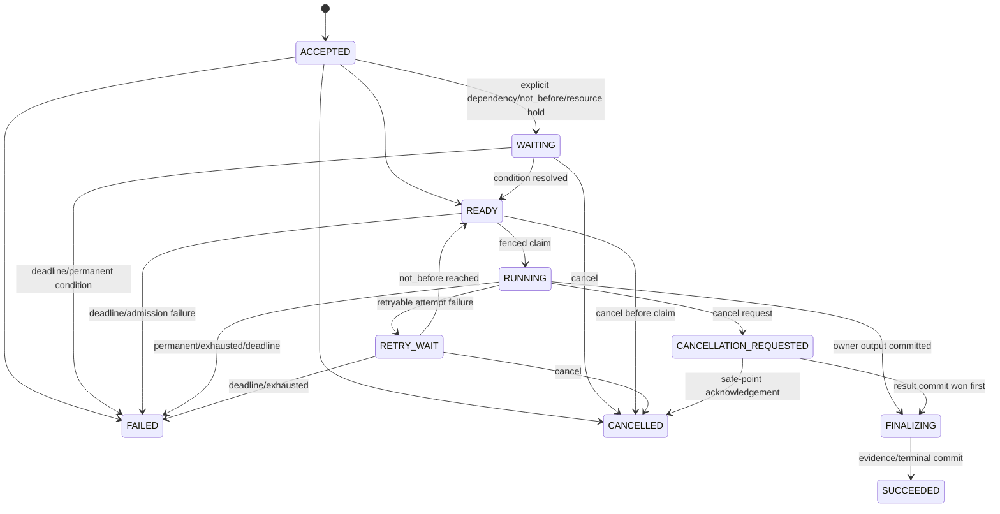

# Stage 08 — Execution and orchestration

Status: `APPROVED`

## Purpose and scope

Define an implementable execution model for immediate inference, durable inference, ingestion/batch/backfill, training, schedules, event-triggered submission, and conditional named multi-capability workflows. Specify the authoritative PostgreSQL job state machine, attempt/lease fencing, worker routing, priority and concurrency controls, cancellation, timeout, retry, duplicate, partial-result, compensation, and delivery semantics.

This stage refines approved components `C05-08` through `C05-12`, `C05-21`, and `C05-22` and maps them to the approved Stage 07 public job contract. It does not activate an internal event path, broker, proactive workflow, general workflow engine, continuous-processing topology, model promotion policy, physical runtime placement, or numeric operating target. Those remain with Stages 09, 10, 12, 13, 15, 17, and 22.

The sponsor explicitly approved Stage 07 and its outputs, including `A-07-INTEGRATION` and ADR-004, on 2026-08-11. Per the sponsor's instruction, Stage 08 stops after its completion gate for approval before Stage 09.

The sponsor explicitly approved Stage 08 and ADR-005 as written on 2026-08-12 and authorized execution of Stage 09 only.

## Inputs read in full

- `AGENTS.md` — all sections
- `WORKFLOW.md` — all sections
- `STATUS.md` — all sections after recording Stage 07 approval
- `SOURCE_MANIFEST.md` — all sections
- `stages/STAGE-CONTRACT.md` — all sections
- `stages/08-execution-orchestration.md` — all sections
- `templates/stage-output.md` — all sections
- `templates/execution-flow.md` — all sections
- `sources/normalized/system-design-prompt.md` — **7. Execution and orchestration** exactly
- `sources/normalized/ark-assumptions.md` — all sections
- `outputs/stages/05-end-to-end-architecture.md` — all sections, especially sync/async/ingestion flows and `C05-08` through `C05-12`, `C05-21`, `C05-22`
- `outputs/stages/06-data-architecture.md` — all sections, especially backfill/reprocessing, correction/late data, training/serving consistency, and publication ownership
- `outputs/stages/07-api-integration.md` — all sections after approval
- `outputs/stages/03-capability-inventory.md` — all seven capability execution profiles and evidence restrictions
- `decisions/ADR-003-architecture-style.md` and accepted `decisions/ADR-004-api-contract-boundary.md` — all sections

The Stage 08-authorized `platform_architect` completed a bounded, read-only review of the state machine, ownership, worker routing, failure/retry boundaries, workload modes, optional infrastructure triggers, and gate. The review confirmed the PostgreSQL-first, at-least-once design and required explicit `WAITING` and `FINALIZING` states, attempt states, handler-version compatibility, and result-finalization recovery. Those findings are reconciled below; the primary agent remains the sole writer.

## Source-instruction coverage

| Governing requirement | Addressed in | Status/evidence |
|---|---|---|
| Immediate inference | Execution-mode disposition; immediate flow | Addressed and kept outside durable job lifecycle unless explicitly submitted |
| Long-running inference | Durable execution flow | Addressed |
| Training jobs | Execution-mode disposition; training flow | Explicit durable lifecycle; no inference-time training/promotion |
| Scheduled executions | Schedule contract and occurrence algorithm | Addressed |
| Batch executions | Durable execution and partition/partial policy | Addressed |
| Event-triggered executions | Conditional event-handler contract | Addressed without activating events/broker |
| Continuous processing, if justified | Continuous-processing gate | Evaluated and not justified now |
| Multi-service workflows | Named-workflow contract | Implementable seam; remains inactive without named workflow |
| Cancellation | Cancellation/race protocol and state transitions | Addressed |
| Retries | Retry classification and boundary | Addressed |
| Timeout | Deadline/attempt/dependency/lease contracts | Addressed without numeric invention |
| Partial failure | Partial-result and partition policy | Addressed |
| Compensation | Compensation policy | Explicit forward compensation only; no generic rollback |
| Job prioritization | Bounded priority classes and aging/fairness | Addressed |
| Concurrency limits | Transactional concurrency leases and scopes | Addressed |
| Duplicate requests | API/job/attempt/effect idempotency layers | Addressed |
| Exactly-once vs at-least-once | Delivery/effect guarantee model | Explicit: at-least-once attempts, logically once effects where fenced/idempotent |
| API gateway | Responsibility matrix | Distinguished |
| Job manager | Responsibility matrix; state machine | Distinguished and authoritative |
| Scheduler | Responsibility matrix; schedule algorithm | Distinguished; creates jobs only |
| Queue | Responsibility matrix; PostgreSQL queue semantics | Distinguished as job-manager-owned dispatch state |
| Worker | Responsibility matrix; claim/lease protocol | Distinguished |
| Workflow orchestrator | Responsibility matrix; named workflow semantics | Distinguished and conditional |
| Event broker | Responsibility matrix; measurable trigger | Not selected |
| Event handler | Responsibility matrix; conditional submission adapter | Distinguished from worker/orchestrator |
| Notification delivery | Responsibility matrix | Separate from job/result truth |
| No vague event system | Component responsibilities and activation states | Satisfied |

## Facts

1. ARK has one platform-level durable job manager. It owns state, retries, scheduling integration, cancellation, progress, idempotency, result locations, audit, and notifications; capability workers own computation. `sources/normalized/ark-assumptions.md — Execution, orchestration, and proactive operation`.
2. PostgreSQL is initially the durable job source of truth. Resource/capability-specific worker pools prevent training, backfills, or accelerator work from blocking interactive work. A broker or workflow product requires scale/complexity evidence. `sources/normalized/ark-assumptions.md — Execution, orchestration, and proactive operation`.
3. Workers assume at-least-once delivery and must make effects idempotent. Long, retryable, scheduled, ingestion, training, backfill, and large/batch inference work cannot rely on HTTP/process lifetime. `sources/normalized/ark-assumptions.md — Execution, orchestration, and proactive operation`; `outputs/stages/02-system-definition.md — ARK-FR-007/008`.
4. The scheduler creates jobs and never runs a capability pipeline. Cross-capability workflows create/observe public child jobs and cannot invoke capability internals. `sources/normalized/ark-assumptions.md — Execution, orchestration, and proactive operation`.
5. Stage 07 exposes stable public states `ACCEPTED | RUNNING | SUCCEEDED | FAILED | CANCELLATION_REQUESTED | CANCELLED`; Stage 08 owns internal states/transitions. Polling remains authoritative recovery and notification delivery remains separate. `outputs/stages/07-api-integration.md — Job contract`, `— Callback/webhook contract`.
6. Churn, RFM, NPT, and REC target durable batch operations and explicit separately authorized training; Synapse has only unmeasured synchronous interface facts and is non-production-eligible. `outputs/stages/03-capability-inventory.md — CAP-CHURN`, `— CAP-RFM`, `— CAP-NPT`, `— CAP-REC`, `— CAP-SYN-*`.
7. Exact traffic, backlog, concurrency, runtime, attempt, retry, timeout, SLO, and recovery values remain unknown. `A-01-SCALE` and `A-01-OPS` remain active.

## Assumptions

Stage 08 introduces no new temporary assumption and does not extend an expiry.

| ID | Assumption | Why needed | Architectural effect | Risk | Validation/expiry |
|---|---|---|---|---|---|
| `A-01-SCALE` | Numeric workload, latency, backlog, concurrency, timeout, and cost targets remain unknown | Prevents speculative broker/capacity/topology commitments | Policies are required and activation-blocking but values are not invented | Production profiles cannot yet be proven | Measured S-01 through S-04 / Stage 17 |
| `A-01-OPS` | Availability, recovery, support, and deployment environment remain unknown | Prevents unsupported recovery/placement claims | Durable state/fencing defined; numeric recovery and topology remain later | Operability not yet proven | OPS-01 through OPS-05 / Stages 13/15 |
| `A-03-ML-MIGRATION` | Prototype lifecycle is migration evidence | Current inference may train or use process-local schedulers | Target execution prohibits implicit training/activation and private schedulers | Per-capability remediation still required | Stages 10/16 per capability |
| `A-03-SYNAPSE` | Synapse remains interface-only and non-production-eligible | Execution/timeout/retry/idempotency/provider behavior is undocumented | No Synapse job, retry, proactive, or sync production profile is activated | Product capability may change/scope out | Existing expiry |
| `A-04-OWNERSHIP` | Logical platform-execution, operations, data, integration, and capability owner roles suffice | State/routing policies need owners without invented teams | Responsibility map is logical; production/on-call remains blocked | Actual team structure/capacity unknown | Existing expiry |
| `A-07-INTEGRATION` | Polling universal, registered webhook conditional, consumer adapters outside cores | Execution result delivery must honor approved API boundary | Notification worker remains supporting path; no SSE/public event feed | Consumer constraints may differ | Existing per-portion expiries |

## Analysis and recommendations

### Execution-mode disposition

| Workload | Mode now | Trigger/admission | Owner and result | Failure/retry boundary |
|---|---|---|---|---|
| Immediate inference | Conditional synchronous | Operation definition proves short, predictable, bounded, no retry/durable dependency; auth/control/readiness/eligibility pass | Capability owns result; HTTP response is critical path | No silent background continuation or conversion to job; deadline yields explicit failure |
| Long-running/large inference | Durable job, required | Typed `:submit`, schedule, or named workflow child | Job manager owns lifecycle; capability owns computation/result | At-least-once attempt with fenced commit and policy retry |
| Ingestion/micro-batch/bulk/backfill/reprocess | Durable job, required | Authenticated source registration or object commit | Data module owns raw/canonical/publication; job manager lifecycle | Raw retained; publication atomic; new run/version on replay |
| Training/evaluation | Durable job, required | Separately authorized lifecycle operation with immutable dataset/config refs | Capability owns science/artifacts/evaluation; registry owns common metadata | Inference cannot trigger; promotion/activation is separate Stage 10 command |
| Scheduled execution | Scheduler submits durable job | Due active schedule occurrence and later grant/control recheck | Scheduler owns schedule/occurrence; job manager owns job | Deterministic occurrence key prevents duplicate logical job |
| Batch execution | Durable job; optional declared partition plan | Typed capability/data operation with bounded manifest | Capability/data owner commits result/dataset or declared partial manifest | Partition attempts idempotent; aggregation publication fenced |
| Event-triggered execution | Conditional handler submits durable job | Stage 09 approves event contract/reliable publication and handler authorization | Event source owns fact; handler maps to public command; job manager owns job | Event delivery at least once; event ID participates in submission idempotency |
| Continuous processing | Not justified | Requires approved latency/volume/window/watermark/state and operations evidence | No owner/topology selected | Use push/micro-batch/schedules until trigger passes |
| Multi-capability workflow | Conditional named workflow | Approved immutable workflow definition, grant/control semantics, public child operations | Orchestrator owns parent/edges; job manager owns children; capabilities own results | Explicit node/failure/compensation policy; no private invocation |
| Notification delivery | Separate delivery work | Authoritative result/intent committed and callback activated | Integration owner owns delivery attempts only | Delivery retry never reruns/changes job/result |

### R-08-01 — Use one PostgreSQL-first durable job state machine

**Requirement/where:** `ARK-FR-007/008`, `ARK-NFR-004/006`, `ARK-CON-005`; all durable paths in Stages 08–10/13/22. **Why now:** retry, cancellation, crash recovery, and truthful status require one authoritative lifecycle. **Simplest implementation:** module-owned PostgreSQL `jobs`, `attempts`, `idempotency_records`, and `concurrency_leases` tables with transactional compare-and-set transitions and worker polling/claim. **Alternative:** per-capability queues/lifecycles, broker, or workflow product. **Why rejected:** duplicates truth/operations or lacks measured need. **Burden:** PostgreSQL job state is critical and needs indexes, cleanup, backups, reapers, and runbooks. **Reconsideration:** broker/engine gates below after simpler remedies are measured.

#### Job record contract

```text
Job {
  job_id, tenant_id, job_type,
  capability_id?, capability_version?, operation_id?, handler_key, handler_version,
  input_ref_or_bounded_input_hash, resolved_dataset/config/artifact refs,
  idempotency_scope, idempotency_key, canonical_request_hash,
  state, state_version, public_state,
  priority_class, routing_key, concurrency_scopes[],
  retry_policy_ref, timeout_policy_ref, partial_result_policy,
  not_before, deadline_at, cancel_requested_at?,
  current_attempt_id?, checkpoint_ref?, prepared_result_ref?, result_ref?,
  evidence_refs?, outcome?, error_code?,
  parent_workflow_id?, parent_job_id?, schedule_occurrence_id?,
  correlation_id, causation_id?,
  submitted_at, started_at?, finished_at?, updated_at
}
```

Large inputs/results remain tenant-scoped references. The job stores exact versions and handler key, never an executable code blob, arbitrary callback URL, body tenant, or mutable “latest” selector.

#### Attempt record contract

```text
Attempt {
  attempt_id, job_id, attempt_number,
  state, worker_id, lease_token, lease_acquired_at, lease_expires_at,
  heartbeat_at, started_at, finished_at?, attempt_deadline_at,
  checkpoint_ref?,
  retry_class?, error_code?, output_candidate_ref?,
  resource_usage_ref?, trace_ref?
}
```

`lease_token` is a fencing token. Every progress, result, effect, and terminal command includes `job_id + attempt_id + lease_token + expected job.state_version`; stale/expired attempts cannot publish or complete the job.

Attempt state is distinct from job state: `LEASED | RUNNING | COMPLETED | FAILED | TIMED_OUT | ABANDONED | CANCELLED`. A retry creates a new monotonically numbered attempt while retaining the same logical job identity. Only the job manager changes attempt state; a worker reports through fenced commands.

### Internal job state machine

| Internal state | Meaning / invariant | Allowed owner transitions | Public mapping |
|---|---|---|---|
| `ACCEPTED` | Durable admission/idempotency record and exact command exist; initial routing decision is not yet committed | Job manager → `WAITING`, `READY`, `FAILED`, or `CANCELLED` | `ACCEPTED` |
| `WAITING` | An explicit dependency, `not_before`, resource, or admission condition prevents claim; the condition and owner are durable | Job manager eligibility/recovery loop → `READY`; cancel → `CANCELLED`; deadline/permanent condition → `FAILED` | `ACCEPTED` |
| `READY` | Due, prerequisites represented, no active attempt, eligible for configured routing/concurrency claim | Dispatcher claim → `RUNNING`; cancel → `CANCELLED`; deadline → `FAILED` | `ACCEPTED` |
| `RUNNING` | Exactly one current fenced attempt/lease; logical execution may still be retried | Fenced handler report/job manager → `FINALIZING`, `RETRY_WAIT`, `FAILED`, `CANCELLATION_REQUESTED`; reaper handles expired lease | `RUNNING` |
| `RETRY_WAIT` | No active attempt; retry decision and `not_before` are durable | Dispatcher → `READY` when due; cancel → `CANCELLED`; deadline/attempt exhaustion → `FAILED` | `RUNNING` |
| `FINALIZING` | The authoritative owner has idempotently committed a result/dataset/artifact outcome; job evidence and terminal truth still need reconciliation | Job manager finalizer → `SUCCEEDED`; recoverable finalization failure remains `FINALIZING` for reconciliation and must not recompute owner work | `RUNNING` |
| `CANCELLATION_REQUESTED` | No new attempt may start; an active attempt may only reach a declared safe point or lose its lease | Worker/job manager → `CANCELLED`; an owner result commit that won before cancel proceeds through `FINALIZING → SUCCEEDED`; expired/ambiguous attempt reconciled by policy | `CANCELLATION_REQUESTED` |
| `SUCCEEDED` | Authoritative bounded result/outcome or immutable result reference, lineage, and required commit evidence exist | Terminal; only separate supersession/revocation workflows may affect result visibility | `SUCCEEDED` |
| `FAILED` | Terminal execution/lifecycle failure with stable code; no authoritative success result | Terminal; retry requires a new explicit job or policy-approved administrative resubmission identity | `FAILED` |
| `CANCELLED` | Cancellation won before authoritative success; no further attempts or success publication | Terminal | `CANCELLED` |

#### Transition rules

1. Every transition is a job-manager command with expected `state_version`; one transaction changes state, version, timestamps, active attempt link, concurrency leases, and mandatory bounded evidence.
2. The capability/data owner first commits its authoritative immutable output idempotently using the active execution identity and fence, then the job manager records `RUNNING → FINALIZING`. `FINALIZING → SUCCEEDED` is legal only after required result, lineage, audit, and usage evidence are linked. A crash in `FINALIZING` is reconciled without recomputing capability/data work.
3. `FAILED` means execution/lifecycle failure, not dataset/scientific ineligibility. `FAILED` carries stable `error_code`, retry class, and optional safe error reference.
4. Terminal states are immutable. Correction/reprocess/administrative retry creates a new job linked by `supersedes_job_id` or an explicit resubmission relation.
5. Notification and telemetry status are not job states. Mandatory audit/result commit participates in the terminal command where required; external delivery remains separate.



### PostgreSQL queue, claim, lease, and reaper semantics

- The queue is the indexed subset of job records in `READY` with `not_before <= now`, a routing key the worker supports, no active attempt, and available concurrency leases. It is not a separate business authority.
- A worker opens a short transaction, selects eligible jobs using row-lock/skip-locked semantics or equivalent, acquires all required concurrency leases, creates the next attempt and unique fencing token, transitions the job to `RUNNING`, then commits before computation.
- The worker heartbeats the attempt before lease expiry according to its configured policy. Work continues only while it can prove a live lease; loss of lease prevents progress/result/effect publication.
- A reaper/job-manager process finds expired leases, marks the attempt abandoned, releases concurrency leases, classifies the job as retry wait/failed/cancellation reconciliation, and increments the state version. The reaper never runs capability code.
- Workers poll only routing keys/priority classes they are authorized to execute and use least-privilege access to referenced tenant/capability/data namespaces.
- Claim batch size, poll interval, lease/heartbeat/abandon thresholds, and database index/partition choices are activation policies requiring measurement; no numeric value is invented here.

### R-08-02 — Route by declared workload/resource class, not capability count alone

Logical first-version routing keys:

| Routing class | Work admitted | Isolation reason |
|---|---|---|
| `interactive-async` | Short async work that still requires durability/retry | Protect from bulk/training backlog |
| `ingestion` | Inline/bulk validation, normalization, publication | Data I/O/CPU characteristics and raw/canonical ownership |
| `capability-batch:{capability_id}` | Churn/RFM/NPT/REC batch inference and capability-specific preparation | Capability handler/version/owned storage isolation |
| `training:{capability_id}:{resource_profile}` | Explicit training/evaluation only | Potential memory/CPU/accelerator/dependency isolation; no implicit inference admission |
| `backfill` | Data/capability reprocessing and correction impact | Lowest urgency and potentially large history |
| `notification` | Registered webhook delivery attempts | Result truth insulated from destination failure |
| `orchestration` | Named parent workflow transition evaluation only | Cannot execute child science; exists only if a named workflow is activated |

These are logical queue names/index partitions inside the same job system, not brokers, services, or promised processes. A worker advertises supported handler IDs/versions and resource profiles. The job manager keeps an accepted job in `WAITING` with an explicit reason when no compatible handler/version is available rather than routing it arbitrarily or silently using `latest`. A deployment must retain compatible workers for already admitted versions or execute an explicit migration/failure policy.

**Alternative:** one undifferentiated pool or one service/queue per capability. The first allows bulk/training interference; the second multiplies infrastructure. **Trade-off:** several logical pools require policy and monitoring. **Reconsideration:** combine unused pools; separate runtime roles only on measured contention/hardware/reliability evidence; extract only through ADR-003.

### Priority, fairness, concurrency, and backpressure

#### Priority

Use a small fixed vocabulary, not caller-chosen arbitrary numbers:

`INTERACTIVE | STANDARD | BULK | MAINTENANCE`

The versioned operation/control policy assigns the class; it is not caller-controlled. Training/backfill cannot impersonate interactive work. Within a class, due time then creation time/job ID give stable order. A policy-defined aging mechanism prevents indefinite starvation; exact aging values require Stage 17 evidence.

#### Concurrency

At claim time the job manager atomically acquires `concurrency_leases` for all applicable scopes:

- global runtime/resource profile;
- routing pool;
- tenant;
- capability/operation;
- expensive dataset/artifact/concurrency key where the owner declares mutual exclusion;
- workflow-specific fan-out limit when applicable.

Each lease belongs to the attempt fencing token and expires/reaps with it. Limits are configuration owned by platform control/operations plus the capability/resource owner; missing production limits block activation. Business quota admission remains separate from runtime concurrency.

#### Backpressure

- Before durable admission, control/edge may reject with a distinct rate/quota/capacity code when the configured policy says not to queue more work; no job is created.
- After `202/ACCEPTED`, ARK owns the durable job. Backlog may delay it in `WAITING`, `READY`, or `RETRY_WAIT` but cannot silently drop it. Status exposes queued/active timing and reason without promising an unapproved SLO.
- Worker claims are bounded to available lease/capacity and do not prefetch unleased work. Claim rate, per-tenant/pool concurrency, and low-priority suspension provide first remedies. Database query/index/batch tuning and separate same-codebase roles precede broker adoption.

### Retry and idempotency boundary

| Layer | Identity and owner | Guarantee / behavior |
|---|---|---|
| External command | Tenant/caller/route/version/idempotency key; API/job owner | Same request replays same logical job; changed request conflicts |
| Job | `job_id`; job manager | One authoritative lifecycle, possibly multiple attempts |
| Attempt | `attempt_id + lease_token`; job manager | At most one current fenced attempt; delivery/execution remains at least once |
| Capability/data effect | Owner-defined effect key normally `job_id + logical partition/operation` | Unique constraint/CAS/immutable publication makes replay logically once |
| External provider/action | Owner-defined downstream idempotency key | Retry only if downstream confirms idempotency or the operation is safely repeatable |
| Result commit | Job/execution/result identity + fence; capability/data owner | One authoritative immutable result/publication for the job |
| Notification | `event_id` logical notification + `delivery_id` attempt; integration owner | At-least-once delivery; consumer dedupes; never reruns job |

There is no end-to-end exactly-once execution claim. ARK provides at-least-once attempts and aims for exactly one logical effect through durable idempotency, immutable identities, unique constraints, fencing, and reconciliation.

#### Attempt failure classification

| Class | Automatic retry? | Rule |
|---|---|---|
| `TRANSIENT_SAFE` | According to operation policy | Dependency unavailable/rate limited or pre-effect failure; idempotent boundary proven |
| `PERMANENT` | No | Invalid contract, denied authority, incompatible version, unsupported handler, deterministic failure |
| `DEADLINE_EXCEEDED` | No new attempt after job deadline | Timed-out attempt is fenced; cleanup/reconciliation separate |
| `AMBIGUOUS_EXTERNAL_EFFECT` | No blind retry | Downstream outcome unknown and no idempotency proof; fail/reconcile with explicit reason |
| `CANCELLED_AT_SAFE_POINT` | No | Leads to `CANCELLED` |
| `WORKER_LOST` | Retry only if all effects are fenced/idempotent | Lease expiry; stale worker cannot commit |

The operation's immutable retry policy declares retryable codes, maximum attempts, backoff/jitter, attempt timeout, overall deadline, and ambiguous-effect treatment. Values are required before activation and remain unapproved until measured. Workers report classification; the job manager alone schedules `RETRY_WAIT` and the next attempt. Workers do not hide retries in unbounded local loops.

### Timeout and deadline semantics

- `submission_deadline`: Stage 07 admission HTTP boundary; retry same idempotency key on ambiguity.
- `job_deadline_at`: absolute logical deadline stored at acceptance. Once passed, no new attempt may start and a late attempt cannot publish through the fence.
- `attempt_timeout`: maximum active attempt duration before cooperative abort/lease reconciliation.
- `lease_timeout/heartbeat_policy`: crash detection and fencing, not a scientific timeout.
- `dependency_timeout`: bounded per external/DB/object/provider call; failure classified explicitly.
- `workflow/node_deadline`: conditional named workflow/node policy; does not extend child job deadlines silently.
- `notification_timeout`: separate delivery attempt policy and never a job deadline.

Timeout never silently converts sync work to async, assumes cancellation, or proves that an external side effect did not happen. Ambiguous effects enter reconciliation.

### Cancellation and race protocol

1. Authorized `POST :cancel` writes `cancel_requested_at`, reason/actor, increments `state_version`, and returns the current public state.
2. `ACCEPTED`, `WAITING`, `READY`, or `RETRY_WAIT` with no live attempt transitions directly to `CANCELLED` and releases reservations.
3. `RUNNING` transitions to `CANCELLATION_REQUESTED`; no new attempt can be claimed. Worker heartbeats receive the cancel flag and stop at a capability-declared safe point.
4. The worker must clean or leave unreferenced partial objects, report its last safe checkpoint, and acknowledge cancellation with the active fence. Published immutable facts/results are not rolled back silently.
5. Completion and cancellation race through compare-and-set. If authoritative result commit wins first, the job enters `FINALIZING`, reconciliation completes `SUCCEEDED`, and cancellation reports too late; if cancellation wins, stale completion is rejected.
6. Loss of a cancelling worker is reconciled after lease expiry. Automatic retry is prohibited unless the cancellation policy explicitly requires cleanup/reconciliation work.
7. Child/workflow cancellation is a request to each eligible child; it cannot claim an already completed external effect was undone.

### Partial failure and result publication

Every operation declares one policy:

- `FORBID_PARTIAL` (default): any required partition/node failure prevents result/dataset success; successful intermediate objects remain unreferenced or cleanup candidates.
- `ALLOW_PARTIAL_WITH_MANIFEST`: capability/data contract explicitly permits an immutable partial result containing completed/failed/skipped partitions, reasons, exact input/version lineage, and coverage. The capability outcome is normally `DEGRADED`; no omission is silent.
- `BEST_EFFORT_SUPPORTING_EFFECTS`: only for non-authoritative supporting effects such as notifications/telemetry; primary result remains independent.

Partitioned work may be implemented as child jobs only when partition identity and aggregation semantics are explicit. Aggregator success is fenced and occurs once after the declared completion rule. It never mutates earlier partition outputs in place.

### Compensation policy

- Database changes owned by one module use local transactions where possible; failed transactions need no cross-module compensation.
- Immutable datasets/results are corrected by superseding versions, tombstones, revocation, or an explicit reprocess job—not destructive rollback disguised as compensation.
- Capability computations without external side effects require cleanup of unreferenced candidates, not business compensation.
- External actions remain Stage 09-governed. A workflow may compensate only through an explicitly named, authorized, idempotent public command with its own audit and failure policy. “Undo” is never inferred.
- No generic saga framework or automatic reverse-order compensation is justified.

### Schedule contract and occurrence algorithm

```text
Schedule {
  schedule_id, tenant_id, schedule_version, operation_ref,
  cadence/calendar/time_zone, active_from, active_until?,
  input/dataset/config/grant refs,
  priority_class, concurrency policy,
  misfire_policy, catchup_limit_policy_ref,
  next_occurrence_at, last_evaluated_at?, state, state_version
}
```

`misfire_policy` is explicit: `SKIP`, `RUN_ONCE`, or bounded `RUN_EACH` under its policy. The scheduler:

1. claims a schedule-evaluation lease;
2. computes due occurrences using the immutable schedule version/calendar/time zone;
3. rechecks active interval and required control/grant authority as later specified;
4. calls `SubmitJob` with occurrence idempotency key `{tenant, schedule_id, schedule_version, scheduled_for}`;
5. advances `next_occurrence_at` and records occurrence/submission outcome transactionally/idempotently;
6. never invokes a capability pipeline.

Disabling a schedule prevents future occurrence creation; it does not silently cancel existing jobs. Duplicate scheduler processes create one logical occurrence/job.

### Conditional named-workflow contract

No named release workflow is evidenced, so `C05-22` remains `useful soon` and inactive. If activated, an immutable definition contains named nodes referencing only public versioned operation/job commands, dependency edges, input/output reference mappings, concurrency limits, node deadlines, failure/partial policies, and any explicit compensation commands. It is not caller-supplied arbitrary code/DAG.

Parent workflow public states:

`CREATED | RUNNING | WAITING | SUCCEEDED | FAILED | CANCELLATION_REQUESTED | CANCELLED`

The orchestrator owns parent/node state and is the sole transition evaluator. It submits ready child jobs through `SubmitJob`, observes their public/owner outcomes, and persists every decision. Job manager owns each child lifecycle; capability/data modules own child results. The orchestrator never claims worker leases, executes scientific logic, writes child state, or authorizes proactive action.

Node failure policy is one of `FAIL_WORKFLOW`, `CONTINUE_WITH_DECLARED_PARTIAL`, or `RUN_NAMED_FALLBACK`; compensation is an explicit node/command, not implicit rollback. A child result remains authoritative even if parent aggregation fails.

### Conditional event-triggered execution

Stage 08 defines only the boundary needed by Stage 09:

1. An event source commits an authoritative fact.
2. If Stage 09 approves a versioned event/reliable publication path, an event handler authenticates/validates the event, derives trusted tenant/correlation/causation, and maps it to one typed public job command.
3. Submission idempotency includes producer/event ID + handler version + target operation/version.
4. The handler records accepted/rejected/duplicate outcome and never executes capability logic.
5. Job attempts remain at least once and use the same state machine. Notification delivery is still separate.

No event broker is selected, no internal event exists merely because a job changes state, and no “event system” combines source facts, job dispatch, workflows, or external callbacks.

### Continuous-processing gate

Continuous processing is not justified now. Push/micro-batch, durable batch jobs, and schedules satisfy approved evidence. It may be proposed only when an approved latency/volume requirement cannot be met after batching/tuning and the design has authoritative event-time, watermark, ordering, replay, state/checkpoint, schema, correction/tombstone, tenant, backpressure, recovery, owner/on-call, and cost semantics. A dedicated ADR and Stage 09/15/17 evidence are required.

### Component responsibility matrix

| Component | Owns | Does not own | First-version mechanism/status |
|---|---|---|---|
| API gateway/edge | HTTP auth handoff, routing, versions, request limits, request/correlation IDs, technical rate limit | Job state, retry, scheduling, science, workflow, tenant business authority | Logical middleware/controllers; required |
| Job manager | Job/idempotency/attempt/state/lease/retry/progress/cancel/result-reference lifecycle | Capability computation, schedules, workflow graph, notification transport | PostgreSQL module; required |
| Queue | Dispatchable job ordering/routing/claim state inside job manager | Business truth or a second lifecycle | PostgreSQL indexed `READY` records; required semantics, not product |
| Scheduler | Schedule definitions/occurrences/due evaluation and job submission | Pipeline execution, worker claim, scientific logic | PostgreSQL schedule table + same-codebase loop; required |
| Worker | Claim/heartbeat, invoke one public handler, report progress/outcome with fence | Job lifecycle authority, cross-capability orchestration, implicit training/promotion | Same-codebase logical pools/roles; required |
| Workflow orchestrator | Named definition, parent/node dependencies, child submission/observation, aggregation policy | Child job state, capability internals, generic caller DAG, permission authority | Conditional/inactive until named workflow |
| Event broker | Transport/fan-out/replay if later justified | Source/business truth, job lifecycle, workflow authority | Not selected |
| Event handler | Validate/map one approved event to typed idempotent command | Capability computation or arbitrary routing | Conditional Stage 09 adapter |
| Notification delivery | Registered callback delivery records, signing adapter, retries/dedupe | Job/result truth, customer campaign sending, internal coordination | Conditional webhook supporting path; polling required |

### Broker trigger

A broker requires a dedicated ADR, named owner/runbook, compatible contract/replay/idempotency/security semantics, and evidence that PostgreSQL/direct mechanisms cannot meet an approved need after indexing, query tuning, batching, table partitioning, worker pool/runtime isolation, and backpressure controls. Qualifying evidence includes:

- approved throughput/backlog/claim-latency target repeatedly missed by PostgreSQL dispatch;
- required multi-consumer fan-out/replay across independently deployed boundaries;
- authoritative streaming source/latency requirement that micro-batch cannot satisfy;
- database contention or blast radius persists after simpler remedies;
- compliance/network boundary mandates independent transport.

Job state remains PostgreSQL authority unless a separate migration ADR explicitly changes it; adding a broker as transport must not create dual job truth.

### Workflow-engine trigger

A workflow product requires at least one approved named workflow whose long-lived timers, external signals, human approvals, large/versioned graph, complex compensation, recovery/migration, or operational volume makes the explicit PostgreSQL parent/child state machine measurably unsafe or unmaintainable. Before selection, demonstrate failed simpler implementation, stable public child contracts, persistence/migration semantics, owner/on-call/runbook, security/tenant isolation, observability, recovery, and cost. Capability count or a desire for visual DAGs is not a trigger.

### Immediate inference flow

| Step | Component | Action | Failure/cancellation/retry |
|---:|---|---|---|
| 1 | Edge/auth/control | Validate/authenticate/derive tenant/check entitlement, rate, quota | Reject before computation; no gateway POST retry |
| 2 | API/data/capability | Validate exact operation/version/input; resolve readiness/artifact/config; scientific eligibility | Explicit ineligible/degraded/fallback; no job |
| 3 | Capability handler | Execute bounded operation under synchronous deadline | Deadline/failure returns problem; never continues unreferenced |
| 4 | Capability/audit/usage | Fenced/local authoritative result and required evidence commit | Response success only after commit |
| 5 | API | Return bounded result/outcome | Client disconnect does not create job; idempotent replay where operation requires it |

### Durable execution flow

| Step | Component | Action | Failure/cancellation/retry |
|---:|---|---|---|
| 1 | API/control | Authenticate, validate exact refs/policies, reserve/authorize | Failure before job means no accepted work |
| 2 | Job manager | Atomically create/replay job and idempotency record; transition `ACCEPTED → WAITING` for an explicit hold or `ACCEPTED → READY`; return 202 | Timeout ambiguity resolved with same key |
| 3 | Dispatcher/worker | Claim matching due job + concurrency leases; create fenced attempt; `READY → RUNNING` | Process death/lease expiry reconciled |
| 4 | Worker + owner port | Recheck time-sensitive authority/readiness, then execute one public handler | Permanent denial/failure explicit; transient safe failure returns retry class |
| 5 | Owner storage/job manager | Owner commits immutable result/publication using execution identity/fence; job manager records `RUNNING → FINALIZING` | Stale attempt rejected; cancel/result race deterministic |
| 6 | Job manager/evidence owners | Reconcile required lineage/audit/usage refs; `FINALIZING → SUCCEEDED` without recomputation | Crash retries finalization, not capability/data science |
| 7 | Job/result API | Polling exposes truthful public state/result | No webhook dependency |
| 8 | Notification worker | If activated, deliver registered signed event independently | At least once; failure does not rerun/alter result |

### Anti-overengineering findings

- PostgreSQL job/attempt/lease tables plus same-codebase worker loops are sufficient now.
- Logical routing pools are not separate services/queues/brokers; combine or split roles only from measurement.
- No broker, streaming platform, service bus, distributed lock product, general workflow engine, saga framework, Kubernetes job system, or per-capability scheduler/job manager is justified.
- No internal event is invented to replace direct calls or job state observation.
- No continuous processor is justified; micro-batch and schedules are simpler.
- Named workflow seam is retained but inactive; no example workflow is treated as approved scope.
- Synapse interface names do not justify agent orchestration, retries, provider state, or background processing.

## Decisions

- Recommend `decisions/ADR-005-postgresql-job-state-machine.md`: one PostgreSQL-first job/attempt/lease state machine with at-least-once attempts, fenced/idempotent effects, typed routing, explicit policies, and separate scheduler/orchestrator/event-handler/notification responsibilities.
- Immediate inference remains synchronous only when the operation definition has measured bounded fitness; all other required workload classes use durable jobs.
- `ACCEPTED`, `WAITING`, `READY`, `RUNNING`, `RETRY_WAIT`, `FINALIZING`, `CANCELLATION_REQUESTED`, `SUCCEEDED`, `FAILED`, and `CANCELLED` are the internal job states; the separate attempt state machine and public mapping preserve ADR-004/Stage 07.
- Priority/concurrency/retry/timeout/partial policies must be explicit before activation; numeric values remain unresolved under `A-01-SCALE`.
- Named workflow, event-triggered execution, webhook delivery, continuous processing, broker, and workflow engine remain conditional according to their gates.
- No job state or orchestrator outcome authorizes proactive external action; Stage 09 remains authoritative for grants/events/actions.
- No execution decision makes Synapse production-eligible or infers its internals.

## Contradictions and dangerous assumptions

| ID | Tension/hazard | Treatment | Consequence |
|---|---|---|---|
| `C-08-01` | “Exactly once” is commonly expected from a queue | Explicit at-least-once attempts plus job/effect idempotency, fencing, unique constraints, reconciliation | No false exactly-once claim |
| `C-08-02` | Shared PostgreSQL can become an unbounded general queue | Typed routing, concurrency/backpressure policies, tuning-first broker gate | Measurable path before new transport |
| `C-08-03` | Worker can appear to own job transitions/retries | Worker sends fenced commands; job manager validates and owns state/retry scheduling | One lifecycle authority |
| `C-08-04` | Lease expiry can let stale worker publish after retry starts | Fencing token + expected state version on every effect/commit | Stale commit rejected |
| `C-08-05` | Cancellation can be reported before running side effects stop | Cooperative safe point, explicit requested state, deterministic CAS race, reconciliation | No false `CANCELLED` |
| `C-08-06` | A timeout can leave an ambiguous provider/external effect | No blind retry without downstream idempotency; explicit ambiguous/reconciliation outcome | Prevent duplicate charge/action |
| `C-08-07` | Partial batch output can be mistaken for complete success | Default forbid; explicit manifest/degraded contract only | No silent omissions |
| `C-08-08` | Compensation can imply universal rollback | Local transaction or explicit forward compensating command only | No generic saga framework |
| `C-08-09` | Scheduler/orchestrator/event handler/worker may collapse into an “event system” | Separate owned records and commands; only worker executes public handler | Gate remains auditable |
| `C-08-10` | Priority can enable caller starvation/abuse | Fixed authorized classes, tenant/pool caps, policy aging | No arbitrary priority integers |
| `C-08-11` | Public Stage 07 states could expose internal retry/lease details | Stable mapping; phases/reasons extensible; internal graph stays owned here | API compatibility preserved |
| `C-08-12` | Prototype process-local schedules/implicit training look reusable | Migration defect; platform scheduler/jobs and explicit training replace them | `A-03-ML-MIGRATION` preserved |
| `C-08-13` | Synapse synchronous endpoints may be assumed immediate/retryable | No measured sync profile or safe provider idempotency evidence | Remains unavailable/non-production |
| `C-08-14` | Owner output can commit before the job/evidence transaction, causing restart to recompute completed work | Explicit `FINALIZING` state and reconciliation by logical output identity | No duplicate science/data work after a finalization crash |
| `C-08-15` | A later attempt may silently use a newer handler/code version | Admitted handler/version is immutable; unavailable compatibility remains explicit `WAITING` or fails by approved migration policy | Reproduction and retry semantics remain stable |

## Open questions

| ID | Question | Blocking? | Options | Recommended temporary treatment | Effect |
|---|---:|---|---|---|---|
| `Q-08-01` | What job/attempt/dependency/lease/heartbeat/retry/backoff/deadline values apply per operation? | Before activation/Stage 13/17 | Measured profiles per workload | Require policy refs and block missing values | State machine implementable; production behavior not numerically configured |
| `Q-08-02` | What global/tenant/capability/resource concurrency and priority/aging policies apply? | Before activation | Capacity/plan/resource policies | Transactional leases with unresolved configured values | Prevents invented capacity |
| `Q-08-03` | Which operations permit partial results and what manifest semantics apply? | Before operation activation | Forbid; explicit partial/degraded | `FORBID_PARTIAL` default | Safest truthful baseline |
| `Q-08-04` | Which downstream/provider operations guarantee idempotency after ambiguous timeout? | Before automatic retry | Proven key; reconciliation-only; no retry | No blind retry without proof | Prevents duplicate side effects/cost |
| `Q-08-05` | What are each capability's cancellation safe points and cleanup/checkpoint semantics? | Before cancellable flag | Non-cancellable; safe points; partition boundary | Mark non-cancellable until contract supplied | Avoid false cancellation promise |
| `Q-08-06` | What schedule cadences/time zones/calendars/misfire/catch-up policies are required? | Before schedule activation | Per tenant/use case | Explicit versioned schedule; no default cadence | No hidden daily scheduler behavior |
| `Q-08-07` | Is any named multi-capability workflow in release scope? | Before `C05-22` activation | None; named deterministic workflow | Keep inactive and insight-only | No generic engine or proactive action |
| `Q-08-08` | Does any internal event-triggered path need activation? | Stage 09 | Direct/job observation; outbox/handler; broker | None until Stage 09 evidence | No vague event system |
| `Q-08-09` | Is continuous processing required by measured latency/volume? | Stage 09/15/17 | Micro-batch; continuous | Keep not justified | Avoid streaming state/operations |
| `Q-08-10` | Who owns job manager, DB queue, scheduler, each worker pool/handler, workflow, and notification runbooks/on-call? | Before production/Stage 20 | Assign named roles | Logical owners under `A-04-OWNERSHIP` | Design can proceed; production blocked |

## Requirements-traceability updates

| Requirement | Stage 08 design response | Verification direction |
|---|---|---|
| `ARK-FR-002/003` | Ingestion/backfill durable route and atomic publication/fenced replay | Crash/duplicate/cancel/late-reprocess tests |
| `ARK-FR-006` | Job success separate from capability/data readiness outcome | Status/outcome matrix tests |
| `ARK-FR-007` | One state machine for ingestion/training/batch/schedule/retry/cancel/result | Transition/ownership/restart tests |
| `ARK-FR-008` | Immediate sync admission only after measured definition; no implicit background | Deadline/disconnect/mode rejection tests |
| `ARK-FR-009` | Training explicit durable operation; inference cannot submit/activate implicitly | Negative lifecycle and version tests |
| `ARK-FR-010` | Schedule/workflow submission does not authorize action; grant recheck remains Stage 09 | No-action and authority tests |
| `ARK-FR-011` | Conditional internal handler and separate notification delivery | Event/job/delivery state-isolation tests |
| `ARK-FR-012` | Durable trace of state/attempt/retry/cancel/versions/results | LAB recovery/reproducibility suite |
| `ARK-NFR-001` | Tenant-bound jobs/leases/worker refs/queues/concurrency | Cross-tenant claim/read/cancel/result negative tests |
| `ARK-NFR-002/003` | Exact handler/input/dataset/config/artifact/policy/result versions | Replay/compatibility/lineage tests |
| `ARK-NFR-004` | At-least-once attempts, fencing, layered idempotency, dedupe/reconciliation | Duplicate/lease-loss/ambiguous-effect fault injection |
| `ARK-NFR-005` | Opaque references and privacy-safe job/error/trace fields | Schema/log/storage scans |
| `ARK-NFR-006` | Correlation/causation across job/attempt/child/result/delivery/audit | Trace completeness tests |
| `ARK-NFR-007` | Required policies with no invented numeric targets; explicit broker/engine gates | Policy completeness + Stage 17 measurements |
| `ARK-CON-001/002` | Same-codebase modules/roles; public handlers; owner writes | Dependency/schema/job-command tests |
| `ARK-CON-004` | Large inputs/results/checkpoints/partials by reference | Payload/reference/orphan tests |
| `ARK-CON-005` | PostgreSQL job truth/queue; broker only after measured gate | DB recovery and broker-decision evidence |
| `ARK-CON-007` | No speculative broker/engine/continuous system/saga/service queue | Anti-overengineering gate |
| `SC-02-04/05/06/07/08/09/10/12` | Truthful outcomes, recovery, isolation, lineage, no action, ownership, target blocks | Named acceptance/fault suites |

## Completion-gate evidence

| Gate item | Result | Evidence |
|---|---|---|
| Every governing execution/orchestration bullet addressed | PASS | Source-instruction coverage maps all bullets |
| Immediate, durable inference, training, schedule, batch, event, continuous, and workflow modes dispositioned | PASS | Execution-mode table and dedicated sections |
| Internal job state machine implementable | PASS | States, invariants, transitions, owners, public mapping, diagram |
| Retry/idempotency boundary implementable | PASS | Layered identities, failure classification, fencing, policy ownership |
| Ownership and component distinctions explicit | PASS | Responsibility matrix; no vague event system |
| Worker routing/priority/concurrency/backpressure implementable | PASS | Routing keys, fixed classes, concurrency leases, claim rules |
| Cancellation/timeout/partial/compensation semantics explicit | PASS | Dedicated protocols and race behavior |
| At-least-once/exactly-once expectations truthful | PASS | At-least-once attempts; logically once effects only with proven controls |
| Scheduler creates jobs only and occurrence dedupe is concrete | PASS | Schedule contract and occurrence algorithm |
| Named workflow safe and conditional | PASS | Public child jobs only; no generic DAG/engine/private calls |
| Broker/workflow engine triggers measurable | PASS | Dedicated evidence/prerequisite gates |
| Continuous processing justified or rejected | PASS | Not justified; explicit future gate |
| Stage 07 public job contract preserved | PASS | Internal-to-public mapping and separate outcome/delivery states |
| Synapse restrictions preserved | PASS | No production sync/retry/job/agent inference |
| Anti-overengineering applied | PASS | PostgreSQL/same-codebase minimum; optional products rejected |
| Authorized platform review reconciled | PASS | `platform_architect` confirmed the design and its `WAITING`, `FINALIZING`, attempt-state, version-compatibility, recovery, and product-gate findings are incorporated |
| ADR-005 | PASS | Material job-state decision accepted by explicit sponsor approval on 2026-08-12 |
| Stage 09 not executed | PASS | No Stage 09 artifact or decision created |
| Sponsor-requested approval | **PASS** | Sponsor explicitly approved Stage 08 and ADR-005 on 2026-08-12 |

**Gate result: PASSED AND APPROVED.** The state-machine, retry/idempotency, ownership, and worker-routing design is implementable, every governing concern is dispositioned, the authorized specialist review is reconciled, and the sponsor explicitly approved Stage 08 and ADR-005 on 2026-08-12. Stage 09 is authorized to begin.

## Downstream consequences

- Stage 09 must decide whether any internal event/outbox/handler, registered webhook delivery, named proactive workflow, or external action path is activated; job state alone cannot authorize action.
- Stage 10 must define per-capability training/evaluation/promotion operations, retryable codes, handler/resource profiles, partial policies, and cancellation safe points without changing shared lifecycle ownership.
- Stage 12 must define worker/service identities, least privilege, grant rechecks, secret/provider access, and callback/event security.
- Stage 13 must set measured retry/backoff/deadline/lease/heartbeat/idempotency retention, database recovery, ambiguous effect, poison/reconciliation, and administrative recovery behavior.
- Stage 14 must instrument queue age, claims, leases, attempts, retries, cancellations, progress, result truth, schedule occurrences, workflow nodes, and notification delivery.
- Stage 15 must place API/scheduler/worker roles and storage without treating routing pools as services.
- Stage 16 must test transition races, duplicate claims, stale fencing, retry safety, cancellation, partial manifests, schedule duplicates, and compatibility migration.
- Stage 17 supplies concurrency, priority, backlog, polling, timeout, retry, and broker/engine measurements.
- Stage 20 must assign named execution/capability/operations/runbook ownership and sequence only activated modes.
- Stage 22 expands the Stage 08 flows into runtime/process/concurrency/critical-path placement.

## Exact next-stage inputs

Approved inputs for Stage 09:

1. Approved `outputs/stages/05-end-to-end-architecture.md` through `outputs/stages/08-execution-orchestration.md`
2. Accepted `decisions/ADR-003-architecture-style.md`, `decisions/ADR-004-api-contract-boundary.md`, and `decisions/ADR-005-postgresql-job-state-machine.md`
3. Active `A-03-ML-MIGRATION`, `A-03-SYNAPSE`, `A-04-OWNERSHIP`, and `A-07-INTEGRATION`
4. `sources/normalized/ark-assumptions.md`
5. All seven service cards under their evidence restrictions
6. `stages/09-events-proactive-actions.md`, `templates/stage-output.md`, and exact governing prompt section **8. Event and proactive-action architecture**

Stage 08 and ADR-005 are approved; Stage 09 may consume them.
