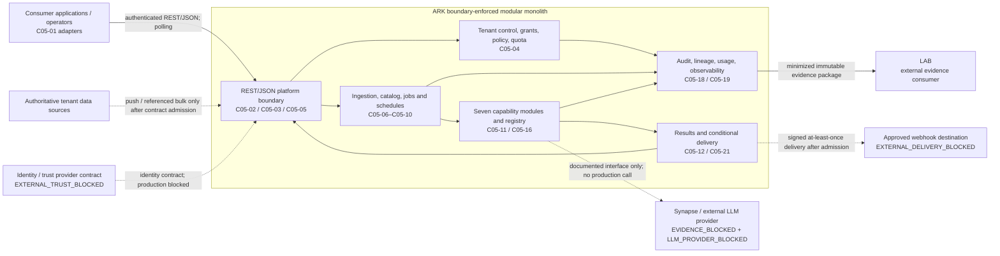
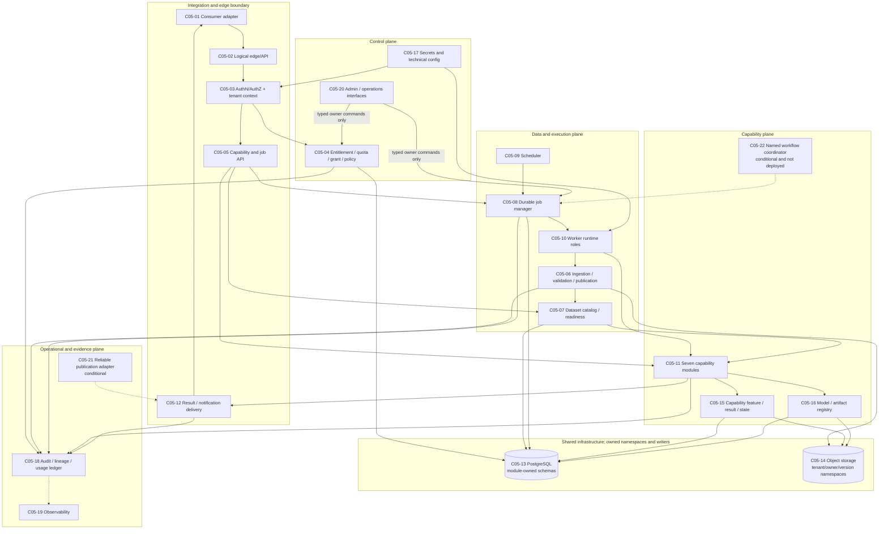
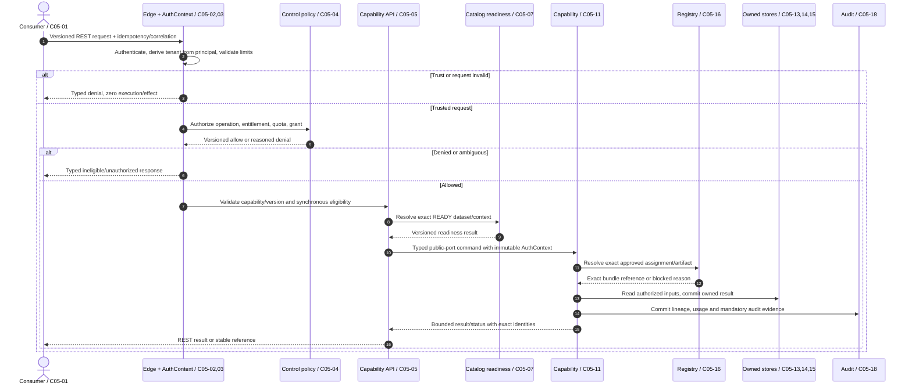
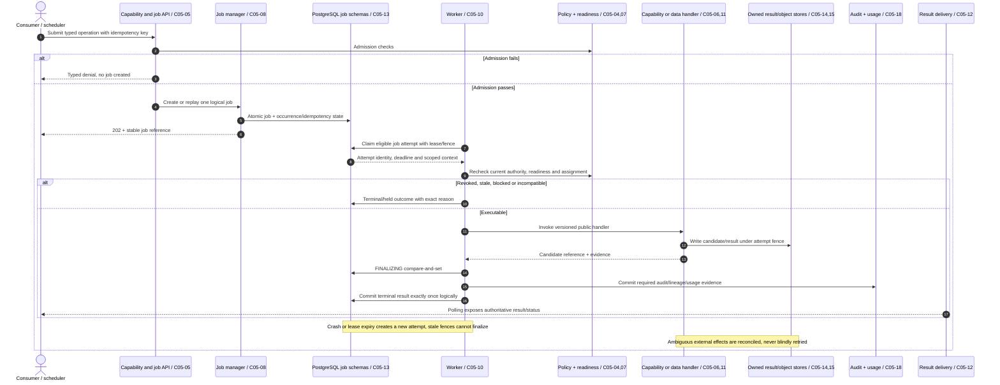
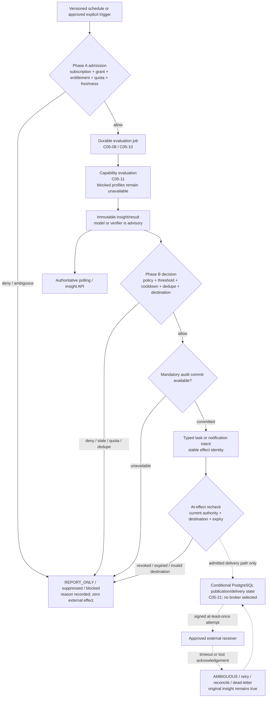
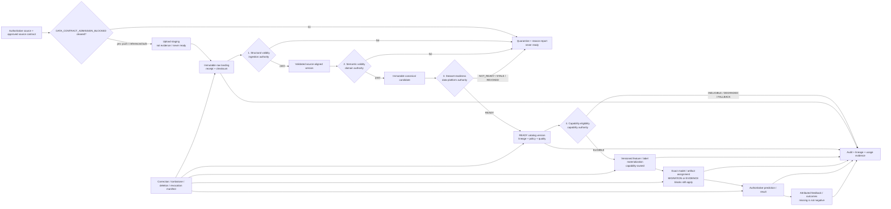
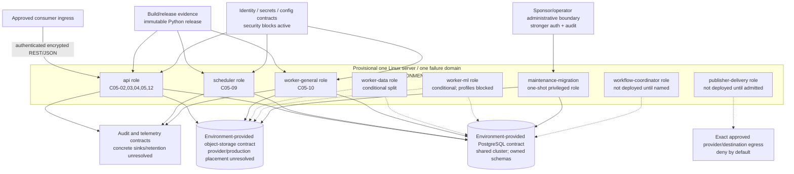

# Stage 19 — Diagrams

**Status:** APPROVED  
**Completed:** 2026-08-13  
**Stage owner:** Primary architecture agent  
**Specialist support:** None required; Stage 19 permits but does not require specialist review

## Purpose and scope

Provide the seven readable Mermaid diagrams required by `sources/normalized/system-design-prompt.md — 18. Diagrams`, using the stable component names, authority boundaries, failure semantics, deployment roles, and accepted ADRs from approved Stages 04–18. These diagrams visualize the approved design; they do not select products, clear production blocks, or begin the Stage 20 roadmap.

## Inputs read in full

- `WORKFLOW.md`
- `STATUS.md`
- `SOURCE_MANIFEST.md`
- `stages/STAGE-CONTRACT.md`
- `stages/19-diagrams.md`
- `sources/normalized/system-design-prompt.md — 18. Diagrams`
- Approved `outputs/stages/04-architecture-style.md` through `outputs/stages/18-architecture-decisions.md`
- Accepted `decisions/ADR-003-architecture-style.md` through `decisions/ADR-015-rest-json-and-typed-ports-before-grpc.md`
- `outputs/stages/05-end-to-end-architecture.md — Component inventory; End-to-end logical architecture`
- `outputs/stages/06-data-architecture.md — Four-layer acceptance model; Zone and authoritative-writer matrix; Lineage and provenance graph`
- `outputs/stages/07-api-integration.md — External resource and operation surface; Internal application-port contracts`
- `outputs/stages/08-execution-orchestration.md — Internal job state machine; Durable execution flow`
- `outputs/stages/09-events-proactive-actions.md — Two-phase fail-closed decision order; External delivery state and semantics`
- `outputs/stages/12-security-governance.md — Security invariants; Tenant-bearing asset control matrix`
- `outputs/stages/15-deployment-infrastructure.md — Conditional starting deployment; Deployable runtime-role matrix; Network, trust, and secrets placement`

## Source-instruction coverage

| Required diagram | Section | Result |
|---|---|---|
| System context | Diagram 1 | Covered |
| Logical container/component architecture | Diagram 2 | Covered |
| One synchronous request flow | Diagram 3 | Covered |
| One asynchronous job flow | Diagram 4 | Covered |
| One proactive ML event-delivery flow | Diagram 5 | Covered |
| Data lifecycle | Diagram 6 | Covered |
| Deployment architecture | Diagram 7 | Covered |
| Readability and consistency | Diagram conventions and validation | Covered; details split across seven views |

## Confirmed facts

1. ARK is a boundary-enforced modular monolith with separately runnable roles from one coordinated Python release, not a service-per-capability system. `ADR-003 — Decision`; `ADR-009 — Decision`.
2. Stable logical component names are `C05-01` through `C05-22`. A component is not automatically a process, container, service, database, or product. `outputs/stages/05-end-to-end-architecture.md — Component inventory`.
3. External contracts use REST/JSON; internal coordination uses typed module ports and PostgreSQL-backed durable jobs. No gRPC, broker, agent runtime, MCP, A2A, Kubernetes, or standalone feature store is selected. ADR-005, ADR-012, ADR-013, and ADR-015.
4. Tenant authority derives from trusted principal/workload context. Body tenant values, object paths, model output, event payload, or delivery destination never create authority. `ADR-008 — Decision`.
5. All production-admission states remain cumulative and active, including four `MIGRATION_BLOCKED`, three `EVIDENCE_BLOCKED`, eight ADR-008 security blocks, `DEPLOYMENT_ENVIRONMENT_BLOCKED`, `CAPACITY_ADMISSION_BLOCKED`, `DATA_CONTRACT_ADMISSION_BLOCKED`, `CONSUMER_CUTOVER_BLOCKED`, and `A-04-OWNERSHIP`. Approved Stage 18.

## Assumptions and diagram conventions

- Solid arrows show an approved logical call, command, data/reference movement, or state transition. They do not imply a network hop.
- Dashed arrows show supporting telemetry, optional/conditional delivery, or a path that remains admission-blocked.
- PostgreSQL and object storage are logical infrastructure contracts. The exact production providers and placement remain unresolved.
- “One Linux server” is the provisional implementation/benchmark target, not a production availability or topology claim.
- Component labels retain their `C05-*` identities so later stages can trace every edge to the component inventory.

## Diagram 1 — System context

**Boundary reading:** Sources and consumers remain authoritative for their own data and presentation. ARK owns platform state and evidence. LAB consumes evidence but has no implicit promotion authority. External providers and delivery are visibly blocked, not depicted as active production dependencies.

## Diagram 2 — Logical container/component architecture

**Ownership reading:** The shared PostgreSQL cluster is physical infrastructure, not shared write authority. Every schema, object namespace, state transition, and command has one logical owner. Conditional `C05-21` and `C05-22` do not imply a broker or workflow engine.

## Diagram 3 — Synchronous request flow

**Failure reading:** Long or unpredictable work is rejected as synchronous and submitted through the durable-job path. No synchronous call trains, promotes, activates, bypasses blocked profiles, or treats telemetry as authoritative evidence.

## Diagram 4 — Asynchronous durable-job flow

**State reading:** Attempts are at least once; the logical job/result/effect is idempotent. PostgreSQL owns job truth. Worker process death, response loss, or lease expiry cannot fabricate success or authorize a stale attempt.

## Diagram 5 — Proactive ML insight and event-delivery flow

**Authority reading:** Capability, ML, LLM, verifier, insight, event, and transport never grant permission. Phase A, Phase B, mandatory audit, and the at-effect recheck are ordered and fail closed. Delivery retry never reruns capability work or changes result truth.

## Diagram 6 — Data lifecycle

**Lifecycle reading:** Structural validity, semantic validity, dataset readiness, and capability eligibility are four independent owner decisions. Published content is immutable but may be superseded, revoked, or deleted through an authoritative lineage-driven workflow. No generic `valid` or `ready` flag collapses these gates.

## Diagram 7 — Provisional deployment architecture

**Placement reading:** Roles may be supervised processes or optional simple containers from the same release. Conditional role boxes are not initially deployed. The drawing makes no HA, RPO/RTO, server-size, provider, network-product, or production-fitness claim; Kubernetes remains unselected.

## Analysis and recommendations

### R-19-01 — Keep diagram edges at logical-contract granularity

**Requirement/where:** source Section 18 readability; Stages 19, 21, and 23. **Why now:** the approved design has many contracts but few initial deployment units. **Simplest implementation:** show stable `C05-*` boundaries, owner stores, trust boundaries, and critical transitions without expanding every schema or operation. **Alternative:** one exhaustive diagram. **Why rejected:** it would obscure authority and failure order. **Trade-off:** readers consult the written stages for field-level detail. **Reconsideration:** a later deliverable requires a bounded use-case-specific execution diagram.

### R-19-02 — Show unavailable and conditional paths without depicting them as active

**Requirement/where:** ADR-007/008/011/015 and Stage 19 accuracy. **Why now:** conventional diagrams can falsely imply that providers, webhooks, publishers, ML workers, or cutovers are deployed. **Simplest implementation:** dashed arrows and explicit block labels. **Alternative:** omit blocked paths. **Why rejected:** omission would hide intended seams and safety conditions. **Trade-off:** legends must be read. **Reconsideration:** a block is explicitly cleared and the path becomes part of an admitted release.

### R-19-03 — Preserve authority separately from transport and placement

**Requirement/where:** ADR-003/005/006/010; every flow. **Why now:** a shared cluster, HTTP call, job, or event can be mistaken for ownership. **Simplest implementation:** label owner components and authoritative commits; treat arrows as logical contracts. **Alternative:** diagram only physical runtime nodes. **Why rejected:** physical placement cannot express policy/scientific/data authority. **Trade-off:** deployment and logical views must be read together. **Reconsideration:** none; authority remains explicit under any topology.

## Decisions

- Adopt the seven diagrams above as the Stage 19 visual representation of the approved architecture baseline.
- Use `C05-*` component names and accepted ADR terminology as the canonical visual vocabulary.
- Treat dashed paths as conditional, blocked, or supporting exactly as labeled; they are not production admission.
- Create no new ADR because Stage 19 introduces no material mechanism, topology, product, protocol, or authority decision.
- Do not begin Stage 20 without the user's next explicit instruction.

## Contradictions and dangerous assumptions

| ID | Finding | Resolution | Consequence |
|---|---|---|---|
| `C-19-01` | Mermaid arrows can look like network calls | Diagram convention says logical contract unless a trust/deployment boundary is explicit | Modules are not silently converted into services |
| `C-19-02` | Shared PostgreSQL can look like shared ownership | Diagram 2 labels owned schemas/writers and typed owner commands | No cross-module write/join authority |
| `C-19-03` | Provider/webhook/publisher paths can look enabled | Dashed paths carry explicit active block labels | No external call or delivery is authorized |
| `C-19-04` | The deployment diagram can look production-ready | Host is labeled provisional, single failure domain, and deployment-blocked | No HA, RPO/RTO, sizing, or production claim |
| `C-19-05` | Proactive “ML event” can imply model authority | Diagram 5 places deterministic gates and audit outside capability output | Model/verifier remains advisory |
| `C-19-06` | A data pipeline can collapse four acceptance decisions | Diagram 6 gives each gate its own owner/outcome | Readiness never implies scientific eligibility |
| `C-19-07` | Retry can look exactly-once | Diagram 4 distinguishes at-least-once attempts from one logical result/effect | Stale attempts and ambiguous effects remain explicit |

## Open questions

| ID | Question | Blocking effect | Current disposition |
|---|---|---|---|
| `Q-19-01` | Which capability and consumer form the first implementation slice? | Blocks roadmap specificity, not these diagrams | Stage 20 must keep sequencing conditional unless evidence answers it |
| `Q-19-02` | What exact production hosting, identity, secrets, object storage, telemetry, backup, and network mechanisms apply? | Blocks concrete production deployment diagram | Preserve ADR-008/009 and deployment blocks |
| `Q-19-03` | Which source contracts, consumers, webhooks, workflows, and external providers are admitted? | Blocks activation of dashed paths | Preserve data-contract, cutover, delivery, provider, and ownership blocks |
| `Q-19-04` | What numeric workload, SLO, recovery, retention, and cost profiles apply? | Blocks sizing and production topology | Preserve `CAPACITY_ADMISSION_BLOCKED` and Stage 17 benchmark process |

## Requirements-traceability updates

| Requirement/decision | Diagram evidence |
|---|---|
| `ARK-CON-001/002/003`, ADR-003/010 | Diagrams 1, 2, and 7 show modular boundaries and owned shared infrastructure |
| `ARK-FR-002/003`, ADR-011 | Diagrams 1 and 6 show push/bulk intake and source-contract admission |
| `ARK-FR-004–008`, ADR-004/005/015 | Diagrams 3 and 4 show sync versus durable job execution |
| `ARK-FR-009`, ADR-007/012 | Diagrams 2 and 6 show capability-owned features, registry, exact assignment, and blocks |
| `ARK-FR-010/011`, ADR-006/013 | Diagram 5 shows deterministic proactive authority and advisory ML/LLM |
| `ARK-NFR-001/005`, ADR-008 | All diagrams preserve principal-derived tenant and fail-closed boundaries |
| `ARK-NFR-004`, ADR-005/006 | Diagrams 4 and 5 show retries, fences, audit, ambiguity, and delivery separation |
| `ARK-NFR-007`, ADR-009/014 | Diagram 7 shows the provisional minimal deployment without production-fitness claims |
| Prompt Section 18 | Seven numbered Mermaid diagrams above |

## Completion-gate evidence

| Gate item | Result | Evidence |
|---|---|---|
| All seven required diagrams present | PASS | Diagrams 1–7 |
| Stable component names | PASS | `C05-*` labels match Stage 05 inventory |
| Trust and tenant boundary visible | PASS | Context, sync, logical, and deployment diagrams |
| Async job authority/retry visible | PASS | Diagram 4 |
| Proactive ordering and delivery separation visible | PASS | Diagram 5 |
| Four data acceptance gates visible | PASS | Diagram 6 |
| Conditional/blocked paths not represented as active | PASS | Dashed-arrow convention and explicit labels |
| No later-stage roadmap or product choice introduced | PASS | Decisions and open questions |
| Mermaid fence and structural validation | PASS | Seven `mermaid` fences; balanced blocks and supported diagram types checked by workspace validation |
| Visual render validation | PASS | All seven diagrams rendered successfully with the local Mermaid renderer; no syntax error |

**Gate result: PASS.** All seven required Mermaid diagrams render, use stable names, preserve ownership and trust/async boundaries, and agree with the approved contracts. Stage 19 is complete. Stage 20 remains unstarted.

## Downstream consequences

- Stage 20 must reference these diagrams when defining the walking skeleton, MVP, hardening, and scale-triggered phases; it must not turn dashed/blocked paths into committed scope.
- Stage 21 may reuse these diagrams provisionally but must preserve labels, blocks, and traceability.
- Stage 22 must add the required use-case runtime/execution views without changing component ownership or deployment admission.
- Stage 23 must publish the final diagram artifact from approved stage outputs and reapply the anti-overengineering test.
- Stage 24 must independently verify diagram-to-contract consistency.

## Exact next-stage inputs

Stage 19 is complete. Do not execute Stage 20 until explicitly instructed.

When authorized, Stage 20 must read:

1. Approved `outputs/stages/00-source-audit.md` through `outputs/stages/19-diagrams.md`
2. Accepted ADR-000 through ADR-015 and the Stage 18 effective decision register
3. `sources/normalized/system-design-prompt.md — 19. Implementation roadmap`
4. `stages/20-roadmap.md`
5. All active production-admission blocks, unresolved ownership/scope questions, and measurable ADR reconsideration triggers

Stage 20 must produce only `outputs/stages/20-roadmap.md` and stop before Stage 21.

## Approval record

The sponsor explicitly approved Stage 19 as written on 2026-08-13 and authorized execution of Stage 20 only.
