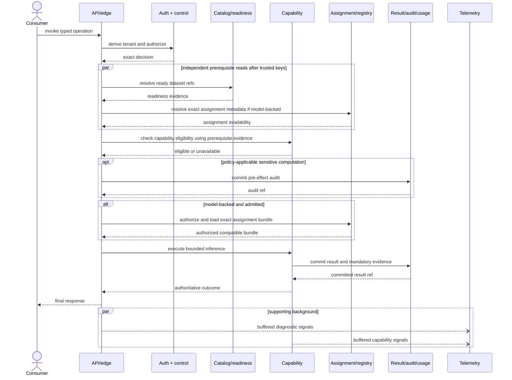
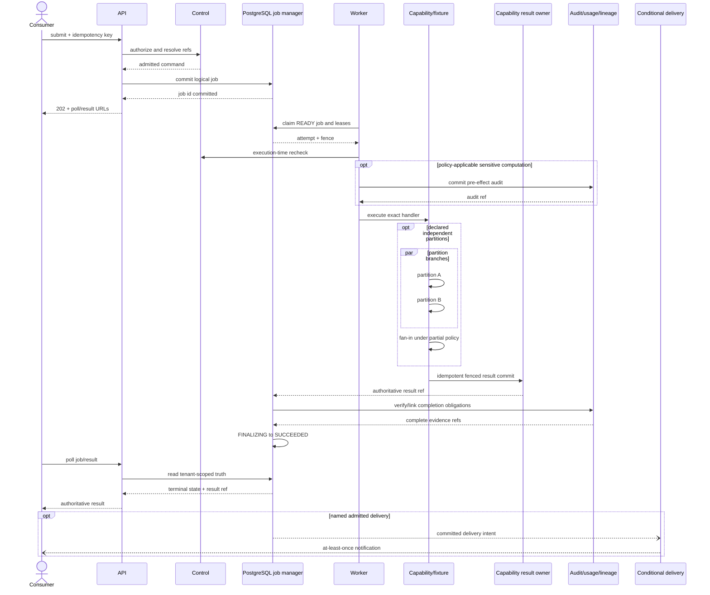
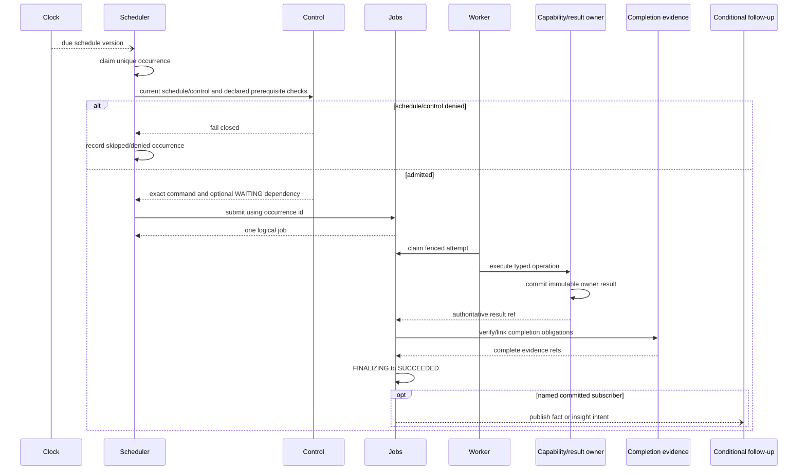
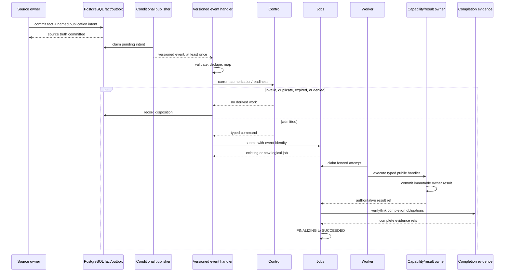
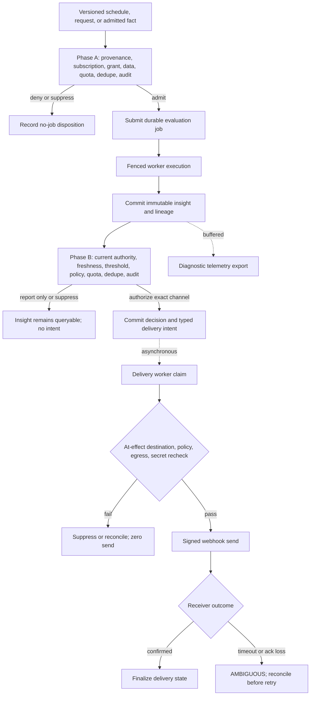
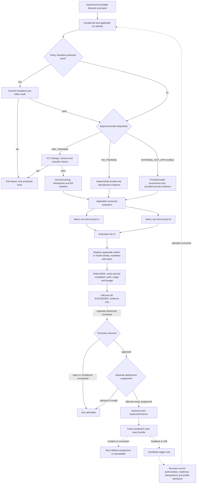
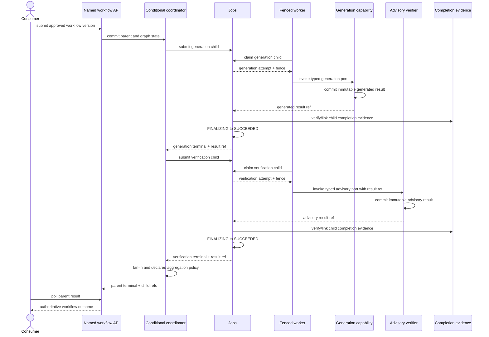
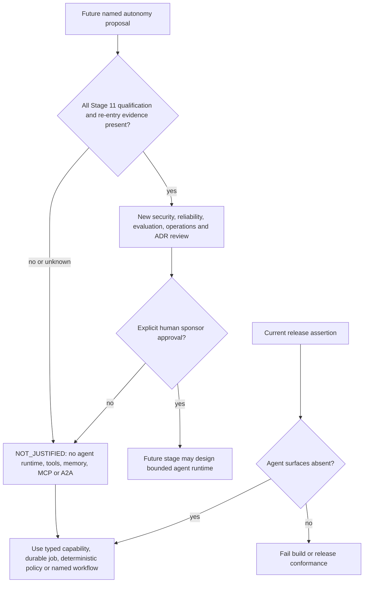

# Stage 22 — Runtime placement and execution-flow analysis

Status: `APPROVED — GATE PASSED`

Approval record: explicitly approved by the human ARK sponsor on 2026-08-14. This approval accepts the runtime placement and execution-flow analysis; it clears no production-admission block and does not constitute Stage 24 assurance.

## Purpose and scope

Explain exactly when, where, why, and in what order every architecturally significant ARK element participates at runtime. The analysis covers the eight use cases required by `sources/normalized/system-design-prompt.md — Runtime placement and execution-flow analysis`, including an explicit not-applicable package for agentic execution under the approved Stage 11 result.

This artifact refines placement and execution only. It does not activate a blocked capability or conditional role, choose a production environment, select the Phase 2 MVP slice, invent a named multi-capability workflow, authorize an agent, clear a production-admission block, publish the design, or execute Stage 23.

## Inputs read in full

- `AGENTS.md`
- `WORKFLOW.md`
- `STATUS.md`
- `SOURCE_MANIFEST.md`
- `stages/STAGE-CONTRACT.md`
- `stages/22-runtime-execution-analysis.md`
- `templates/stage-output.md`
- `templates/execution-flow.md`
- `sources/normalized/system-design-prompt.md — Runtime placement and execution-flow analysis`
- Approved `outputs/stages/05-end-to-end-architecture.md` through `outputs/stages/21-provisional-final-deliverables.md`
- Accepted ADR-000 through ADR-016 and the Stage 18 supersession register

## Specialist reconciliation

Stage 22 authorizes both `platform_architect` and `data_mlops_architect`. Each performed an independent, read-only analysis of placement, dependencies, concurrency, failure boundaries, the eight required use cases, and the four required artifacts. After reconciliation and exact-file re-review, the platform specialist reported no unresolved Critical, High, or material Medium defect and `PASS`; the data/ML specialist reported the same and `PASS`. The primary agent is the sole writer.

## Source-instruction coverage

| Governing requirement | Evidence below | Status |
|---|---|---|
| Usage and placement for significant elements | Runtime element placement matrix; significant operation matrix | Covered |
| Exact execution order and dependency analysis | Common execution laws; eight use-case packages | Covered |
| Sequential, asynchronous, parallel, event, scheduled, conditional, and out-of-band classification | Execution-mode legend and every stage-usage table | Covered |
| Data/state prerequisites, fan-in, ordering, concurrency, races, consistency, timeout/cancel, failure and retry boundary | Every dependency table and runtime narrative | Covered |
| Critical path versus background, side effect, telemetry, audit and delivery | Common path rules and every use-case package | Covered |
| Four artifacts per use case | Stage-usage table, dependency table, narrative and Mermaid diagram in each package | Covered |
| Eight named use cases | UC-22-01 through UC-22-08 | Covered; UC-22-08 is explicitly not applicable under Stage 11 |
| Function-level restraint | Only boundary-, authority-, state-, security-, reliability-, performance-, or scaling-significant operations are expanded | Covered |

## Confirmed facts

1. ARK starts as a boundary-enforced Python modular monolith with one coordinated release, PostgreSQL durable operational truth, provider-neutral object storage, and role entrypoints rather than one service per component. `decisions/ADR-003-architecture-style.md — Decision`; `outputs/stages/15-deployment-infrastructure.md — Conditional starting deployment`.
2. The portable target role architecture has `api`, separately runnable/co-hostable `scheduler`, workers, and explicit one-shot maintenance/migration contracts. The immediately runnable Phase 1 placement is narrower: `api`, `worker-general`, and one-shot maintenance/developer entrypoints only. Scheduler activation waits for a selected scheduled path; `worker-data`/`worker-ml` splits wait for resource/isolation evidence; `publisher-delivery` and `workflow-coordinator` remain absent until a named admitted path exists. `outputs/stages/15-deployment-infrastructure.md — Deployable runtime-role matrix`; `outputs/stages/20-roadmap.md — Phase 1 — Walking skeleton / proof of architecture`.
3. Synchronous execution is allowed only for definition-declared short, predictable work. Ingestion, training, backfill, large/batch inference, schedules and retryable work use the shared durable job lifecycle. `outputs/stages/07-api-integration.md — Facts`; `outputs/stages/08-execution-orchestration.md — Execution-mode disposition`.
4. PostgreSQL jobs provide at-least-once attempts and one logical result/effect through stable identity, compare-and-set state, leases, fencing, idempotent owner commit and reconciliation; there is no end-to-end exactly-once execution claim. `outputs/stages/08-execution-orchestration.md — Retry and idempotency boundary`; `outputs/stages/13-reliability.md — Authoritative commit and finalization contract`.
5. The four data-acceptance authorities are structural validity, semantic validity, dataset-readiness publication, and capability/scientific eligibility; later layers depend on earlier evidence and cannot collapse into one flag. Platform entitlement, grant, quota, purpose, policy and runtime admission are separate non-data control decisions. `outputs/stages/06-data-architecture.md — Four-layer acceptance model`; `outputs/stages/05-end-to-end-architecture.md — R-05-03`.
6. Training, evaluation, promotion, deployment assignment and prediction are distinct operations. Inference never trains or selects `latest`; rollback is a new compatible assignment for future selection. `outputs/stages/10-mlops.md — Lifecycle principles and ownership boundary`; `— Deployment assignment, selection, and model loading`; `— Rollback and revocation`.
7. Proactive execution is deterministic and fail-closed: Phase A decides whether evaluation work may be created; Phase B authorizes an immutable insight to become an intent; an execution-time recheck precedes the external effect. Advisory model/verifier output has no authorization power. `outputs/stages/09-events-proactive-actions.md — Two-phase fail-closed decision order`; accepted ADR-006.
8. Audit evidence needed to authorize or finalize work is inline/transactional as its owner contract requires. Diagnostic logs, metrics and trace export are bounded supporting work and normally asynchronous; export failure does not create false business failure. `outputs/stages/14-observability-evaluation.md — R-14-02 — Keep authoritative evidence inline and diagnostic export asynchronous`.
9. `CAP-CHURN`, `CAP-RFM`, `CAP-NPT` and `CAP-REC` remain `MIGRATION_BLOCKED`; `CAP-SYN-CHAT`, `CAP-SYN-MSG` and `CAP-SYN-VERIFY` remain `EVIDENCE_BLOCKED`. All ADR-008 blocks plus deployment, capacity, data-contract and cutover blocks remain active. Runtime analysis and passing tests cannot clear them. `decisions/ADR-007-versioned-ml-lifecycle-and-production-admission.md — Decision`; `outputs/stages/20-roadmap.md — Active block-preservation register`.
10. No production agent is justified or selected from current evidence. MCP, A2A, an agent runtime, autonomous tool execution and agent memory are absent. `outputs/stages/11-agent-architecture.md — Decisions`; `— No-agent security and operations consequence`.

## Assumptions and unresolved activation inputs

| ID | Classification | Treatment in this stage | Runtime effect |
|---|---|---|---|
| `A-22-01` | Confirmed approved provisional target | Place logical roles on the approved Python/PostgreSQL/one-Linux-server baseline for local/shared validation only | No production topology, HA, RPO/RTO or server-size claim |
| `A-22-02` | Confirmed test-only scope | Use the Stage 20 `POA_FIXTURE_ONLY` REC-shaped batch path as the only immediately runnable end-to-end example | Proves plumbing, not REC science, source admission or production fitness |
| `A-22-03` | Missing evidence | No Phase 2 consumer/capability/source operation is selected | Target contracts are analyzed, but conditional paths stay inactive |
| `A-22-04` | Missing evidence | Concurrency, timeout, retry, lease, queue, schedule, retention and cost values remain versioned operation-profile inputs | No number is invented; absent production values block activation |
| `A-22-05` | Accepted authority boundary | Human sponsor owns non-production Phase 1 decisions; AI is non-authoritative; later data/scientific/security/integration/release/production authorities remain unassigned | No later gate or production effect can pass by implication; accepted ADR-016 governs |

## Execution-mode and path legend

| Code | Meaning | ARK rule |
|---|---|---|
| `SB` | Sequential and blocking | Next operation requires committed predecessor state; failure stops the branch |
| `SA` | Sequential but asynchronous | Caller no longer waits, but durable successor cannot start until predecessor commits |
| `PB` | Parallel with fan-in | Independent branches run concurrently and a named synchronization policy joins them |
| `PN` | Parallel non-blocking | Supporting branch is not a prerequisite for business commit/response |
| `ET` | Event-triggered | A committed versioned fact may invoke a mapped handler; delivery is at least once |
| `SCH` | Scheduled | Durable occurrence identity submits work; scheduler never runs capability code |
| `COND` | Conditional | Absent unless its named gate and prerequisites pass |
| `OOB` | Background/out-of-band | Reconciliation, telemetry export, delivery or cleanup outside the initiating response |

**Critical path** means required for truthful acceptance, owner commit, authoritative result, or authorized effect. It does not mean “runs in the API process.” **Mandatory audit** may be critical; **diagnostic export** is supporting. External delivery never becomes capability-result truth.

### Immutable identity carried across applicable flows

| Domain | Identities kept distinct |
|---|---|
| Request and authority | tenant, principal/workload, request, correlation, idempotency scope/key and canonical hash, purpose/policy/grant/config versions |
| Data | source/contract version, source fact/object/checksum, ingestion run, validation report, canonical contract, dataset version/readiness/lineage |
| ML | feature/label/split/PIT identities, training code/environment/run, artifact/bundle digest, evaluation policy/report, promotion decision, deployment assignment |
| Execution | operation/handler version, job, attempt, fence, state version, recovery epoch, result/effect identity |
| Schedule/event | schedule/version/occurrence, event/schema/producer, handler version and causation |
| Proactive/delivery | insight, action decision, quota/cooldown reservation, intent, event/notification, endpoint version and delivery attempt/generation |
| Feedback | outcome source event, result/exposure link, attribution-policy version, correction/tombstone lineage and retraining reason/evidence |

Only identities applicable to a flow are carried, but none is silently substituted for another. `outputs/stages/10-mlops.md — Independent identity and evidence graph`; `outputs/stages/14-observability-evaluation.md — Required correlation fields`.

## Runtime element usage and placement matrix

| Element | Where/workflows | Trigger, prerequisites, invoker, frequency | Why here / requirement | Path and removal, movement, delay or replacement effect |
|---|---|---|---|---|
| `C05-01` consumer/anti-corruption adapter | Every external consumer flow; outside ARK authority | Consumer request/result; approved consumer schema; consumer invokes per call | Isolates consumer-specific mapping from platform contracts (`ARK-NFR-003`) | Critical only to that consumer. Removal leaks legacy semantics into ARK; moving inward contaminates capability ownership; replacement must pass conformance/cutover gates |
| `C05-02` logical edge/API | Public sync/submit/poll/admin flows; `api` role | HTTP request; valid route/version/size envelope; caller invokes every request | Creates request/correlation context, transport validation and routing without science/orchestration | Critical to public request acceptance. Removal loses a consistent boundary; moving domain logic here collapses owners; a gateway product is optional, not a new authority |
| `C05-03` auth/tenant context | Every protected public call and delegated workload | Credential/workload identity; trust profile and delegated context; edge or role invokes every operation | Derives principal-bound tenant/caller; body tenant never authoritative (`ARK-NFR-001/005`) | Critical. Missing/ambiguous context gives zero execution/effect. Moving after resource lookup creates IDOR/cross-tenant risk; provider replacement must preserve `AuthContext` |
| `C05-04` control/eligibility/policy | Before admission, schedule/event mapping, Phase A/B/effect, privileged operations | Exact entitlement/grant/quota/policy records; owner port invoked for each governed decision | Keeps platform/action authority separate from data/science | Critical for governed work. Removal or delay permits unauthorized work; moving after effect is invalid; policy product only if measured rule burden justifies it |
| `C05-05` versioned capability/job API | Discovery, sync, submit, job/result and conditional workflow APIs; `api` role | Valid authenticated request and immutable operation definition; per request | Stable typed envelope over owner ports and job lifecycle (`ARK-FR-004–008`) | Critical to external contract. Removing common lifecycle fragments APIs; moving capability schema ownership into facade creates generic untyped execution |
| `C05-06` ingestion/validation/publication | Push/reference ingestion, backfill, training/inference prerequisites; worker pool | Accepted ingestion job and immutable raw reference; data handler invokes per dataset/version | Raw-first structural and semantic work precedes readiness | Critical to dataset publication, async to submitter. Removal loses provenance; moving validation after READY violates data authority; split role only on resource/isolation evidence |
| `C05-07` dataset catalog/readiness | Dataset lookup, job admission, training/inference | Candidate validation evidence; data owner publishes once per version; consumers query as needed | Authoritative immutable readiness/lineage reference, not scientific sufficiency | Critical wherever dataset required. Removal forces unsafe object inspection; moving readiness to capability collapses data/science authority |
| `C05-08` job manager/dispatch | All durable ingestion, batch, training, schedule, event and workflow child paths | Typed command + idempotency/control/readiness; API/scheduler/handler/coordinator submits per durable operation | Owns logical job/attempt/lease/fence/cancel/finalization truth (`ARK-FR-007/008`) | Critical to durable acceptance and completion. Removal loses recoverability; moving lifecycle into workers duplicates truth; broker may wake workers later but cannot replace job authority |
| `C05-09` scheduler | Scheduled ML/evaluation/retraining/proactive triggers; `scheduler` role | Due enabled versioned schedule + occurrence key + policy/readiness; invokes per occurrence | Creates a typed durable job only; separates time trigger from execution | Critical only to scheduled paths. Removal disables schedules but not explicit submits; moving pipelines into scheduler breaks retry/resource isolation |
| `C05-10` worker roles | Durable data/general/ML work; worker processes/pools | Eligible job, supported exact handler, available leases/resources; claims per attempt | Isolates long/retryable compute from request process and preserves fences | Critical to durable completion, not HTTP acceptance. Removal leaves jobs pending; premature service/process split adds burden; stale workers must be rejected |
| `C05-11` capability modules | Sync/async inference, training/evaluation, insight creation | Exact operation contract, ready data, control and capability eligibility; API or worker invokes per operation | Owns scientific/business semantics, result and fallback—not platform/action authority | Critical to capability outcome. A generic shared ML module erases ownership; blocked profile returns unavailable, never test-derived production output |
| `C05-12` result/polling/delivery | Polling every async path; webhook only named admitted delivery | Committed result for poll; admitted endpoint/intent for webhook; consumer polls or delivery role invokes | Polling is authoritative universal recovery path; delivery state is separate | Poll is critical to universal retrieval; webhook is conditional supporting path. Removing poll makes callback ambiguity fatal; moving delivery before result commit creates false success |
| `C05-13` PostgreSQL | Control, jobs, catalog, registry, audit/usage and bounded metadata | Owner-module command; every state transition | One durable transactional substrate with module-owned schemas/writers | Critical to accepted baseline. Unrestricted cross-schema writes destroy boundaries; separate databases require extraction evidence |
| `C05-14` object storage | Raw/curated/feature/result/artifact/evidence objects | Tenant-scoped opaque write/read command with immutable version/digest; large-data operations | Keeps large immutable payloads out of operational rows while preserving lineage | Critical when referenced content is required. Metadata must not publish READY/result before durable object; local filesystem cannot be assumed production storage |
| `C05-15` capability feature/result/state namespace | ML preparation/inference/results/feedback | Capability-owned versioned command; per relevant run/result | Preserves tenant/capability/version ownership without a standalone feature store | Critical to affected capability only. Shared mutable tables cause skew/cross-write; product feature store remains unjustified absent shared online reuse need |
| `C05-16` logical model/artifact registry | Training registration, evaluation, promotion, assignment, load/revocation | Candidate artifact + immutable evidence; registry/capability/release authorities invoke per lifecycle change/load | Separates bundle identity, evidence, approval and exact deployment assignment | Critical to model-backed execution. Removing exact assignment permits `latest`; standalone registry product remains optional |
| `C05-17` secret/config delivery | Role startup, external provider/delivery, technical adapters | Environment-scoped workload identity; each start/reload/authorized effect | Keeps secrets outside source/config payloads and scopes technical settings | Critical when secret-dependent path admitted; current production mechanism blocked. Moving values into request/DB/log leaks authority |
| `C05-18` audit/lineage/usage/metering | Every authoritative mutation, job/result, model lifecycle, privileged/effect operation | Owner transaction/evidence obligation; per governed operation | Durable authoritative evidence, distinct from business truth and telemetry | Critical where policy/finalization requires it; unavailable mandatory audit fails closed. Delayed telemetry cannot substitute |
| `C05-19` observability | All roles/flows | Inline correlation/instrumentation per operation; buffered export continuously | Diagnosis/SLIs without becoming authority (`ARK-NFR-006`) | Inline context supports every path; export is `PN/OOB`. Export loss is visible/degraded, not false business failure; mandatory evidence stays elsewhere |
| `C05-20` admin/operations interfaces | Explicit control, reconcile, recover, promote/assign and inspect actions | Authenticated privileged request, exact precondition/step-up/audit; only when invoked | Narrow owner commands instead of database access or broad UI | Critical to the requested admin action, absent from normal requests. Removal harms operability; broad DB shell bypasses controls; production privileged path remains blocked |
| `C05-21` reliable-publication adapter/outbox | Named event subscriber and webhook delivery only | Same transaction as committed publishable fact/intent; conditional per event | Bridges committed authority to at-least-once delivery without making transport truth | Critical only to a promised delivery intent; downstream is supporting to capability result. Removing it risks lost notification; broker cannot repair missing atomic intent |
| `C05-22` named-workflow coordinator | Only an approved immutable multi-capability workflow | Named versioned workflow request + child operation contracts/grants; conditional per workflow | Owns parent/edge state and invokes public child jobs; no private science or generic DAG | Currently absent. Removal has no current effect; premature activation invents scope; workflow engine only after measured complexity trigger |

Source basis: `outputs/stages/05-end-to-end-architecture.md — Component inventory`; `outputs/stages/15-deployment-infrastructure.md — Deployable runtime-role matrix`.

### Placement, ownership, state, contract and reconsideration matrix

| Element | Runtime role / logical owner | Authoritative state and invocation contract | Failure boundary / simplest implementation | Rejected alternative and measurable reconsideration trigger |
|---|---|---|---|---|
| `C05-01` | Consumer-side adapter / integration owner | Consumer mapping/config; calls versioned REST/JSON | Mapping failure stops that consumer request; thin library/module | Mapping inside capabilities rejected; reconsider ownership only with actual consumer/cutover contract |
| `C05-02` | `api` / platform integration | No business state; typed HTTP controllers call owner ports | Transport failure creates no false owner commit; middleware/controllers | Separate gateway product only for mandated ingress/security or measured scale need |
| `C05-03` | `api` and delegated roles / security-control | Trust adapter config and immutable `AuthContext`; auth/workload port | Missing/ambiguous identity fails before lookup/effect; common adapter | Per-capability auth rejected; provider changes only with approved trust profile |
| `C05-04` | Control module in `api`/scheduler/handlers / control-security | Versioned entitlement/grant/quota/policy records in owned PostgreSQL schema; decision port | Owner-port denial creates zero work/effect; relational records/functions | Generic policy product only after measured rule/admin complexity and named owner |
| `C05-05` | `api` / platform contract-integration | Definition index plus owner schemas; typed discovery/invoke/submit/job/result ports | Unsupported version/mode fails at boundary; shared namespace controllers | Generic execute endpoint/service-per-capability rejected; extraction only via ADR-003 |
| `C05-06` | `worker-general` initially, conditional `worker-data` / data platform | Ingestion runs/candidates in PostgreSQL and immutable zone objects; typed ingestion handler | Invalid data quarantined and never READY; Python handler + object adapter | Streaming/lakehouse or role split only after freshness/volume/dependency/isolation evidence |
| `C05-07` | Data catalog module / data platform | Dataset/version/readiness/lineage metadata; catalog query/publication ports | Candidate/object ambiguity reconciles without false READY; owned tables + refs | Capability-owned readiness rejected; product catalog only on measured governance/scale gap |
| `C05-08` | Job module plus worker polling loops / platform execution | Jobs, attempts, leases, idempotency, state versions in PostgreSQL; `Submit/Claim/Report/Finalize/Cancel` ports | DB commit is acceptance truth; CAS/fence rejects stale work | Broker/per-capability queue cannot replace truth; reconsider wake-up transport on accepted measured trigger |
| `C05-09` | Target `scheduler`, outside Phase 1 / platform execution | Schedule/version/occurrence/lease records; occurrence evaluator calls `SubmitJob` | Miss/duplicate resolves by occurrence identity; same-release loop | Capability timers/product scheduler rejected; activate for named schedule, product only on measured need |
| `C05-10` | `worker-general`, conditional data/ML splits / platform plus handler owners | No business truth; claims fenced attempt and calls exact public handler | Worker loss reaped; cannot terminally write owner/job state directly | Service/process per capability only for dependency, hardware, contention, security or extraction evidence |
| `C05-11` | In-process capability port in API/worker / per-capability owner | Capability-owned feature/state/result namespaces; versioned operation handler | Bounded unavailable/ineligible/failure cannot corrupt other modules | Generic ML/agent service rejected; profile implementation/placement only after exact evidence gate |
| `C05-12` | Polling in `api`; conditional delivery role / integration | Owner result refs plus separate endpoint/delivery records; result and delivery ports | Delivery failure never changes result; polling + shared conditional worker | Webhook-only result truth/SSE rejected; activate delivery on named consumer and ADR-008 exit |
| `C05-13` | Shared PostgreSQL infrastructure / schema owners | Module-owned schemas/tables/migrations/writers | Cluster outage blocks stateful authority; no cross-owner writes | DB per module/polyglot stores only after extraction/isolation/scale evidence |
| `C05-14` | Object adapter in data/capability workers / namespace owners | Immutable tenant/version/digest objects; opaque-ref read/write contract | Missing/corrupt object prevents metadata publication/result use | Local filesystem as production or new lake product rejected; reconsider with environment/scale/governance evidence |
| `C05-15` | Capability port/worker / capability owner | Versioned feature/result/feedback/state namespaces on accepted stores | Namespace error fails affected capability only; owner adapters | Standalone feature store only for proven shared online reuse/skew/latency need |
| `C05-16` | Registry module plus capability/release ports / registry and capability owners | Artifact metadata, promotion decisions, assignments in PostgreSQL; objects by ref | Registry/assignment ambiguity makes model unavailable; logical registry | Standalone MLOps/registry serving product only if accepted controls cannot meet a measured need |
| `C05-17` | Role startup and admitted external adapters / security-platform | Environment-scoped secret/config authority; narrow lookup/reload interface | Missing/revoked secret prevents readiness/effect; no value in request/log | Embedded secrets rejected; select provider mechanism only from production environment evidence |
| `C05-18` | Owner modules and evidence queries / security-operations-platform | Audit/usage/lineage/metering owned schemas/object refs; append/verify/query ports | Missing mandatory evidence blocks/finalizes later; durable owner records | Logs/SIEM as authority rejected; backend changes only on retention/volume/environment evidence |
| `C05-19` | Instrumentation in all roles plus exporter / operations and module owners | Bounded buffers and telemetry backend, never business authority; signal/export ports | Export degradation is visible but normally non-blocking; inline correlation + buffered export | Observability microservice/vendor only after environment/volume/operations evidence |
| `C05-20` | `api`/one-shot maintenance as scoped / each owner plus operations | State stays with owner; authenticated admin command/query ports | Failed precondition/step-up/audit gives zero mutation; narrow CLI/API | Broad admin UI/direct DB access rejected; add interfaces only for named runbook/action |
| `C05-21` | Absent; conditional publisher within same release / source + integration owners | Producer fact/outbox and separate delivery state; publish/ack/replay ports | Intent survives crash; poison/ack ambiguity isolated | Event backbone rejected; activate on named subscriber, broker only on accepted fan-out/throughput trigger |
| `C05-22` | Absent; conditional coordinator / orchestration owner | Parent/node/edge state in PostgreSQL; public child job commands/outcomes | Restart resumes durable graph; child truth survives parent failure | Generic workflow engine/DAG rejected; activate only for approved named graph, product on Stage 08 complexity trigger |

These are logical elements, not 22 processes. Each remains in the coordinated release unless its accepted extraction or role-split trigger passes. `decisions/ADR-003-architecture-style.md — Service-extraction gate`.

## Architecturally significant operation placement

| Operation/pattern | Exact position and dependency | Execution/criticality | Race/failure rule and simpler alternative |
|---|---|---|---|
| Derive `AuthContext` | Immediately after transport parsing, before tenant resource resolution or owner command | `SB`, critical on every protected path | Forged body tenant is ignored/rejected; missing trust gives no work. One middleware/port, not identity logic in every capability |
| Raw evidence commit | After upload/push acceptance, before parsing/normalization | `SA`, critical to ingestion truth | Metadata never claims a raw object not durably stored; retry uses source/object identity |
| Structural validation | After raw commit, before semantic rules | `SA`, critical to candidate progression | Schema/encoding failure quarantines; it cannot be parallelized with transformations requiring a valid shape |
| Semantic validation | After structural pass; independent rule families may run `PB` with declared fan-in | `SA/PB`, critical to candidate outcome | All mandatory rule results must join; unknown/failed required rule prevents publication |
| Dataset-readiness publication | After structural/semantic evidence and candidate object commit | `SA`, critical and owner-atomic | One immutable READY version; capability cannot publish it; crash reconciles candidate/metadata without false READY |
| Platform/control eligibility | After auth and immutable refs resolve, before sync execution or durable acceptance; repeated at effect time where required | `SB`, critical | Revocation/quota/policy race fails closed; scientific checks cannot replace it |
| Capability eligibility | After data readiness and exact operation/config/model availability, before capability compute | `SB`, critical | Ineligible is a truthful outcome, not transport failure. Keep inside capability owner port |
| Durable job admission/idempotency | After request/control/reference checks, before `202` | `SB`, critical to acceptance | Commit job + canonical hash before response; retry returns same job, changed body conflicts |
| Claim/lease/fence | After job READY and resource/concurrency leases available, before compute | `SA`, critical to attempt | Stale/expired attempt cannot progress/publish; PostgreSQL row/lease logic precedes broker/product adoption |
| Owner result commit and finalization | Compute → idempotent owner commit → `FINALIZING` → link audit/usage/lineage → terminal job | `SA`, critical | Response/crash loss reconciles from owner truth; retry finalization, not computation |
| Exact model selection/load | After tenant/capability/operation assignment and revocation checks, before inference | `SB` or `SA` inside attempt, critical | No `latest`, no fallback bundle guess, authorization precedes cache lookup; unavailable is truthful |
| Promotion then assignment | Evaluation evidence may be built in parallel, but approved promotion must precede a separate effective assignment | `SA` plus human/authorized decision points, critical to activation | No evaluation dashboard/LAB/AI auto-promotes; rollback is a new assignment |
| Phase A → evaluation → Phase B → at-effect recheck | Scheduled/event trigger, immutable insight, intent, then external effect | `SA/COND`, every authority step critical | Reordering enables action without current policy; advisory verifier cannot authorize |
| Outbox publication/delivery | Create intent with source commit; publish/deliver after commit | Inline intent critical only if delivery promised; transport `OOB` | Ack-loss is ambiguous and reconciled by stable delivery/effect identity; no blind retry |
| Correlation/audit/telemetry | Trace context inline; mandatory audit tied to owner transaction; diagnostic export buffered | Mixed critical + `PN/OOB` | Export overload drops/bounds diagnostics visibly; never drop required audit or block business solely on exporter |

### Significant runtime functions and loops

| Function/loop | Placement and invocation | Owns / must not own | Ordering, failure and retry boundary |
|---|---|---|---|
| Eligibility/recovery evaluator | Job module loop over `WAITING/RETRY_WAIT/FINALIZING`; wakes on time/state or polling | Owns legal job transition evaluation; never capability output | Re-resolves explicit hold/retry/finalization condition under CAS; repeats transition/reconciliation only |
| READY dispatcher query | PostgreSQL job module, polled by workers | Owns eligible ordering view; not separate queue truth | Filters exact handler/routing/not-before and available leases; DB failure leaves jobs durable |
| Claim transaction | Worker calls job-manager claim port | Job manager owns attempt/lease/state; worker receives context | Atomically acquires every configured lease, creates attempt/fence and enters RUNNING before compute |
| Heartbeat/progress command | Active worker calls fenced job port | Job manager owns lease/progress; capability may supply bounded progress | Live attempt only; late/stale heartbeat rejected; heartbeat loss stops publish and invokes reaper policy |
| Lease reaper | Job-manager recovery loop | Owns expiry/abandon/release/classification; never capability code | Marks old attempt abandoned and releases leases before retry/new attempt; no concurrent stale completion |
| Finalizer | Job manager after owner output commit or on recovery scan | Owns `FINALIZING→terminal`; not result content | Verifies/links result, lineage, usage/reservation and mandatory completion evidence; retries finalization, never owner compute |
| Schedule occurrence evaluator | Target scheduler loop, outside Phase 1 | Owns schedule/occurrence outcome; not pipeline/job attempt | Claims schedule lease, computes immutable occurrence, checks current authority, submits idempotently, advances outcome |
| Event intent publisher | Conditional absent role | Owns publication attempt state; source owns fact | Reads only committed intents; at-least-once retry preserves event ID; poison/ack ambiguity isolated |
| Typed event/intent handler | Conditional handler in publisher/worker role | Owns mapping/dedupe disposition; not capability science or policy | Validates/dedupes/rechecks and calls public command; retry returns same job/delivery resource |
| Delivery worker | Conditional absent role | Owns delivery attempts/receipts; not result/decision truth | Claims intent, at-effect rechecks, sends once per attempt; ambiguous external outcome reconciled before retry |
| Workflow transition evaluator | Conditional absent coordinator | Owns parent/node transitions; not child job/result | CAS evaluates ready nodes and fan-in, submits one child per parent+node identity, resumes after restart |
| Cross-store/recovery reconciler | One-shot maintenance/recovery role under explicit authority | Owns reconciliation actions through owner ports; not broad data mutation | Recovery epoch fences active roles; compares DB/object/artifact/audit/deletion/effect truth before bounded resume |

Source basis: `outputs/stages/08-execution-orchestration.md — PostgreSQL queue, claim, lease, and reaper semantics`; `outputs/stages/13-reliability.md — Required logical recovery order`.

## Common dependency, concurrency, and failure laws

1. **Authority before work:** authentication, tenant binding and route/contract resolution precede every tenant lookup. Safe read-only control, readiness and exact assignment/configuration lookups may run in parallel only after their immutable keys exist and must fan in before capability eligibility. Capability eligibility consumes, rather than runs as a peer of, the required READY dataset evidence. The simplest implementation may keep these reads serial until measurement justifies concurrency.
2. **Parallelism only over independent immutable inputs:** rule families, evaluation slices, or workflow child nodes may run in parallel only when they do not share mutable state, ordering, leases, resource ceilings or authority. Their parent records the declared fan-in and partial/failure policy.
3. **Bounded concurrency:** job claims acquire configured global, pool, tenant, capability, dataset and workflow leases atomically. Missing production limits keep activation blocked; load characterization does not invent them. `outputs/stages/08-execution-orchestration.md — Priority, fairness, concurrency, and backpressure`.
4. **Timeout and cancellation:** request deadlines stop waiting, not necessarily committed async work. A job deadline prevents new attempts; cancellation is a state transition and safe-point protocol. A result commit that wins the race finalizes; otherwise the attempt is fenced and reconciliation decides truthful state.
5. **Retry the failed boundary:** transport replay resolves by idempotency; attempt retry creates a new attempt under one job; finalization retry never recomputes committed owner output; delivery retry never reruns inference; ambiguous external effects require reconciliation, not blind retry.
6. **Consistency:** owner state plus immutable identity is authoritative. Cross-store publication is metadata-atomic, not physically atomic; candidate/orphan objects are hidden until owner metadata commits and are later reconciled.
7. **Recovery:** restored schedulers/workers/publishers remain fenced by recovery epoch until database/object/artifact/audit/deletion/effect reconciliation completes. `outputs/stages/13-reliability.md — Required logical recovery order`.

## UC-22-01 — Synchronous inference

**Activation:** target contract only. A production invocation is unavailable while every capability profile remains `MIGRATION_BLOCKED` or `EVIDENCE_BLOCKED` and applicable trust/data/model/environment gates remain active. Once admitted, only an operation whose definition and measured profile declare bounded synchronous execution may use this path; otherwise the API requires durable submission.

### A. Stage usage table

| Step/stage | Component/operation | Trigger | Why here | Prerequisites | Input | Output | Mode | Blocking? | Failure effect | Next |
|---|---|---|---|---|---|---|---|---|---|---|
| S1 ingress | Edge + correlation | `:invoke` request | Bound transport before domain work | Route/version/size supported | HTTP envelope | Request context | `SB` | Yes | Problem response; zero work | S2 |
| S2 trust | Auth/tenant context | Parsed request | Tenant must precede resource lookup | Admitted trust profile | Credential | `AuthContext` | `SB` | Yes | 401/403; concealed resources | S3 |
| S3 admission | Control + operation/ref resolution | Authorized operation | Prevent unauthorized/unversioned compute | Entitlement, grant, policy, quota; exact operation and request refs | Auth + command | Decision + immutable lookup keys | `SB` | Yes | Ineligible/problem; zero compute | S4 |
| S4 prerequisite fan-in | Catalog plus registry/config metadata when applicable | Immutable keys exist | Ready data and exact assignment/config availability are prerequisites to science | All required datasets READY; effective assignment metadata non-revoked where model-backed | Dataset/operation/config/assignment refs | Exact prerequisite evidence | Simplest `SB`; safe reads may `PB` then explicit fan-in | Yes | Unavailable/not ready; zero compute | S5 |
| S5 capability eligibility | Capability public port | Prerequisite fan-in complete | Ready data is not scientific sufficiency | READY evidence, exact config/assignment availability, admitted profile/handler | Exact prerequisite refs | Eligibility outcome | `SB` | Yes | Truthful `INELIGIBLE/UNAVAILABLE` | S6 |
| S6 pre-effect audit | Mandatory audit owner, when policy classifies compute/data access as sensitive | Capability eligible | Sensitive computation must not begin without its admission/effect evidence | Exact tenant/purpose/operation/data/assignment decision refs | Authorized execution intent | Durable pre-effect audit ref | `COND/SB` | Yes | Audit unavailable means zero load/compute | S7 |
| S7 bundle load | Registry/artifact adapter, model-backed only | Eligibility and applicable audit passed | Authorize and construct exact bundle before prediction | Tenant/capability/purpose/assignment-aware authorization; digest/schema/handler/revocation checks | Exact assignment/artifact refs | Loaded compatible bundle | `COND/SB` | Yes | Unavailable or explicitly approved fallback only | S8 |
| S8 inference | Capability public port | All gates passed | Capability owner computes bounded result | Remaining request deadline and resource guard | Typed input + exact refs | Candidate result/evidence | `SB` | Yes | No success; timeout/circuit policy applies | S9 |
| S9 commit/finalize | Capability result owner, completion evidence and audit/usage/lineage obligations | Computation outcome | Truth must exist before response | Stable invocation/result identity; mandatory completion evidence available | Outcome/result hash | Immutable bounded result + verified evidence refs | `SB` | Yes | Fail/reconcile; no fabricated response | S10 |
| S10 response/support | API response + buffered telemetry | Owner commit/finalization | Return authoritative outcome; export diagnostics later | Result authorization still valid | Result/ref + evidence refs | 200 outcome or problem | Response `SB`; export `PN/OOB` | Response yes; export no | Response loss replay resolves same result; exporter degradation visible | End |

### B. Execution dependency table

| Operation | Depends on | Parallel with | Fan-in/synchronization | Ordering | Critical? | Consistency/race risk | Timeout/cancel | Retry boundary |
|---|---|---|---|---|---|---|---|---|
| Contract/control/ref checks | Auth context | Independent read-only exact-ref checks | All required decisions join before eligibility | Auth first | Yes | Grant/revocation changes | Recheck policy if required before commit | Replay whole command under request idempotency; no compute until pass |
| Data/assignment prerequisite fan-in | Auth/control + immutable lookup keys | Independent safe readiness/config/assignment metadata reads | All required READY datasets and exact applicable assignment/config availability | Before capability eligibility | Yes | Dataset/assignment revocation or staleness | Deadline stops sync attempt | Retry reads only against recorded/exact versions |
| Capability eligibility | Prerequisite fan-in | No science before readiness | Capability-owned sufficiency decision | After readiness/assignment availability, before load/compute | Yes | Stale prerequisites | Abort before compute | Re-evaluate exact immutable inputs/current revocation |
| Assignment authorization/load | Capability eligibility + exact assignment metadata | Safe artifact checks | Authorization, artifact, digest and compatibility all join | Before inference; authorization before cache | Model path yes | Revoked assignment/cross-tenant cache confusion | Abort before prediction | Reload exact bundle; never select another silently |
| Pre-effect audit | Capability eligibility and current authority | No sensitive load/compute | Required policy-applicable admission/effect record | Before sensitive bundle/data access or compute | Where policy requires | Audit outage or incomplete evidence | Request deadline applies | Retry audit command by stable invocation identity |
| Capability compute | All gates/applicable audit/load | Inline telemetry creation | None | Strictly after gates | Yes | Shared mutable capability state prohibited | Bounded sync deadline/cancel | Only if operation declares safe/idempotent sync replay |
| Result/evidence commit | Compute | Diagnostic buffering | Result + required audit/usage/lineage | Before response | Yes | Commit wins vs timeout/response loss | Reconcile committed result | Retry commit/finalization, not computation when output exists |

### Critical path and supporting paths

- Required before response/commit: S1–S9 and result authorization.
- Background/out-of-band: bounded diagnostic export and later cleanup only.
- Operational side effects: none beyond authoritative invocation/result/evidence records.
- Observability export: buffered `PN/OOB`; inline correlation stays on the path.
- Mandatory audit/compliance: policy-applicable pre-effect audit precedes sensitive computation; separate completion evidence is required before returning a governed result. Unavailable required audit fails closed.
- Notification/event delivery: not part of synchronous inference; any later notification is a separate conditional flow.

### C. Step-by-step runtime narrative

The API accepts only a definition-declared synchronous operation. It derives tenant identity before resolving opaque resources, validates the exact request/contract, and joins platform-control and immutable-reference decisions. The capability separately confirms that READY datasets are scientifically sufficient. Before policy-classified sensitive data/model access or computation, the mandatory pre-effect audit must commit; failure produces zero sensitive computation. A model-backed operation then resolves one exact, approved, non-revoked deployment assignment and authorizes artifact access before any cache lookup. The capability computes within its declared deadline and commits one immutable result; separate mandatory completion-audit, lineage and usage obligations are verified before the API responds. A client timeout or lost response does not turn a committed result into failure; an idempotent retry resolves the same invocation/result. If work cannot stay within its bounded profile, the operation is not allowed to continue invisibly in the request role: the consumer must use the durable async contract. Telemetry export may lag or fail visibly without rewriting the business outcome. `outputs/stages/07-api-integration.md — Endpoint contract matrix`; `outputs/stages/13-reliability.md — CP-13-01 — Synchronous authenticated capability request`.

### D. Mermaid execution diagram

### Removal/movement analysis

Removing pre-compute tenant/control/readiness/eligibility checks violates authority; moving them after inference spends resources and may expose cross-tenant/model data. Removing exact assignment makes results irreproducible. Moving result/audit commit after the HTTP response permits false success. Making telemetry export blocking conflates diagnostics with authority. Replacing the direct in-process capability port with RPC is permitted only after the ADR-003 extraction gate; it does not change ordering.

## UC-22-02 — Asynchronous inference or batch job

**Activation:** immediately executable only as the synthetic, non-production Stage 20 Phase 1 `POA_FIXTURE_ONLY` REC-shaped path. The same target flow applies to a later admitted batch capability, but the fixture clears neither `DATA_CONTRACT_ADMISSION_BLOCKED` nor CAP-REC `MIGRATION_BLOCKED`.

### A. Stage usage table

| Step/stage | Component/operation | Trigger | Why here | Prerequisites | Input | Output | Mode | Blocking? | Failure effect | Next |
|---|---|---|---|---|---|---|---|---|---|---|
| A1 submit boundary | API/auth/control/contract | `:submit` with idempotency key | Reject before durable ownership | Valid trust lane, exact refs, entitlement/policy/quota | Typed command | Authorized canonical command | `SB` | Yes to acceptance | Problem; zero job | A2 |
| A2 durable admission | Job manager/PostgreSQL | Authorized command | `202` means ARK owns one job | Canonical request hash, exact handler/routing/deadline policy | Command + idempotency identity | Job `ACCEPTED/WAITING/READY` | `SB` | Yes to `202` | No acceptance if commit uncertain; replay resolves truth | A3 + response |
| A3 client response | API | Job commit | Decouple request from long work | Durable job exists | Job ref | `202` + status/result URLs | `SB` | Yes to submission | Lost response safe to replay | Poll |
| A4 claim | Worker + job manager | READY job/poll | Acquire compatible handler and bounded concurrency | Available pool/tenant/capability/dataset leases | Job | Attempt + lease/fence | `SA` | No to submit; yes to run | WAITING or retry/reap | A5 |
| A5 eligibility recheck | Worker owner ports | Claimed attempt | Close admission-to-execution race | Live fence; current authority/readiness/assignment | Execution context | Current eligible decision | `SA` | Yes | No compute/effect; truthful failure/wait | A5b |
| A5b pre-effect audit | Mandatory audit owner, when policy classifies work as sensitive | Recheck passed | Sensitive computation requires durable admission/effect evidence | Exact job/attempt/fence/tenant/purpose/operation decision refs | Authorized execution intent | Pre-effect audit ref | `COND/SA` | Yes | Audit unavailable means zero sensitive compute | A6 |
| A6 batch compute | Capability handler | Recheck and applicable audit passed | Owner computes without job-state ownership | Exact immutable inputs; live fence/deadline | Dataset/config/model refs | Candidate result | `SA`; partitions `PB` only with declared fan-in | Yes to outcome | Retry/partial policy; stale attempt cannot publish | A7 |
| A7 owner commit | Capability result store | Successful allowed outcome | One immutable logical result before terminal job | Live fence; all required partitions joined | Candidate result/evidence | Authoritative result ref | `SA` | Yes | Reconcile; no duplicate publish | A8 |
| A8 finalization | Job manager + audit/usage/lineage | Owner commit | Make job truth match owner truth | Result/evidence refs | `FINALIZING` job | `SUCCEEDED` or explicit non-success | `SA` | Yes | Retry finalization only | Poll/delivery |
| A9 retrieval/support | Job/result API; telemetry; conditional delivery | Client poll / committed intent | Poll is universal truth; delivery separate | Tenant authorization; result commit | Job/result ID | Status/result; optional delivery state | Poll `SB`; telemetry/delivery `OOB/COND` | Poll yes; delivery no | Delivery failure never reruns batch | End |

### B. Execution dependency table

| Operation | Depends on | Parallel with | Fan-in/synchronization | Ordering | Critical? | Consistency/race risk | Timeout/cancel | Retry boundary |
|---|---|---|---|---|---|---|---|---|
| Durable admission | Auth/control/refs | Safe exact-ref lookups | All checks + canonical hash | Before `202` | Yes | Duplicate submit/body mismatch | Request timeout resolves by idempotency | Same logical job |
| Claim/leases | READY + compatible handler | Other jobs within approved lease scopes | Atomic acquisition of every required scope | Before attempt | Yes to execution | Double claim/stale worker | Lease expiry/reaper | New attempt, same job |
| Pre-effect audit | Execution-time recheck + live attempt | No sensitive compute | Policy-applicable audit obligation | Before sensitive data/model access or compute | Where policy requires | Audit outage or stale authority | Job deadline/cancel applies | Retry by job/attempt/effect identity; no compute on failure |
| Partition work, if declared | Live attempt + immutable plan | Other independent partitions | Explicit result-set/partial policy joins | Plan before parts; join before commit | Yes where required | Duplicate/late partition | Cancel at checkpoint; deadline fences | Retry failed partition if handler contract permits |
| Result commit | Successful compute + live fence | Diagnostic export | All mandatory outputs/evidence | Before finalization | Yes | Cancel/lease/result race | Commit winner determines reconcile path | Idempotent owner commit |
| Finalization | Owner result | Conditional intent creation where transactionally defined | Required audit/usage/lineage | After owner commit | Yes | Crash in `FINALIZING` | No recompute | Retry reconciliation/finalizer |
| Poll/delivery | Job/result commit | Delivery and telemetry independent | None for poll; delivery tracks its own state | Delivery after committed intent/result | Poll yes; delivery no | Ack loss/duplicate notification | Separate delivery deadline | Retry delivery only |

### Critical path and supporting paths

- Required before `202`: authenticated authorization, exact references, canonical idempotency and durable job commit.
- Required before successful job/result: claim/fence, execution-time recheck, policy-applicable pre-effect audit, capability work, owner result commit and finalization evidence.
- Background/out-of-band: worker execution after `202`, reaper/reconciliation, telemetry, conditional delivery.
- Operational side effects: job/attempt/lease/result state; no external action implied.
- Mandatory audit/compliance: policy-applicable pre-effect audit precedes sensitive computation; terminal/completion evidence is separately linked during finalization; diagnostic export is separate.
- Notification/event delivery: optional and never gates result truth; polling remains authoritative.

### C. Step-by-step runtime narrative

After auth, control and exact-reference checks, the job manager commits the canonical command, idempotency record and one logical job before returning `202`. Workers claim only compatible READY work while atomically acquiring all declared leases; each attempt receives a new fence. The handler rechecks mutable authority and, before policy-classified sensitive data/model access or computation, commits the required pre-effect audit; audit failure produces zero sensitive computation. It then reads immutable inputs and, for the Phase 1 proof, invokes only the conspicuous deterministic fixture. A real admitted batch profile may use a declared immutable partition plan; independent partitions can run concurrently, but publication waits for the named fan-in/partial policy. The capability owner commits its result once, then the job finalizer links separate mandatory completion evidence and marks success. Cancellation, lease expiry and result commit are races resolved by compare-and-set and fences. A crash after owner commit enters reconciliation, not recomputation. Polling survives response loss; a webhook, if later admitted, observes a separate delivery lifecycle. `outputs/stages/08-execution-orchestration.md — Internal job state machine`; `outputs/stages/13-reliability.md — CP-13-02 — Durable job, schedule, batch, training, backfill, or long inference`.

### D. Mermaid execution diagram

### Removal/movement analysis

Returning `202` before the job/idempotency commit creates lost work. Letting the worker own job truth creates split-brain retries. Removing fences permits stale publication; moving finalization before owner commit creates false success. A broker may later assist wake-up but cannot replace PostgreSQL job truth. A separate worker service is unnecessary until dependency, isolation, accelerator or measured contention evidence passes its trigger.

## UC-22-03 — Scheduled ML execution

**Activation:** the scheduler role and contract are required, but no production schedule/cadence is selected. Execution remains inactive for blocked capability profiles; Phase 1 does not need the scheduler.

### A. Stage usage table

| Step/stage | Component/operation | Trigger | Why here | Prerequisites | Input | Output | Mode | Blocking? | Failure effect | Next |
|---|---|---|---|---|---|---|---|---|---|---|
| T1 occurrence | Scheduler/PostgreSQL | Due schedule scan | Create one occurrence independent of pipeline | Enabled versioned schedule; valid time basis; scheduler lease | Schedule/version/time | Stable occurrence ID | `SCH/SB` | Yes to occurrence | No duplicate; missed scan reconciles | T2 |
| T2 schedule/admission checks | Scheduler + control; catalog when operation policy requires pre-admission readiness | Occurrence claimed | Prevent revoked schedules while allowing ordinary WAITING dependencies | Current schedule/grant/policy/quota/handler; readiness only when declared as a submit prerequisite | Occurrence + exact refs | Denied occurrence or admitted/waiting command | `SA` | Yes | Scheduler records skip/deny, or command declares WAITING dependency; no capability compute | T3 |
| T3 job submit | Scheduler → job manager | Occurrence admitted or allowed to wait | Scheduler never executes ML | Deterministic occurrence idempotency key | Typed command + explicit dependency if any | One durable `WAITING/READY` job | `SA` | Yes | Retry submission against same identity | T4 |
| T4 execute/finalize | Worker/capability/job manager | READY claim | Reuse common durable lifecycle | UC-22-02 prerequisites | Job | Result/non-success | `SA`, optional declared `PB` | Yes to result | Fenced retry/reconcile | T5 |
| T5 follow-up | Poll/result; conditional event/insight | Committed terminal outcome | Separate result truth from downstream work | Named consumer/subscriber/policy | Result ref | Queryable result; optional committed fact | `OOB/COND` | No to job truth | Failed follow-up has own state | End |

### B. Execution dependency table

| Operation | Depends on | Parallel with | Fan-in/synchronization | Ordering | Critical? | Consistency/race risk | Timeout/cancel | Retry boundary |
|---|---|---|---|---|---|---|---|---|
| Occurrence creation | Schedule version/time | Other schedules within leases | Unique schedule + occurrence key | Before admission | Yes | Multiple schedulers/time ambiguity | Occurrence expiry policy | Re-evaluate same occurrence, never new duplicate |
| Current admission | Occurrence | Independent exact control and policy-declared readiness lookups | All mandatory schedule/control decisions; readiness joins only if required at submission | Before job or recorded WAITING dependency | Yes | Revocation since schedule creation | Deadline may skip/expire | Retry decision only if policy permits |
| Job creation | Admitted occurrence | Other admitted occurrences under limits | None | Before compute | Yes | Duplicate scan/submit | Job deadline derived from approved profile | Same job via occurrence id |
| Capability execution | Durable job | Other tenants/capabilities under leases | Declared job fan-in only | Common UC-22-02 order | Yes to scheduled result | Overlap with prior occurrence | Overlap/catch-up policy explicit | Attempt-level retry only |
| Follow-up | Committed result | Telemetry/event delivery | No join with result unless named workflow requires it | After commit | No to base job | Duplicate fact/delivery | Own expiry | Stable fact/delivery retry |

### Critical path and supporting paths

- Required before scheduled job: unique occurrence, current schedule/control checks, any operation-declared pre-admission readiness check, and one durable submission; other unmet dependencies enter explicit `WAITING`.
- Required before result: the common durable job critical path.
- Background/out-of-band: all work relative to an external caller; reaper, telemetry and optional publication/delivery.
- Operational side effects: occurrence and job records only; a schedule never directly sends or promotes.
- Mandatory audit/compliance: schedule version, occurrence decision, job/evidence identities.
- Notification/event delivery: conditional after committed result/insight and not part of schedule success.

### C. Step-by-step runtime narrative

The scheduler claims a due immutable schedule occurrence using PostgreSQL identity/lease rules. It resolves current schedule, control and handler conditions because a previously valid schedule is not permanent authorization. Readiness is checked before job creation only when the operation contract declares it a submission prerequisite; otherwise the scheduler submits an ordinary job with an explicit `WAITING` dependency and the UC-22-02 execution-time path rechecks it. A denial is recorded in scheduler-owned occurrence state and creates no job. An admitted occurrence submits one typed command with an occurrence-derived idempotency key; the scheduler does not run ML or invoke private capability functions. A scheduled inference target must already be an admitted inference operation; a proactive schedule uses the full UC-22-05 Phase A before evaluation-job creation; a retraining schedule or approved drift/feedback trigger creates a candidate training job only and never promotes or assigns. Overlap, catch-up, lateness and cancellation are versioned operation-profile decisions, not implied by wall-clock time. A completed result may later create a named fact or insight, but delivery failure cannot retroactively fail the schedule/job. `outputs/stages/08-execution-orchestration.md — Schedule contract and occurrence algorithm`; `outputs/stages/09-events-proactive-actions.md — R-09-03 — Keep scheduled jobs as the first proactive trigger and internal events conditional`; `outputs/stages/10-mlops.md — Monitoring, feedback, drift, and retraining`.

### D. Mermaid execution diagram

### Removal/movement analysis

Removing occurrence identity permits duplicates; moving capability code into the scheduler defeats worker isolation and retries. Treating schedule enablement as lasting authorization bypasses revocation. Adding a distributed scheduler product is unjustified while PostgreSQL occurrence truth meets the contract. Removing the scheduler affects only scheduled triggers; explicit API submission remains available according to its own gates.

## UC-22-04 — Event-triggered execution

**Activation:** conditional and not deployed initially. It requires a named committed event, approved schema/subscriber/mapping, current authorization, and reliable publication. No broker is selected; direct transactional outbox polling is the simplest admitted implementation.

### A. Stage usage table

| Step/stage | Component/operation | Trigger | Why here | Prerequisites | Input | Output | Mode | Blocking? | Failure effect | Next |
|---|---|---|---|---|---|---|---|---|---|---|
| E1 fact commit | Source owner + outbox seam | Authoritative business/data/result transition | Event must follow fact, not predict it | Named versioned fact and subscriber requirement | Owner transaction | Fact + publication intent | `SB` | Intent yes if promised | No committed intent, no delivery claim | E2 |
| E2 publication | Publisher-delivery role, when enabled | Pending outbox intent | Decouple source transaction from handler | Active compatible schema/route; recovery epoch clear | Event envelope | At-least-once delivery attempt | `ET/OOB` | No to source fact | Retry/dead-letter state; fact remains true | E3 |
| E3 handler boundary | Versioned event adapter | Event received/replayed | Map externalized fact to public command only | Authenticated source, tenant/schema/version, dedupe, subscription | Event | Accepted/ignored/denied mapping | `SA/COND` | Yes to derived work | Poison isolated; no job on ambiguity | E4 |
| E4 current admission | Control/catalog/capability | Mapped command | Event is not authorization | Current grant/policy/quota/readiness/handler | Fact + mapping | Admitted command | `SA` | Yes | Explicit denial/expiry | E5 |
| E5 durable submit | Handler → job manager | Admission passed | Reuse one job lifecycle | Stable event+mapping idempotency identity | Command | One durable job | `SA` | Yes | Retry maps to same job | E6 |
| E6 execute/result | Common worker/capability flow | READY job | Produce owner result | UC-22-02 gates | Job | Result/non-success | `SA` | Yes to result | Fenced retry/reconcile | End |

### B. Execution dependency table

| Operation | Depends on | Parallel with | Fan-in/synchronization | Ordering | Critical? | Consistency/race risk | Timeout/cancel | Retry boundary |
|---|---|---|---|---|---|---|---|---|
| Fact + intent commit | Owner state | Diagnostic signals | Same owner transaction/atomic publication contract | Fact before transport | Fact yes; intent only if promised | Fact committed but intent lost | Source deadline | Retry owner command/idempotency, not fabricate event |
| Publish | Committed intent | Other intents under ordered partition policy | Per aggregate/tenant order only where contract requires | After commit | No to source result | Duplicate/reorder/ack loss | Delivery expiry | At-least-once attempt |
| Validate/map/dedupe | Event receipt | Safe schema/security checks | All required envelope and mapping checks | Before control/job | Yes to derived work | Duplicate, late, poison, wrong tenant/version | Handler deadline | Replay same event ID |
| Admission + job | Valid mapping | Independent current-control lookups | All authority/readiness checks | Before durable job | Yes | Revocation between fact and handling | Expired event yields no work | Same event+mapping job identity |
| Derived execution | Job | Other jobs under lease policy | Common job fan-in | After job | Yes to derived result | Replayed event vs existing job | Common cancel/deadline | Attempt retry only |

### Critical path and supporting paths

- Required for source truth: owner fact commit; transport is not part of source business result.
- Required for event-derived work: committed intent, valid envelope/mapping/dedupe, current admission and durable job.
- Background/out-of-band: publisher, handler, worker, retries, dead-letter/replay, telemetry.
- Operational side effects: the derived job/result only; no proactive external action unless UC-22-05 separately passes.
- Mandatory audit/compliance: publication/mapping/admission/replay decisions; event logs are not authority.
- Notification/event delivery: this flow is internal fact delivery; external webhook remains a separate typed delivery path.

### C. Step-by-step runtime narrative

A source owner commits a versioned fact and, only for a named subscriber contract, an atomic publication intent. The conditional publisher reads committed intents and delivers at least once. The handler validates source identity, tenant, schema/version, expiry and deduplication, then maps the fact to a public typed command; it never invokes capability internals. Current control, readiness and handler checks occur after receipt because an old fact cannot carry current authorization. If they pass, the handler submits one job keyed by event and mapping identity. Duplicate delivery resolves to the same job; poison events are isolated and replay is an audited new delivery attempt under the same fact identity. Failure in transport or derived work does not rewrite the source fact. `outputs/stages/09-events-proactive-actions.md — Event and action taxonomy`; `— Internal reliable publication and broker disposition`; `outputs/stages/13-reliability.md — CP-13-06 — Conditional internal publication and external notification delivery`.

### D. Mermaid execution diagram

### Removal/movement analysis

Removing atomic intent permits lost promised facts; publishing before owner commit permits phantom events. Removing handler dedupe causes duplicate jobs; treating an event as authorization bypasses current policy. A broker is not needed for correctness and remains scale-triggered; replacing outbox polling with a broker later retains owner fact/outbox identity, handler contract and job truth.

## UC-22-05 — Proactive insight and webhook delivery

**Activation:** conditional and inactive. No production capability may currently create an admitted production insight; `EXTERNAL_DELIVERY_BLOCKED`, applicable trust/governance/privileged/provider gates, missing named integration/security authorities and the absent `publisher-delivery` role prevent an external webhook effect.

### A. Stage usage table

| Step/stage | Component/operation | Trigger | Why here | Prerequisites | Input | Output | Mode | Blocking? | Failure effect | Next |
|---|---|---|---|---|---|---|---|---|---|---|
| P1 trigger/provenance | Scheduler, explicit request, or admitted event adapter | Due occurrence/request/named fact | Establish stable cause before decision | Versioned trigger and authenticated tenant/source | Trigger identity | Provenance/correlation | `SCH`, `SB`, or `ET/COND` | Yes to evaluation | Reject/quarantine; no job | P2 |
| P2 Phase A | Control/catalog/job admission/audit | Valid trigger | Avoid unauthorized resource spend | Active entitlement/subscription/grant; ready/fresh data; quota/dedupe/cooldown; mandatory audit | Trigger + policy/data refs | Denial/suppression or typed evaluation command | `SB`; independent safe reads may `PB` then fan-in | Yes | No evaluation job | P3 |
| P3 evaluation job | Job manager/worker/capability | Phase A passed | Durable, retryable science separated from trigger | Exact handler/profile; live fence | Evaluation command | Immutable insight/result + lineage | `SA` | Yes to insight | Truthful failure/ineligible; no action | P4 |
| P4 Phase B | Capability semantics + control/security/catalog/audit | Insight committed | Current authorization may have changed during compute | Current subscription/grant/policy/freshness/revocation; threshold; channel/action rule; quota/cooldown/dedupe | Immutable insight | `REPORT_ONLY`, `SUPPRESSED`, or decision + typed intents | `SB` | Yes to intent | Insight remains evidence; no task/delivery intent | P5 |
| P5 intent commit | Control owner ports + audit + integration owner | Phase B authorizes exact action/channel | Close crash gap without cross-owner table writes | Registered endpoint/subscription; stable decision/effect/delivery IDs | Decision + exact target refs | Durable action/delivery intent and reservations | `SB` | Yes | Fail closed before effect | P6 |
| P6 delivery claim/recheck | Conditional publisher-delivery role | Pending intent | Close decision-to-effect race | Recovery epoch clear; destination/secret/current authority valid | Delivery intent | Authorized attempt/fence | `SA/OOB` | Yes to send | Cancel/suppress/reconcile; zero send | P7 |
| P7 webhook send | Delivery adapter | Recheck and pre-effect evidence passed | External notification cannot block insight truth | Signed versioned envelope; egress/destination allowed | Resource/event refs, no broad data | Receiver response or ambiguity | `SA/OOB` | No to insight; yes to delivery state | Retry only with stable identity; ack loss `AMBIGUOUS` | P8 |
| P8 delivery finalization | Integration/audit | Response/timeout | Preserve separate, truthful delivery lifecycle | Attempt/effect identity | Receipt/error | Delivered/retry/dead-letter/ambiguous | `SA/OOB` | No to result | Result/insight never rewritten | End |

### B. Execution dependency table

| Operation | Depends on | Parallel with | Fan-in/synchronization | Ordering | Critical? | Consistency/race risk | Timeout/cancel | Retry boundary |
|---|---|---|---|---|---|---|---|---|
| Phase A | Provenance | Independent control/data reads | All 8 accepted Phase A checks including audit | Before job | Yes | Trigger duplicate, revocation, stale data | Expired trigger no job | Same trigger/occurrence decision identity |
| Evaluation | Phase A command/job | Declared capability partitions | Capability fan-in before insight | Before Phase B | Critical to insight | Duplicate attempt/stale result | Common job cancel/deadline | Fenced attempt; owner insight commit once |
| Phase B | Immutable insight | Independent current policy/ref reads | All required 11 ordered Phase B obligations, including intent handling | After insight; before intent/effect | Yes to any action | Authority/freshness/quota race | Expiry yields report/suppress | Same decision/dedupe identities |
| Delivery recheck | Committed intent | Other delivery records under throttle | Destination + auth + egress + secret + audit | Immediately before send | Yes to effect | Revocation after decision | Expiry/cancel before send | Retry recheck each attempt |
| External send/finalize | Recheck + stable effect id | Telemetry export | Receiver result only | Send before delivery terminal | No to insight; yes to delivery truth | Ack loss/duplicate receiver effect | Bounded connect/response timeout | No blind retry if receiver idempotency/outcome unknown |

### Critical path and supporting paths

- Required before insight commit: trigger provenance, Phase A and the durable evaluation critical path.
- Required before any intent/effect: immutable insight, Phase B, mandatory decision audit, intent commit and execution-time recheck.
- Background/out-of-band: evaluation after trigger, intent handling, webhook delivery, replay/dead-letter and telemetry.
- Operational side effects: quota/cooldown reservation, typed task/delivery records and the external send; never the advisory verifier itself.
- Observability export: supporting and buffered; correlation spans trigger→job→insight→decision→intent→attempt.
- Mandatory audit/compliance: Phase A admission, Phase B decision and pre-effect/delivery outcome are authoritative obligations.
- Notification/event delivery: external and at least once; separate from insight/result and task truth.

### C. Step-by-step runtime narrative

A supported schedule, explicit request or admitted fact establishes a stable trigger. Phase A checks provenance, subscription, standing grant, data readiness/freshness, quota, runtime admission, dedupe/cooldown and mandatory audit before creating one evaluation job. The normal fenced job path produces an immutable insight; a failure, degraded result or ineligibility creates no action. Phase B rechecks current authority and data state, applies capability-owned thresholds plus deterministic policy/channel rules, reserves quota/cooldown and commits mandatory decision evidence and typed owner intents. A Synapse verifier, if ever admitted, is advisory input only. The conditional delivery worker claims an intent, rechecks destination, subscription, policy, revocation, egress and secret authority immediately before send, and records the attempt. Timeout after an external send is `AMBIGUOUS` unless the receiver’s stable idempotency contract proves the outcome; reconciliation precedes retry. Polling/result truth remains valid even if every webhook attempt fails. `outputs/stages/09-events-proactive-actions.md — Two-phase fail-closed decision order`; `— External delivery state and semantics`; `outputs/stages/13-reliability.md — CP-13-05 — Scheduled proactive evaluation and governed internal action`.

### D. Mermaid execution diagram

### Removal/movement analysis

Removing Phase A spends resources without authority; removing Phase B acts on stale authority. Moving threshold/policy before an immutable insight invents a result. Removing at-effect recheck permits revoked destinations/actions. Coupling webhook success to insight truth causes recomputation or false failure. A broker is not required; a direct PostgreSQL intent/outbox is simpler until measured fan-out/throughput evidence passes the broker gate.

## UC-22-06 — Model training and deployment

**Activation:** target lifecycle only; all seven profiles are production-blocked. The ARK-owned training branch applies only where an admitted profile actually trains/fine-tunes. A deterministic `NO_TRAINING` profile and an external/provider-hosted `EXTERNAL_NOT_APPLICABLE` training profile use their own evidence branches; no undocumented Synapse training is inferred. Applicable lifecycle completion may register a candidate/model identity and evaluation evidence, but promotion and deployment assignment are separate authorized commands. No current profile may auto-continue into production activation.

### A. Stage usage table

| Step/stage | Component/operation | Trigger | Why here | Prerequisites | Input | Output | Mode | Blocking? | Failure effect | Next |
|---|---|---|---|---|---|---|---|---|---|---|
| M1 submit/admit | API/control/catalog/job manager | Authorized lifecycle command or allowed candidate trigger | Establish exact applicable profile/run before resource use | Profile-specific permission; READY datasets where required; purpose/policy/provenance; idempotency | Exact applicable data/code/config/provider/model refs | Durable lifecycle job/run identity | `SB` then `SA` | Yes to acceptance | No job/run activation | M1b |
| M1b pre-effect audit | Mandatory audit owner, when policy classifies lifecycle work as sensitive | Admitted job/attempt before protected access/compute | Sensitive data/model/provider work requires durable evidence | Exact job/attempt/fence/tenant/purpose/profile decision refs | Authorized execution intent | Pre-effect audit ref | `COND/SA` | Yes | Audit unavailable means zero protected access/compute | M2 |
| M2 profile branch | Capability lifecycle owner | Applicable audit passed | Do not invent one training mode for every profile | Approved profile disposition | Profile evidence | `ARK_TRAINING`, `NO_TRAINING`, or `EXTERNAL_NOT_APPLICABLE` path | `COND/SA` | Yes | Unknown disposition remains blocked | M3 or M4 |
| M3 ARK-owned prep/train/checkpoint | ML worker/capability, only `ARK_TRAINING` | Training path selected | PIT/leakage/sufficiency precedes fitting; produce candidate without activation | Exact environment/handler/data/feature/label/split; live fence; approved resource profile | Immutable training refs | Checkpoints + candidate artifact + full training manifest | `SA`; independent validations/algorithm branches only with bounded fan-in | Yes to candidate | Quarantine/fail; retry safe checkpoint; stale cannot publish | M4 |
| M4 applicable evaluation | Capability evaluator | Candidate/model/profile evidence available | Scientific/safety/reproduction evidence precedes review | `ARK_TRAINING`: untouched evaluation data; `NO_TRAINING`: deterministic bundle/reproduction record; `EXTERNAL_NOT_APPLICABLE`: provider/model provenance plus approved provider/security evidence | Applicable candidate/model/baseline/policy | Versioned evaluation/reproduction report | `SA`; independent slices `PB` then fan-in | Yes to review eligibility | Rejected/quarantined/evidence-blocked | M5 |
| M5 register/finalize | Registry/object store/job manager/evidence | Applicable evaluation complete | Durable identity/evidence, not deployment | Applicable digests/provider-model identity, compatibility, manifests, completion audit/usage | Bundle/provider identity + report | Registered applicable candidate/model evidence + terminal lifecycle job | `SA` | Yes | `FINALIZING` reconciliation; no promotion | Stop/wait |
| M6 promotion decision | Scientific/policy/release owner ports | Separate reviewed command | Separate evidence from authority | Named authorized roles; complete gate packet; all required thresholds and evidence supplied and approved | Candidate/model evidence refs | Approved/rejected/conditional immutable decision | `COND/SB` | Yes to selection eligibility | Candidate/model remains non-selectable | M7 or stop |
| M7 deployment assignment | Release/operations/registry owner ports | Separate activation command | Bind exact environment/tenant/operation/version | Approved non-expired promotion; security/compatibility/runbook/environment gates | Promotion + bundle + scope | New immutable assignment version | `COND/SB` | Yes to future serving | No activation; prior assignment unchanged | M8 |
| M8 direct load/conformance and optional cache | Worker capability adapter | New request/job under effective assignment | Verify access/compatibility before serving | Direct load: exact assignment, provenance, integrity, compatibility and all other applicable gates. Optional cache: additionally requires `MODEL_CACHE_BLOCKED` exit | Exact assignment/artifact/provider refs | Healthy exact model/bundle binding or unavailable | `COND/SB/SA` | Yes | No fallback guess; cache block does not by itself prohibit exact direct fetch/load | Serving |
| M9 rollback/revocation | Authorized admin command | Incident/evaluation/revocation | Affect future selection without rewriting history | Current policy and compatible previously approved bundle, if any | Evidence + assignment precondition | New assignment/revocation record | `COND/SB` | Yes | Capability unavailable if no safe bundle | Serving/reconcile |

### B. Execution dependency table

| Operation | Depends on | Parallel with | Fan-in/synchronization | Ordering | Critical? | Consistency/race risk | Timeout/cancel | Retry boundary |
|---|---|---|---|---|---|---|---|---|
| Pre-effect audit | Admitted lifecycle job + current authority | No protected work | Policy-applicable audit obligation | Before sensitive data/model/provider access or compute | Where policy requires | Audit outage/stale authority | Job deadline/cancel applies | Retry by stable job/attempt/effect identity; no protected work on failure |
| Profile branch | Applicable audit and admitted profile | No branch may infer another | Exactly one approved profile disposition | Before candidate/model evaluation | Yes | Undocumented Synapse training or accidental fitting | Cancel before work | New approved profile decision, not retry inference |
| ARK-owned prep/training | `ARK_TRAINING` + READY immutable data | Bounded validation/algorithm branches only | All prep plus explicit checkpoint/result policy | Before evaluation | Yes to candidate | Corrections/version drift/duplicate checkpoint | Safe-point cancel/deadline | Same run versions; attempt-scoped writes |
| Non-trained/external evidence | `NO_TRAINING` or `EXTERNAL_NOT_APPLICABLE` disposition | Independent provenance/security evidence collection | Complete applicable evidence packet | Before evaluation/review | Yes | Provider/model/version ambiguity | Expiry/deny without provider call | Retry exact evidence retrieval only where admitted |
| Evaluation | Applicable candidate/model/profile evidence | Independent metrics/slices/resources under limits | Complete applicable evaluation policy | Before registration/review | Yes | Test-data leakage/partial metric set | Fail/expire review eligibility | Retry exact evaluation, never mutate result |
| Registration/finalization | Artifacts + evaluation | Evidence encoding where independent | Digests + manifests + report + audit/usage | Before training job success | Yes | Object committed, metadata absent | Reconcile candidates/orphans | Retry registration/finalization, not fitting |
| Promotion | Complete registered candidate packet | No activation | Named evidence/authority join | Strictly separate after M5 | Yes to selectable state | Concurrent/revoked/expired evidence | Decision expiry explicit | New immutable decision command |
| Assignment | Approved promotion + environment/compatibility | No implicit load | Exact scope has no conflicting active assignment | After promotion | Yes to activation | Overlap/concurrent activation | CAS/preconditions | New assignment version only |
| Direct load / optional cache | Effective assignment + authorization | Artifact fetch/format checks where safe | All access/provenance/digest/schema/handler/revocation checks | Before prediction; authorization before either direct load or cache | Yes | Cross-tenant cache hit/revocation race | Bounded load; cancellation | Direct reload same assignment; cache only after its separate block exits |

### Critical path and supporting paths

- Required before applicable lifecycle-job success: M1–M5 only, using exactly one approved training disposition. Promotion/deployment are not continuations of job success.
- Required before future model-backed prediction: approved promotion, separate effective assignment and load/conformance checks.
- Background/out-of-band: training/evaluation attempts, checkpoint cleanup, reproduction, telemetry and authorized review.
- Operational side effects: candidate registration, promotion decision, assignment/revocation; each is separate immutable authority.
- Mandatory audit/compliance: policy-applicable pre-effect audit precedes protected lifecycle work; separate run-completion, evidence, promotion and assignment/rollback obligations follow. LAB/telemetry are not authority.
- Notification/event delivery: optional evidence notification only and never activation.

### C. Step-by-step runtime narrative

An authorized lifecycle command fixes every identity applicable to the approved profile and creates one durable job/run. Before protected data/model/provider access or computation, policy-applicable pre-effect audit must commit. An `ARK_TRAINING` branch performs PIT, leakage, schema and scientific-sufficiency checks, then trains with attempt-scoped checkpoints and a full manifest. A deterministic `NO_TRAINING` branch supplies the exact bundle/rules plus reproduction evidence without fitting. An external/provider-hosted `EXTERNAL_NOT_APPLICABLE` branch supplies provider/model provenance, evaluation and security evidence without claiming ARK training; Synapse remains blocked, so no provider call occurs today. Applicable evaluation may parallelize independent metric/slice computations only under a declared fan-in. The owner registers immutable applicable artifacts or provider/model identities, manifests and evaluation evidence; lifecycle-job success still produces evidence only. Later, named authorities may issue a separate promotion decision after every evidence/policy/operations gate passes. A still-separate deployment assignment binds one exact approved bundle/model to tenant, capability, operation, environment and effective interval. Serving authorizes the tenant/capability/purpose/assignment before direct fetch/load or optional cache lookup. Direct exact load is not cleared merely by the cache block; cached loading additionally requires `MODEL_CACHE_BLOCKED` exit. Rollback creates another authorized assignment and does not edit past results. Feedback/drift may submit another candidate lifecycle job but never promotes or assigns it. `outputs/stages/10-mlops.md — Reproduction manifests and procedure`; `— Capability ML profiles and production-admission gates`; `— Registry, evaluation, and accountable promotion`; `— Monitoring, feedback, drift, and retraining`.

### D. Mermaid execution diagram

### Removal/movement analysis

Training without fixed data/code identities is irreproducible. Evaluating training data or registering partial artifacts creates false evidence. Merging registration, promotion and assignment permits a worker or metric to deploy. Moving authorization after cache lookup violates ADR-008 isolation. A standalone MLOps/registry/workflow product is not needed; logical registry records, object artifacts and durable jobs suffice until a measured control gap uniquely justifies one.

## UC-22-07 — Multi-capability workflow

**Activation:** conditional and inactive because no named workflow is approved. The generate-then-verify example below is a contract illustration from the approved Stage 11 candidate analysis, not selected scope. Both Synapse operations remain `EVIDENCE_BLOCKED`, and verifier output is advisory.

### A. Stage usage table

| Step/stage | Component/operation | Trigger | Why here | Prerequisites | Input | Output | Mode | Blocking? | Failure effect | Next |
|---|---|---|---|---|---|---|---|---|---|---|
| W1 parent admit | Workflow API/auth/control | Named versioned workflow submit | Arbitrary caller DAG is forbidden | Approved immutable definition, grants, exact child versions, idempotency | Typed parent input | Parent `CREATED/RUNNING` | `COND/SB` | Yes to acceptance | No parent/child jobs | W2 |
| W2 node evaluation | Coordinator/PostgreSQL | Parent transition | Only dependency-ready nodes may submit | Parent state, committed predecessor outputs, concurrency/failure policy | Graph + node states | Ready node set | `SA` | Yes to graph progress | Parent WAITING/FAILED truthfully | W3 |
| W3 generation child | Coordinator → public job API → capability | Node ready | Child lifecycle remains job-owned | CAP-SYN-MSG admitted; exact input mapping | Parent refs | Child job/result ref | `SA` | Yes to dependent workflow | Child failure policy applies | W4 |
| W4 verification child | Coordinator after generation result | Required dependency committed | Verifier consumes immutable generated result | CAP-SYN-VERIFY admitted; typed mapping; verifier remains advisory | Generated result/ref | Advisory verification result | `SA` | Yes to this example's aggregation | No policy/action authority; named fallback/fail only | W5 |
| W5 aggregate parent | Coordinator | Required child outcomes terminal | Parent owns composition, not child truth | Declared success/partial/fallback policy | Child public outcomes/refs | Parent result/state | `SA` | Yes to parent success | Child results remain authoritative if parent fails | W6 |
| W6 retrieve/support | Workflow/job/result API | Poll | Universal durable recovery | Tenant authorization | Parent ID | Parent + child refs | `SB`; telemetry `OOB` | Poll yes | Delivery separate | End |

### B. Execution dependency table

| Operation | Depends on | Parallel with | Fan-in/synchronization | Ordering | Critical? | Consistency/race risk | Timeout/cancel | Retry boundary |
|---|---|---|---|---|---|---|---|---|
| Parent admission | Auth/control/immutable graph | Exact child definition checks | All contracts/grants available | Before child creation | Yes | Duplicate parent submit/version drift | Parent deadline fixed | Same parent via idempotency |
| Ready-node evaluation | Durable parent/node state | Independent ready nodes | Graph-declared dependency fan-in | Predecessors terminal first | Yes | Double child submit/stale transition | Parent/node deadlines | Coordinator transition CAS |
| Generation child | Ready node | Other independent graph nodes only | Its result is dependency for verifier | Before verifier in illustration | Yes | Duplicate child | Common job cancel | Stable parent+node child id |
| Verification child | Generation result | Other independent post-generation nodes if declared | Aggregator waits for declared children | After generation | Example yes | Advisory status misused as authority | Common job cancel | Child attempt only |
| Aggregation | Declared child terminal outcomes | Diagnostic export | Exact graph fan-in/partial/fallback policy | After required children | Yes to parent | Child commits after parent stale view | Re-evaluate state idempotently | Retry aggregation only |

### Critical path and supporting paths

- Required before parent acceptance: approved immutable named definition, tenant/control checks and parent commit.
- Required before parent result: graph-declared child jobs and aggregation; independent nodes alone may run in parallel.
- Background/out-of-band: all child work after acceptance, coordinator recovery and telemetry.
- Operational side effects: none beyond parent/child/result records; verifier never authorizes campaign/action/delivery.
- Mandatory audit/compliance: parent admission, node transitions, child identities, fallback/partial decision and result.
- Notification/event delivery: optional only after parent result under UC-22-05; not workflow success truth.

### C. Step-by-step runtime narrative

If a sponsor later approves a named immutable workflow, the API admits one parent with exact node versions, input/output mappings, concurrency limits, deadlines and failure/partial/fallback policy. The coordinator is the sole parent/node transition evaluator, but submits child work only through public job commands. In the illustrative sequence, generation completes and commits an immutable result before verification is eligible; those two nodes cannot run in parallel. A different graph may run independent nodes concurrently, but the coordinator waits at its declared fan-in. Child results remain authoritative even if aggregation fails. Restart re-evaluates durable node state and stable parent+node idempotency keys, so it cannot submit a second logical child. Cancellation requests propagate according to the definition but do not claim to undo completed child effects. No generic workflow engine or caller-supplied DAG is required. `outputs/stages/08-execution-orchestration.md — Conditional named-workflow contract`; `outputs/stages/13-reliability.md — CP-13-08 — Conditional named multi-capability workflow`.

### D. Mermaid execution diagram

### Removal/movement analysis

Removing durable parent/node state makes restart duplicate children. Direct private capability calls bypass job authority and versioning. Running verification before the generated result exists is invalid; treating verifier output as policy authority violates ADR-006. A general workflow engine, agent or A2A protocol adds no value for this enumerable graph and remains unjustified. Because no named workflow exists, removing the coordinator role has no current runtime effect.

## UC-22-08 — Agentic workflow: not applicable

**Applicability decision:** `NOT APPLICABLE — NO AGENT JUSTIFIED OR SELECTED FROM CURRENTLY ADMITTED EVIDENCE.` Undocumented Synapse internals remain unresolved; this is not a claim that agents can never be justified. The four artifacts below make the runtime absence and re-entry boundary explicit.

### A. Stage usage table

| Step/stage | Component/operation | Trigger | Why here | Prerequisites | Input | Output | Mode | Blocking? | Failure effect | Next |
|---|---|---|---|---|---|---|---|---|---|---|
| G1 qualification gate | Architecture/governance review | Future named proposal | Prevent LLM/workflow labels from creating autonomy | All 12 Stage 11 re-entry items and explicit sponsor approval | Goal, baseline comparison, tools, authority, limits, eval/ops evidence | `JUSTIFIED` or `NOT_JUSTIFIED` decision | `COND/SB` | Yes to any agent design | Missing evidence retains absence | `NOT_JUSTIFIED` → G2/current absence; `JUSTIFIED` → future downstream design/ADR review |
| G2 runtime packaging assertion | Release/test boundary | Every current build/deploy | Prove no hidden agent surface | Approved no-agent baseline | Release manifest/imports/config/roles | Evidence: no planner, agent memory, MCP/A2A, dynamic tools or autonomous effect role | `SB` test/evidence | Yes to release conformance | Build/release fails; ordinary deterministic paths unaffected | End |
| G3 deterministic alternatives | Typed APIs/jobs/policies/workflows | Current capability/proactive/lifecycle requests | Meet current needs without autonomy | Their own admitted contracts | Typed command | Bounded result/job/decision | Ordinary modes from UC-22-01–07 | Per applicable path | Path-specific failure only | End |

### B. Execution dependency table

| Operation | Depends on | Parallel with | Fan-in/synchronization | Ordering | Critical? | Consistency/race risk | Timeout/cancel | Retry boundary |
|---|---|---|---|---|---|---|---|---|
| Agent qualification | New named evidence + deterministic comparison | Independent security/evaluation reviews | All 12 re-entry items + explicit approval | Before architecture/runtime introduction | Yes to future agent | Framework added from naming alone | Review expires with changed scope/evidence | New decision/ADR, not runtime retry |
| Absence assertion | Release manifest and dependency/role graph | Other architecture tests | All forbidden surfaces absent | Before release evidence acceptance | Yes to current conformance | Transitive dependency enables tool/runtime | Normal test deadline | Fix build/config; rerun assertion |
| Current deterministic execution | Approved typed path | Other admitted jobs under limits | Its own explicit state machine | No agent dependency | Yes per path | None from agent state because none exists | Path-specific | Path-specific |

### Critical path and supporting paths

- Required before response/commit: no agent operation exists; each current use case follows its deterministic critical path.
- Background/out-of-band: no agent planner, loop, memory or tool executor.
- Operational side effects: no autonomous effect; typed owner commands retain all authority.
- Observability export: ordinary role telemetry only; no agent trace surface exists.
- Mandatory audit/compliance: deterministic commands/decisions retain normal audit; a future proposal would require immutable agent/tool/approval traces.
- Notification/event delivery: typed conditional delivery only; never an agent tool call.

### C. Step-by-step runtime narrative

There is no current agent trigger, process, component, state, memory, planning loop, dynamic tool registry, MCP server/client, A2A peer, autonomous credential or agent-to-effect route to execute. Current LLM-shaped operations, if their evidence gates ever pass, remain bounded request/response capability handlers. Proactive work follows the deterministic Phase A/B/effect order; multi-step composition follows a named immutable workflow; lifecycle operations use explicit jobs and authorized decisions. Every build asserts that agent packages, roles and configuration are absent. A future agent proposal starts with the Stage 11 qualification and twelve-item re-entry gate, new security/reliability/evaluation/operations evidence, a material ADR and explicit sponsor approval before any runtime placement is designed. `outputs/stages/11-agent-architecture.md — Agent qualification test`; `— Future agent re-entry gate`; `outputs/stages/16-testing.md — Agent evaluation disposition`.

### D. Mermaid execution diagram

### Removal/movement analysis

There is no agent element to remove or move. Adding an agent framework “for later” would create credentials, memory, tool, injection/exfiltration, recovery, evaluation and operational burdens without a use case. Replacing typed ports/jobs/workflows with an agent weakens deterministic ordering and cannot bypass Stage 08 fences, Stage 09 authority or Stage 10 assignment. Reconsideration requires every Stage 11 re-entry item; MCP and A2A each require their additional relationship proof.

## Cross-use-case placement and activation summary

| Use case | Current placement/activation | Critical owner truth | Conditional/supporting roles absent by default | Production blockers preserved |
|---|---|---|---|---|
| Sync inference | Target contract; inactive | Capability result + mandatory evidence | No separate serving service | All 7 profiles; trust/data/model/environment/capacity as applicable |
| Async/batch | Phase 1 fixture runnable in local/shared validation; real capability inactive | PostgreSQL job + capability result | Delivery absent; worker split not required | Fixture clears none; all applicable blocks |
| Scheduled ML | Target scheduler contract; outside Phase 1 and no schedule selected | Occurrence + job + result | No publisher required | Capability, ownership, environment/capacity |
| Event-triggered | Conditional/inactive | Source fact + publication intent + derived job | Publisher absent; no broker | Named schema/subscriber/trust plus applicable capability blocks |
| Proactive/webhook | Conditional/inactive | Insight, control decision, intent and delivery state remain separate | Publisher-delivery absent | Capability + external delivery/trust/governance/privileged/provider as applicable |
| Training/deployment | Target lifecycle; inactive for all profiles | Run/artifact/evaluation, promotion and assignment are separate | ML role split/product suite absent | Four migration + three evidence profiles, cache/supply-chain/environment/capacity/owners |
| Multi-capability | Conditional/inactive; illustration only | Parent/node state + public child truths | Workflow coordinator absent | Named scope/contracts and every child/applicable gate |
| Agentic | N/A | No agent state exists | Agent runtime/MCP/A2A/memory/tools absent | Full Stage 11 re-entry and explicit approval |

Phase 1 actual placement is intentionally smaller than the portable target role baseline: `api`, `worker-general`, and one-shot maintenance/developer entrypoints participate; scheduler, publisher-delivery, workflow coordinator, separate data/ML roles, external provider and production trust are absent. `outputs/stages/20-roadmap.md — Phase 1 — Walking skeleton / proof of architecture`; `outputs/stages/15-deployment-infrastructure.md — Deployable runtime-role matrix`.

## Analysis and recommendations

### R-22-01 — Keep the request role thin and move durable work behind one job authority

**Requirement/where:** prompt execution-order section; UC-22-02 through UC-22-07. **Why now:** acceptance, crash recovery and status need one durable truth. **Simplest viable implementation:** typed in-process owner ports plus PostgreSQL job/attempt/lease/fence records and same-codebase workers. **Alternative:** capability-specific queues/services or broker. **Why not preferred:** duplicates lifecycle and adds distributed failure without measured need. **Trade-off:** PostgreSQL dispatch needs indexes, reapers and runbooks. **Reconsideration:** the accepted broker/extraction triggers pass after simpler tuning.

### R-22-02 — Parallelize immutable independent work only behind explicit fan-in

**Requirement/where:** prompt concurrency analysis; semantic rules, batch partitions, evaluation slices and workflow nodes. **Why now:** speed does not justify races or incomplete publication. **Simplest viable implementation:** immutable plans, bounded leases and a durable parent/aggregation record. **Alternative:** unconstrained concurrent tasks. **Why not preferred:** unclear partial truth, resource starvation and duplicate effects. **Trade-off:** explicit synchronization adds state. **Reconsideration:** measured single-thread bottleneck plus proven independence and approved resource profile.

### R-22-03 — Keep authority and mandatory evidence inline; export diagnostics asynchronously

**Requirement/where:** every use case, especially proactive/effect and finalization. **Why now:** telemetry loss must not falsify business truth, while missing required audit must not permit sensitive work. **Simplest viable implementation:** owner transactions/typed intents and durable audit/evidence records; bounded diagnostic buffers/exporters. **Alternative:** logs/dashboard as authority or synchronous remote telemetry. **Why not preferred:** loss, latency and ambiguous ownership. **Trade-off:** two evidence paths must be operated. **Reconsideration:** storage/export implementation may change; authority separation does not.

### R-22-04 — Keep conditional diagrams and roles visibly inactive

**Requirement/where:** event, proactive, training, workflow and agent use cases. **Why now:** a seam is not an activated runtime. **Simplest viable implementation:** default-deny configuration/build manifests and negative tests proving publisher/workflow/provider/agent roles absent. **Alternative:** deploy dormant future infrastructure. **Why not preferred:** creates security/operations burden and misleading availability. **Trade-off:** later activation requires an explicit change. **Reconsideration:** named scope, full admission evidence, owner, tests and material ADR where required.

## Decisions

- Adopt the runtime placement, dependency ordering, concurrency/fan-in, failure and critical/supporting-path analysis above as the Stage 22 interpretation of the approved architecture.
- Keep Phase 1 placement narrower than the portable target role baseline.
- Treat only the synthetic async Phase 1 path as immediately executable, and only in non-production validation.
- Keep synchronous, scheduled ML, event-triggered, proactive/webhook, model lifecycle activation and multi-capability execution conditional/inactive until their exact gates pass.
- Retain the approved bounded result that no agent is currently justified or selected; UC-22-08 is not applicable, with an explicit absence assertion and re-entry boundary.
- Introduce no new ADR: this stage explains accepted placement and order without changing a material decision.

## Contradictions and dangerous assumptions

| ID | Apparent conflict | Resolution | Consequence |
|---|---|---|---|
| `C-22-01` | Stage 15 lists scheduler as a required target role, while Stage 20 Phase 1 excludes it | Target deployment contract and actual first milestone placement are distinct | Phase 1 runs explicit submit only; scheduler is implemented/activated at its first named use |
| `C-22-02` | Source asks for eight use cases, but Stage 11 rejected an agent | Supply all four artifacts for the explicit N/A disposition and future re-entry boundary | No invented agent runtime or missing coverage |
| `C-22-03` | Source names event/proactive/webhook flows, but publisher/delivery is absent initially | Analyze accepted conditional contracts and label every activation gate | Diagrammed seam is not deployment or permission |
| `C-22-04` | Training-to-deployment is commonly drawn as one pipeline | Training finalizes a candidate; promotion and assignment are separate authorized commands | No metric, LAB, worker or AI auto-deploys |
| `C-22-05` | Stage 10 contains an older digest-only local cache sentence | Accepted ADR-008 narrowly supersedes it with tenant/capability/purpose/assignment-aware authorization and identity | UC-22-01/06 authorize before cache; `MODEL_CACHE_BLOCKED` remains active |
| `C-22-06` | Operational PostgreSQL permits one transaction, while modules retain one authoritative writer | Same-codebase owner ports may coordinate the accepted commit/intent contract without direct cross-module writes | Extraction must replace local transaction with producer-owned durable handoff and a new reliability decision |

No contradiction reopens an approved decision.

## Open questions and decisions requiring human input

| ID | Question | Required before | Current safe treatment |
|---|---|---|---|
| `Q-22-01` | Which capability/operation/consumer/source form Phase 2? | Any real runtime activation | Run only Phase 1 fixture; do not infer REC |
| `Q-22-02` | Which operations qualify for sync and what exact time/resource profiles apply? | Enabling UC-22-01 | Async by default; no numeric values invented |
| `Q-22-03` | Which schedules, overlap/catch-up/cooldown policies and owners apply? | Enabling UC-22-03 | Scheduler outside Phase 1; no schedule active |
| `Q-22-04` | Which exact internal fact has which subscriber, ordering, replay and schema contract? | Enabling UC-22-04 | Publisher absent; no broker |
| `Q-22-05` | Which proactive outcome/action/channel/endpoint and authority packet are approved? | Enabling UC-22-05 | Report/poll only; no external effect |
| `Q-22-06` | Who supplies scientific, promotion, security, release and operations authority/thresholds per profile? | UC-22-06 promotion/assignment | All profiles remain blocked under ADR-007/016 |
| `Q-22-07` | Is there a named multi-capability workflow with stable public child contracts? | Enabling UC-22-07 | Coordinator absent; example remains illustrative |
| `Q-22-08` | Does future evidence justify autonomy over a deterministic alternative? | Any agent work | `NOT_JUSTIFIED`; require full Stage 11 re-entry and explicit approval |

## Requirements-traceability updates

| Requirement/decision | Stage 22 runtime evidence |
|---|---|
| `ARK-FR-001–006` | Tenant/control, ingestion/readiness, capability contract and sync/async placement |
| `ARK-FR-007/008` | One durable admission, attempt/fence, cancellation, finalization and result lifecycle |
| `ARK-FR-009` | Separate training/evaluation/promotion/assignment/prediction execution package |
| `ARK-FR-010/011` | Conditional fact, two-phase proactive and webhook paths with at-effect recheck |
| `ARK-FR-012` | Evidence is immutable input/consumer material, never promotion/action authority |
| `ARK-NFR-001/002/005` | Auth before tenant resource access; fail-closed blocks; minimized reference delivery |
| `ARK-NFR-003/004/006` | Exact versions, idempotency/fencing/reconciliation, correlation and evidence flow |
| `ARK-NFR-007` | No unapproved numeric concurrency/deadline/capacity; activation uses approved profiles |
| `ARK-CON-001/002/004/005` | Modular-monolith ports, module-owned stores, raw/reference lifecycle and PostgreSQL jobs |
| `ARK-CON-007` | Broker, workflow engine, services, MLOps suite and agent stack remain trigger-gated |
| ADR-006/007/008/009/016 | Proactive order; profile blocks; zero-trust/cache rules; provisional placement; phase-specific authority all preserved |

## Completion-gate evidence

| Gate item | Result | Evidence |
|---|---|---|
| Every significant element has exact participation and removal/movement analysis | PASS | 22-element matrix plus significant operation matrix and per-use-case analysis |
| Serial/parallel choices follow data/state/authority dependencies | PASS | Common laws and eight dependency tables |
| Synchronization, ordering, concurrency, races, timeout/cancel and retry boundaries explicit | PASS | Dependency tables and narratives |
| Critical, background, side-effect, telemetry, audit and delivery paths separated | PASS | Path section in each use-case package |
| All four artifacts exist for every required use case | PASS | UC-22-01 through UC-22-08 each contain A–D |
| Agent flow handled only if justified | PASS | UC-22-08 explicit N/A/absence/re-entry package under approved Stage 11 decision |
| Conditional/blocked paths not represented as active | PASS | Activation labels and cross-use-case summary |
| Target baseline distinguished from Phase 1 actual placement | PASS | Cross-use-case summary and `C-22-01` |
| Active blocks and ADR-016 authorities preserved | PASS | Facts, activation labels, open questions and traceability |
| Specialist reviews reconciled with no unresolved critical/high/material-medium defect | PASS | Exact-file final reviews from both authorized specialists returned `PASS` |
| No Stage 23 work or publication artifact created | PASS | Only this Stage 22 artifact changed for the stage |

**Gate result: PASS.** Stage 22 is complete. It clears no production-admission block and does not authorize Stage 23 without the user's explicit instruction.

## Downstream consequences

- Stage 23, only after explicit approval of Stage 22, must use these actual activation and placement labels when challenging every component and assembling publication artifacts.
- Stage 23 must not render conditional event, delivery, workflow, provider, model or agent seams as deployed/available.
- Implementation of Phase 1 can use UC-22-02 and the placement matrices directly, while retaining conspicuous fixture/test-trust profiles and negative block assertions.
- Any future extraction or transport replacement must preserve the owner truth, identities, ordering, fences, evidence and recheck points documented here.

## Exact next-stage inputs and stop condition

Stage 22 must stop after its completion gate and sponsor review. Do not execute Stage 23 without explicit instruction.

When authorized, Stage 23 must read:

1. Approved Stages 00–22 and accepted ADR-000 through ADR-016;
2. `outputs/stages/21-provisional-final-deliverables.md` and this runtime analysis;
3. `sources/normalized/system-design-prompt.md — Anti-overengineering test`;
4. `stages/23-anti-overengineering-publication.md` and the required publication templates/checklists;
5. Every active block, conditional role, measured reconsideration trigger, contradiction and unresolved question recorded here.
