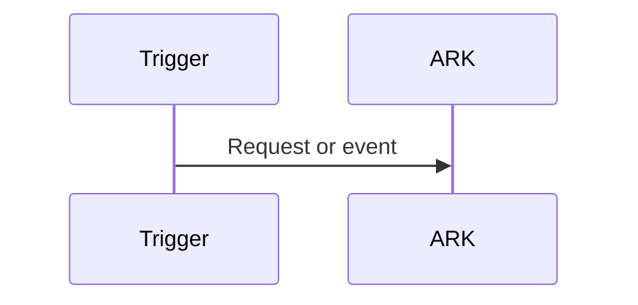

# Execution flow — USE CASE

## Trigger, outcome, and execution boundary

## Stage usage table

| Step/stage | Component/operation | Trigger | Why here | Prerequisites | Input | Output | Execution mode | Blocking? | Failure effect | Next step |
|---|---|---|---|---|---|---|---|---|---|---|

## Dependency and concurrency table

| Operation | Depends on | Can run in parallel with | Fan-in/synchronization | Ordering | Critical path? | Consistency/race risk | Timeout/cancel | Retry boundary |
|---|---|---|---|---|---|---|---|---|

## Critical path and supporting paths

- Required before response/commit:
- Background/out-of-band:
- Operational side effects:
- Observability export:
- Mandatory audit/compliance:
- Notification/event delivery:

## Step-by-step runtime narrative

Include conditional branches, partial failures, retries, cancellation, duplicate execution, and result delivery.

## Mermaid sequence or flow diagram

## Removal/movement analysis

For each significant element, state what fails or changes if it is removed, moved, delayed, or replaced.
